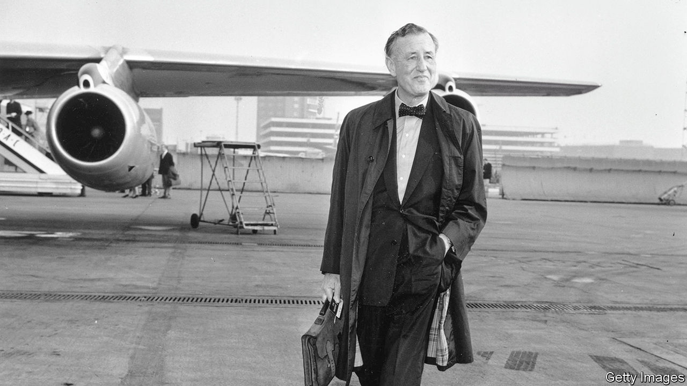

###### The man with the golden pen

# Spy, womaniser, cad: the writer who created James Bond 

##### A new biography tries to make sense of Ian Fleming 

 

> Oct 6th 2023 

By Nicholas Shakespeare. 

It was a chance invitation to a dinner party that changed Ian Fleming’s life and legacy. In 1960 Fleming, the author of some modest-selling books about a spy called , was on a trip to Washington, as foreign manager of the The dinner was with , who had just declared himself a presidential candidate and was a James Bond superfan. As the conversation turned to the problem of ’s revolutionary Cuba, Kennedy asked Fleming, “What would James Bond do?” Fleming replied that Bond would make Castro look ridiculous, rather than important.

That Kennedy should have sought Fleming’s (and Bond’s) advice on how to bring down Castro was not as odd as it may seem. Fleming had a wartime career as an officer in British naval intelligence. In 1961, when Kennedy had become president, he told  magazine that Fleming’s “From Russia, with Love”, the fifth Bond novel, was one of his ten favourite books. The endorsement introduced a relatively unknown English author to American readers. Fleming’s publisher scrambled to relaunch five Bond books ahead of the publication of “Thunderball”. 

As Fleming’s literary agent in New York put it, “the gusher burst.” In the remaining two years of his short life, Fleming became an international celebrity. James Bond made his  in “Dr No” in 1962, launching what would become the longest-running—and one of the most valuable— of all time.

Well over 100m copies of Fleming’s 14 James Bond books (12 novels and two short-story collections) have been sold. With 27 movies in the can, global box-office revenues are around $20bn in today’s prices. The search is currently on  Whoever is chosen for the part may do it for a long time; Daniel Craig’s tuxedo-clad tour of duty lasted 15 years. 

“The Complete Man” is only the second biography authorised by Fleming’s estate since the author’s death in 1964. (The first, by John Pearson, a  colleague, was published in 1966.) But Nicholas Shakespeare’s is the most comprehensive picture yet of Bond’s creator and offers insights into how his experience serving in the war shaped his fiction.

Fleming’s childhood and early adulthood were privileged but defined by loss. His grandfather was a self-made Scottish financier, who disapproved of Eve, Ian’s mother, who he thought was a social climber. Fleming’s father, Valentine, the MP for Henley, was killed by German shelling in 1917. (Winston Churchill wrote his obituary in the .) 

Valentine left the equivalent of about £15m ($18.2m) in today’s money to care for his widow and four children. With his war-hero father dead, mother in control of the purse-strings and brilliant older brother groomed as the male head of the family, “the mould was set…like Peter Pan, part of Ian remained frozen at the age of eight”, Mr Shakespeare writes.

After a miserable time at prep school, Fleming left  early for Sandhurst, an army academy. (He hated it and dropped out after a year.) He contracted gonorrhoea, an early sign of the womaniser he was to become. Next came a spell in Switzerland, where Eve hoped learning languages would get him into the Foreign Office. While there he fell in love, but not with someone grand enough for Eve, who threatened to cut Fleming’s allowance if he married her. He capitulated, a decision that would affect his relationships with women for the rest of his life. 

Failing to be accepted into the Foreign Office, Fleming worked as a journalist until his family pushed him into stockbroking. Fleming’s City connections recommended him as an assistant to John Godfrey, the director of naval intelligence (who would become the inspiration for “M”), when the second world war broke out. 

Fleming rose to the rank of lieutenant commander and proved to be an innovative administrator, using his ruthless charm to get results. He helped devise “Operation Mincemeat”, a successful ruse to deceive the Nazis with a dead body bearing bogus intelligence, and set up a spying network in Spain. He was one of a trusted few tasked with drawing America into the war. Mr Shakespeare argues (controversially) that Fleming was “one of the three main spearheads” who contributed to the establishment of the Office of Strategic Services, which morphed into the CIA.

The commando unit known as 30 Assault Unit (30AU), formed to seize enemy documents from targeted enemy headquarters, was also Fleming’s creation. One of 30AU’s triumphs was to capture a German inventor, Dr Hellmuth Walter, at his rocket-motor works in Kiel before the Russians could get to him. A co-operating Walter revealed a trove of advanced weapons, including the forerunner of a ballistic-missile submarine. In “Moonraker”, the third Bond book, the villain Sir Hugo Drax employs a “Dr Walter” to build a nuclear missile to destroy London.

After the war, Fleming missed the derring-do of the clandestine world. He set up a network of foreign correspondents for the (some were probably recruited as MI6 agents) and found refuge in Jamaica, building Goldeneye, a house with steps down to the sea where he could scuba-dive with sharks. It was there he finally mustered the self-confidence and found the time to write novels, starting with “Casino Royale” in 1952. All drew on Fleming’s wartime experiences. 

Soon after Fleming opened his typewriter to write the first Bond book, he married Ann Charteris, a socialite with whom he had conducted an affair both before and throughout her marriage to his close friend, Esmond Rothermere, the s owner. Neither would remain faithful to the other. But Fleming was discreet in the many liaisons he carried on, which the author , a friend, attributed to the fact that the women “were almost always married”.

Towards the end of his life he was dogged by ill health. He suffered from a heart condition made worse by alcohol and the 70 cigarettes he smoked a day. He was also stressed by litigation related to accusations of plagiarism brought by an Irish director, who had worked with Fleming on a screenplay for “Thunderball” before the novel was written. Fleming felt increasingly trapped by Bond and resentful of the pressure to produce new books. He died at the age of 56, a few days after he played a round of golf.

Though there have been at least seven other books written about Fleming, Mr Shakespeare’s is likely to be remembered as definitive, though overlong. What he does not do is make Fleming likeable. Despite Fleming’s patriotism and notable contributions to Britain’s war effort, the picture Mr Shakespeare draws is of an entitled, selfish misogynist. 

Some think the same could be said of Bond as Fleming wrote him. Many people believe that the books, with what one contemporary critic decried as their “sex, snobbery and sadism”, are skilfully crafted but feel very much of their time—and not in a good way. They consider the films, updated to reflect the tastes of their day, to be rather better, in one of those rare occasions where the films outshine the books they are based on. Fortunately for Fleming’s fragile ego, he will never know. ■


