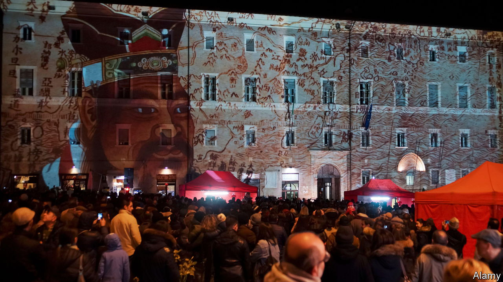

###### The persistence of memory

# A corner of Italy that is forever China 

##### Despite decoupling 

 

> Oct 12th 2023 

Italy may, like other Western countries, be hard at work “de-risking” its links to China; Giorgia Meloni’s government is considering leaving the Belt and Road Initiative that promotes Chinese trade and investment by next year. But in the hilltop university city of Macerata in the Marche region, relations with China are as enthusiastically friendly as ever. And that is because of a Jesuit priest who lived more than 400 years ago.

Matteo Ricci, born in 1552, is Macerata’s most notable son. A missionary and scholar, he was the first European invited to enter the Forbidden City in Beijing. Father Ricci co-wrote the earliest translations into Latin of the Confucian classics and left an enduring bond between China and his birthplace.

Though formally a city with its own cathedral and bishop, Macerata is a very small one, with barely 40,000 inhabitants. Yet its local authority keeps close relations with that of Shanghai, which has 26m. Macerata’s Confucius Institute, which promotes Chinese culture, is ranked by the Chinese authorities as on a par with that of Rome. And up to 300 Chinese students can be found studying at Macerata’s academy of fine arts.

“At Chinese New Year, the entire city becomes a Chinese town for the day,” says the Confucius Institute’s co-director, Giorgio Trentin. It is perhaps the only provincial Italian city where a visitor could find a group of locals practising in a side-street.

Macerata is also a key point of linkage between the Roman Catholic church and its members in China, split between an underground movement and the government-sanctioned Catholic Patriotic Association (CPA). Missionaries from Macerata followed in Father Ricci’s footsteps for centuries. 

Today the diocese produces Chinese translations of theological works, and many of the graduates of its seminary subsequently go to China to study or work in non-ecclesiastical roles while maintaining contact with the country’s scattered Catholics. “I currently have a priest in Beijing and two more in Inner Mongolia,” says the bishop, Nazzareno Marconi. His diocese also sponsors Chinese who come to study for the priesthood in Italy. But ask him whether they belong to the CPA or the underground church and he smiles and gives a polite “No comment”.■

