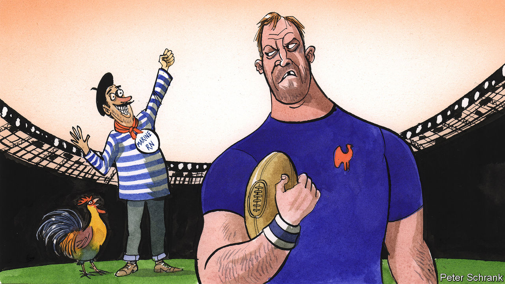

###### Charlemagne

# How rugby became a darling of Europe’s chauvinist right 

##### The sport’s main attraction is that it isn’t football 

 

> Oct 12th 2023 

Rare is the European politician who does not profess a passion for football. Supporting the local club is a sure-fire way to being seen as an everyman; visiting players in the changing rooms after a match is as much a ritual of electioneering as smooching babies. One politician stands apart. Giorgia Meloni, Italy’s hard right prime minister, is publicly unmoved by football, by far the most popular sport in Italy and Europe. Her game is rugby. There, burly men crash into each other for 80 minutes and whoever can most often limp, stagger or dive past the try line wins the game. Alas, Ms Meloni’s support did not help her Azzurri progress past the group stages of the Rugby World Cup, which is currently taking place in France. But the tournament has rekindled the political class’s interest in the sport there. Many, as it happens, are allies of Ms Meloni on the chauvinist fringes of the spectrum. 

Rugby has historically been a pursuit of the prosperous middle class, a sport not so much of the streets as of the private school. That may once have limited its appeal among populists, keen to appeal to blue-collar types first. Not at all, according to , a magazine that doubles as a mouthpiece for the French hard right. It has lauded “La France rugby”, an idyllic land where fans are polite, men are manly and players patriotic. That chimes with Ms Meloni, for whom rugby “represents true values, pride and commitment”. In Britain, too, populists know how to rally around the oval ball. Nigel Farage, its Brexiteer-in-chief, wallowed in his party’s “rugby club” image, and celebrated one national team win at a previous tournament with a pint of England’s Glory.

Chauvinists are drawn to rugby because it is the un-football. In soccer, as Americans call it, players routinely feign injury and collectively howl at the referee when they are not awarded a penalty. In contrast, rugby players feign not to be injured and have to be hauled off the field by anxious medics. They politely address the ref as “sir”, like children addressing an authority figure: just the thing for law-and-order fans. Between matches, footballers have feuds that fill the tabloids. Rugby matches end with a “third half” played in the pub, where opposing teams get blotto together. Football may be the sport of the masses, but its stars live in the stratosphere. Kylian Mbappé, a French prodigy, is said to earn €72m ($76m) a year in salary alone. Rugby players used to be amateurs until the 1990s, and still make a pittance in comparison. That makes for more down-to-earth role models.

Football rewards individual brilliance: TikTok is filled with clips of bicycle kicks and impossible dribbles. In rugby, as Ms Meloni rightly puts it, “there is no place for exaggerated individualism to the detriment of the collective”; a key feature requires a complex choreography of 16 blokes locked in a scrum. Usually the rugby player’s name does not even appear on his team jersey. The adulation of the collective and not the individual has knock-ons. Stardom has given football players elevated ideas of their role in society, for example combating racism by taking the knee before matches. Europe’s populists don’t go for this kind of . Rugby players are subservient to their team and tend to make less fuss.

Another way in which rugby is not football is who plays it. For years politicians of the hard right in France grumbled about the national football team being, in their chauvinist eyes, not quite French. Many of its most dazzling stars hailed from the , sporting names like Zinedine and Karim. There are a lot more dark faces in the French rugby team than there once were. But it remains a sport that draws players from the leafy suburbs and , especially in the provincial south-west, which are paler and less prone to riots. You cannot play a pickup game of rugby like you can one of football or basketball. Perhaps as a result, those from migrant backgrounds who do play are more showily integrated into their teams—and thus wider society. It is that sense of community, of belonging, that appeals to the chauvinists, who think it used to be the norm.

Such harking for yesteryear was on display in the opening ceremony of the World Cup on September 8th. Set in the 1950s—think berets and accordions—it dripped with reassuring clichés of . The intention was tongue-in-cheek, but it struck a chord. “This is the France we love, where young ladies didn’t wear [a full-length robe worn by some Muslim women], where you didn’t have riots,” gushed one commentator. Rugby has become a safe space for those who think things used to be better and fear the world is moving on only to leave them behind. That is a powerful sentiment in Europe these days, not least among the French, over eight in ten of whom think the country is in decline. 

Kicked into touch

The great bulk of rugby fans surely want nothing to do with the populist right. And the idyll imagined by the chauvinists is not quite what it seems. The fans supposed by to be of the polite sort were not above jeering President Emmanuel Macron during the opening ceremony. Nor are all players models of civic values: one forward in the French team, Bastien Chalureau, was convicted of a racist assault in 2020 (he is appealing against his sentence). Antoine Dupont, France’s captain, has in the past called for people not to vote for the hard right. 

But for middle classes anxious about losing their place in the world, rugby is a haven, says Emmanuel Kujawski, a Green politico who plays on the wing for the European Parliament rugby team. Football can be played by anyone—a rich white kid, one from the , or one who shone on a dusty field in Africa and gets recruited to play in Europe’s top leagues, where Gulf sheikhs and American tycoons vie for their teams to prevail. Rugby, at any rate in swathes of Europe, is a sport whose players and fans tend to honour a code of a supposedly more gentlemanly past. It is no surprise it has proved attractive to those politicians intent on pitting Us against Them. ■


 


