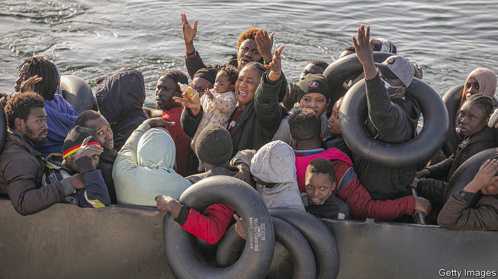
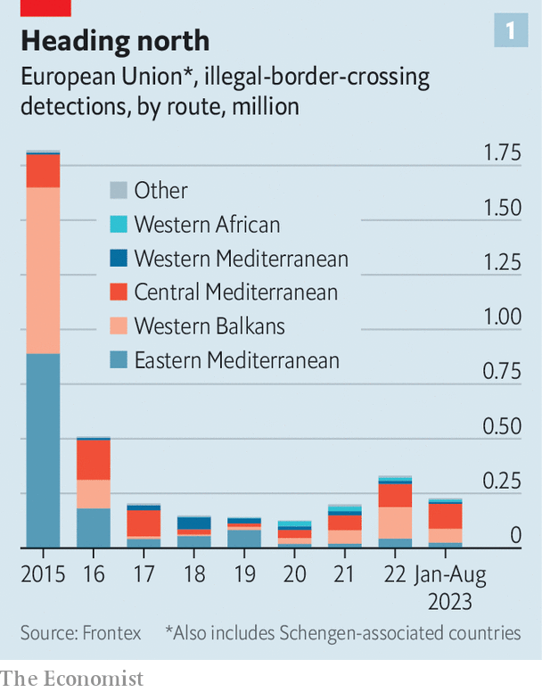
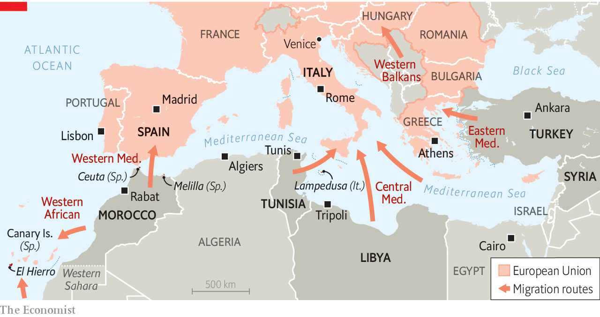

###### Out of sight, out of mind

# The EU’s endless search for a migration fix 

##### An internal deal comes together while a cross-Mediterranean one falls apart 

 

> Oct 12th 2023 

When boubacar Touré heard the crash of a tour bus near Venice, plunging 15 metres from a bridge, he ran towards the noise. He and a room-mate helped pull people from the bus as it burned. The accident killed 21; more might have died if not for his heroics. “When somebody needs help because they’re dying, you don’t just walk away.” Mr Touré, a Gambian, was himself rescued from his crossing of the Mediterranean at the age of 17. “The Italians saved my life and now I’ve done something for them,” he said.

 


Such stories tug at the conscience. That is why European countries would rather keep them far from their consciences in the first place. Migration is back in the headlines, with 2023 almost certain to become the biggest year for arrivals in Europe since 2016 (see chart 1). The European Union has just struck a deal to distribute the burden of migrant arrivals more evenly between countries, with those taking fewer people paying those who take more. This defused a row in which Italy had bitterly criticised Germany for funding NGOs that rescue migrants at sea. This, in Italy’s view, incentivises more to come.

But as Europe took a step forward on its internal management, it took another step back on its foreign front. A deal with Tunisia, announced in July, was meant to reduce the number of migrants arriving via that country. But it is unravelling. The autocratic president, Kais Saied, suddenly said on October 2nd that he did not want Europe’s money, and on October 9th Tunisia sent €60m ($64m) back. He appears to have been expecting more cash than was sent to Tunisia recently, possibly owing to an internal wrangle within the EU. (The deal offers longer-term co-operation on issues like energy, but Tunisia is now particularly cash-strapped.) Nor has the deal had the desired effect. Since July, thousands have continued to come from Tunisia, especially to the Italian island of Lampedusa.

The bust-up with Tunisia highlights several problems with using neighbouring states as Europe’s border force. A deal may be ineffective, or it may be too brutally effective. In either case those states, recognising their leverage, have a continuing incentive to renegotiate.

Migration has changed since 2015, when the wars in Syria, Iraq and Afghanistan gave Europeans something of a sense of responsibility. But much of the strain was relieved by a deal with Turkey in 2016, when a big aid package was largely successful at keeping migrants from crossing into the EU. It has not been perfect—Turkey has occasionally threatened to flounce out—but fewer migrants are using this eastern route into Europe.

 


Today, though the numbers are smaller, the issues are tricker. A greater percentage of the migrants come from sub-Saharan Africa and Asia, not all of them from coup-ridden or war-torn places (see chart 2). Many hail from poor countries and just seek a better life, which smugglers assure them is on easy offer in Europe. As the Turkish route gets harder, they choose the longer and more dangerous central Mediterranean one.

One point of departure has been Libya, where migrants heading for Europe roughly tripled between 2019 and 2021, when around 32,000 people left for Europe. This led the EU to deal with the misnamed Libyan coast guard, a force run largely by militias in that war-battered country, giving them boats and equipment to return migrants to Libya. Human-rights groups and reporters have documented brutal conditions, including rape, torture and slavery in what amount to prisons there. Such reporting may have led to the closure of Al Mabani, a notorious camp, last year. But the Outlaw Ocean Project, an NGO, says that the Libyans have probably just moved the camps to places farther from scrutiny.

 


At the western end of the Mediterranean, things are quieter, and Spain’s centre-left government touts its success in handling the migration route there. But critics say that this is because of a grubby deal with Morocco. In 2021 Moroccan authorities looked away while migrants streamed into Spain’s North African enclave of Ceuta. When Pedro Sánchez’s government abruptly announced a shift on policy towards Western Sahara—in effect blessing Morocco’s position that it should remain under Moroccan sovereignty but with local autonomy—many sensed that the Moroccan use of the “migration weapon” had worked, winning a long-sought foreign-policy concession. In any case, Spain has less to crow about over the Atlantic route; in the week ending on October 8th over 2,000 migrants from west Africa arrived in El Hierro, one of Spain’s smallest Canary Islands.

The flow of migration continually adapts to the deals with the transit states. The deal with Turkey mostly worked, so migrants then headed through Libya. A deal with Libya may have worked, at a brutal human cost, but now Tunisia is demanding a better offer. Europe has the look of a harried plumber watching new leaks spring as soon as one is fixed. Making deals with unsavoury partners and non-democracies is an ugly but necessary part of foreign policy. It is an entirely different matter when it does not even seem to work. ■

