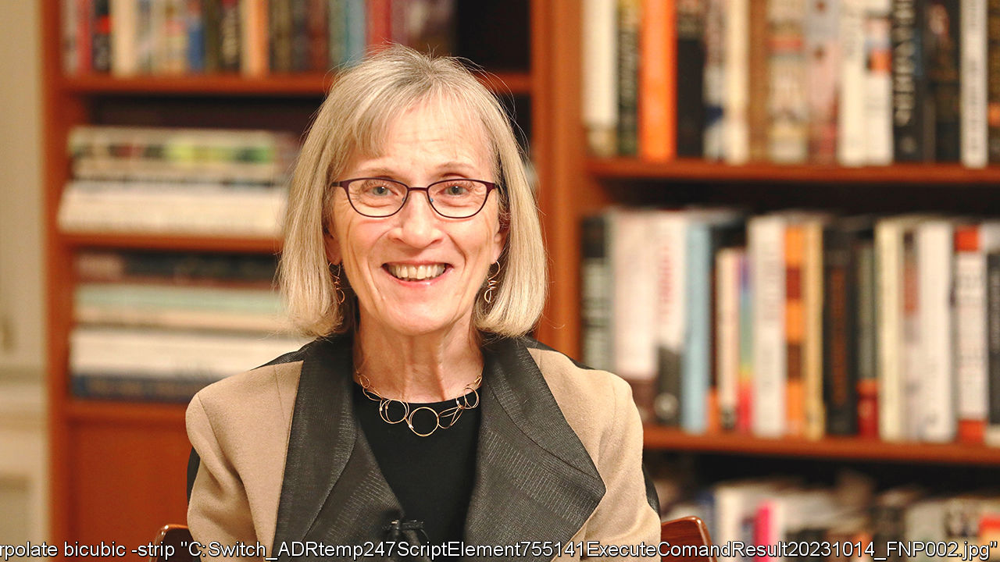
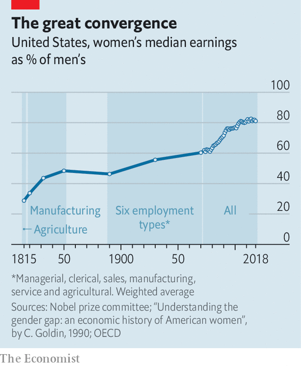

###### Golden Goldin

# Claudia Goldin wins the Nobel prize in economics 

##### Her work has overturned assumptions about gender equality 

 

> Oct 9th 2023 

On the morning of October 9th the National Bureau of Economic Research circulated a working paper to economists around the world entitled “Why Women Won”. In the paper, Claudia Goldin of Harvard University documents how women achieved equal rights in American workplaces and families. Rather fittingly, a few hours later, Ms Goldin was announced as the winner of this year’s economics Nobel prize, for advancing “our understanding of women’s labour-market outcomes”. 

Having been the first woman to be granted tenure at Harvard’s economics department, Ms Goldin is now the third woman to have won the subject’s Nobel prize. Taken together, her research provides a comprehensive history of gender labour-market inequality over the past 200 years. In telling , she has overturned assumptions about both historical gender relations and what is required to achieve greater equality in the present day.

Before Ms Goldin’s work, economists had thought that economic growth led to a more level playing field. In fact, Ms Goldin showed, the Industrial Revolution drove married women out of the labour force, as production moved from home to factory. In research published in 1990 she demonstrated that it was only in the 20th century, when service-sector jobs proliferated and high-school education developed, that the more familiar pattern emerged. The relationship between the size of Western economies and female-labour-force participation is u-shaped—a classic Goldin result.

Ms Goldin’s research has busted other myths, too. Lawrence Katz, her colleague and husband, marvels at her ability to trawl archives to fill gaps in the historical data on women’s work. Simple statistics, such as the female employment rate, were mismeasured because when surveyed, women might respond “I’m a housewife”, notes Ms Goldin, even if they managed the family business. Once corrected, the employment rate for white married women, for example, was 12.5% in 1890—five times greater than previously thought. 

 


Her findings also showed that the gender wage gap narrowed in bursts.  rose relative to men’s in 1820-50 and then again in 1890-1930, before shooting up in 1980-2005 (see chart). What drove these bursts? The initial two came well before the equal-pay movement and were caused by changes in the labour market: first, during the Industrial Revolution; second, during a surge in white-collar employment for occupations like clerical work. 

For the third and most substantial drop, in the late 20th century, Ms Goldin emphasises the role of expectations. If a young woman has more say over when and whether she will have a child, and more confidence that women can work in a wide range of jobs, she may invest more in the future, such as by staying in school for longer. In work published in 2002 Ms Goldin and Mr Katz detailed the example of the contraceptive pill, which was approved in 1960, and gave women more control over decisions about children. Between 1967 and 1979 the share of 20- and 21-year-old women who expected to be employed at 35 jumped from 35% to 80%.

Expectations also matter for employers. Although the pay gap narrowed in the early 1900s, the portion driven by discrimination, rather than job type, grew. An important factor, says Ms Goldin, was changes in how payment was decided. Wages used to be tied to output—how many clothes were knitted, for instance. But after industrialisation, workers were increasingly paid periodically, in part because measuring an individual’s output became trickier. Therefore more ambiguous factors grew in importance, such as ideas about how long a worker would stay on the job. This penalised women, who were expected to quit when they had children.

Since around 2005 the wage gap has hardly budged. Here Ms Goldin’s work questions popular narratives that continue to blame wage discrimination. Instead, in a book published in 2021, Ms Goldin blames “greedy” jobs, such as being a consultant or lawyer, which offer increasing returns to long (and uncertain) hours. 

She explains how such work interacts with the so-called parenthood penalty. “Let’s say there are two lawyers, equally brilliant,” explains Ms Goldin. Once children arrive, “they realise that they both can’t work these gruelling hours.” Women spend more time raising children, which is why the gender pay gap tends to open up after a first child. Both partners could take on less demanding jobs, but then the couple would earn less as a unit, she explains. 

Ms Goldin’s research holds lessons for economists and policymakers. For the former group, it shows the importance of history. Ms Goldin’s prize is the first economics Nobel awarded for work largely in economic history since Robert Fogel, her former adviser, triumphed in 1993. Before Ms Goldin’s research, many academics considered questions about historical gender pay gaps to be unanswerable because of a paucity of data. Yet she has repeatedly demonstrated that digging through historical archives allows researchers to credibly answer big questions previously thought beyond their reach.

For policymakers, Ms Goldin’s research demonstrates that fixes for gender inequality vary depending on time and place. In early 20th-century America, companies barred married women from obtaining or retaining employment. A policy response came with the Civil Rights Act of 1964, which banned such behaviour. Today, wage gaps persist because of greedy jobs and parental norms, rather than because of straightforward employer discrimination. In the past, Ms Goldin has suggested more flexibility in the workplace could be a solution to the problem. Perhaps working out how to achieve it will be her next act. ■


