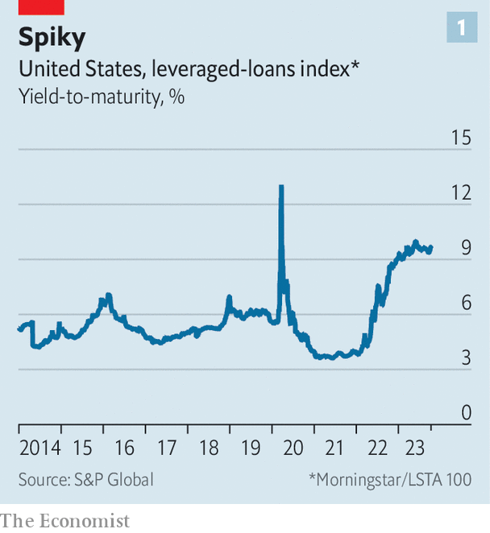
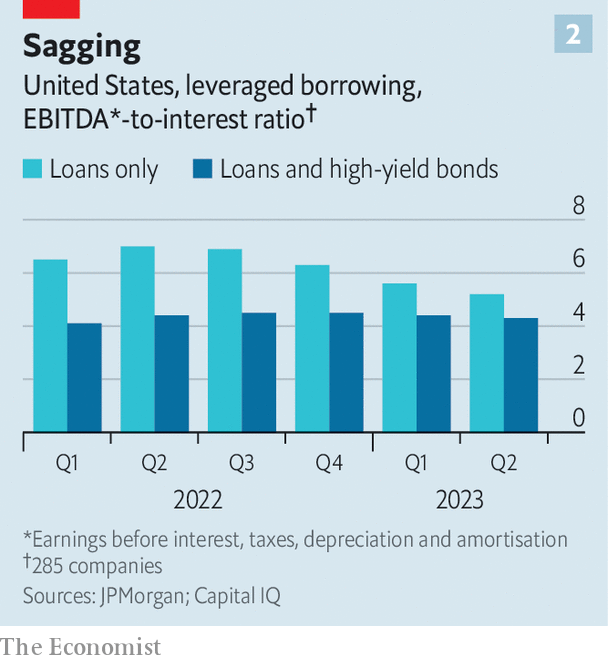

###### Floating and sinking

# Corporate America faces a trillion-dollar debt reckoning 

##### With interest rates set to stay higher for longer, who will bear the brunt? 

 

> Oct 12th 2023 

Big American companies are living in a debt dreamland. Although cheap borrowing has fuelled the growth of corporate profits for decades, the biggest firms have been largely insulated from the effects of the Federal Reserve’s recent bout of monetary tightening. That is because many of them borrowed plentifully at low, fixed interest rates during the covid-19 pandemic. The tab must be settled eventually by refinancing debt at a much higher rate of interest. For now, though, the so-called maturity wall of debt falling due looks scalable.

 


But not all companies are escaping the impact of the Fed’s actions. Indeed, there is trillions of dollars of floating-rate debt, with interest payments that adjust along with the market, that has suddenly become much more expensive. This pile of debt consists of leveraged loans and borrowing from private debt markets. Companies seldom hedge interest-rate risks, meaning that they now find themselves paying through the nose—the yield-to-maturity of one index of leveraged loans has leapt to almost 10% (see chart 1). Meanwhile, since American economic growth remains resilient, the Fed’s policymakers warn that interest rates will have to stay higher for longer. This will push more borrowers to breaking-point. A market that has grown vast is now asking two miserable questions. How bad will things get? And who, exactly, will lose out?

Since the global financial crisis of 2007-09, companies have borrowed fast and loose. UBS, a bank, estimates the value of outstanding American leveraged loans at around $1.4trn and the assets managed by private credit lenders at more than $1.5trn. The two types of debt are more alike than they are different. Both have grown to service the private-equity buy-out boom of the past decade. Traditional leveraged loans are arranged by banks before being sold (or “syndicated”) to dozens of investors, whereas private lending involves just a handful of funds, which usually hold smaller loans to maturity, creating a less liquid and more opaque market.

Increasing numbers of borrowers are now hitting the rocks. Since 2010 the average annual default rate in the leveraged-loan market has been less than 2%. According to Fitch, defaults rose to 3% in the 12 months to July, up from 1% a year earlier. The ratings agency reckons that they could shoot up to 4.5% in 2024. Restructurings and bankruptcies on this scale amount to spring cleaning rather than the deep distress felt during the financial crisis, when loan defaults exceeded 10%. But if rates stay higher for longer, as central bankers predict, the tally of troubled firms will grow. Although all companies with unhedged floating-rate debt balances are vulnerable, those loaded with debt in private-equity buy-outs at high valuations during the recent deal boom are especially at risk.

 


Slowing profit growth means that borrowers are finding it harder to afford their floating-rate debt. JPMorgan Chase, a bank, analysed 285 leveraged-loan borrowers at the end of June, before the Fed’s most recent rate rise. Firms where borrowing consisted only of leveraged loans saw their annual interest expense soar by 51% year-on-year. Their fortunes are diverging sharply from those that instead tapped high-yield bond markets for fixed-rate funds. According to the study, the interest expenses of such businesses have increased by less than 3%. Coverage ratios, which compare a firm’s profits with its interest costs, have begun an ominous decline (see chart 2).

In the private debt market, where default rates tend to be higher, borrowers are confronting similar woes. According to Bank of America, interest costs now consume half of profits at firms where loans are held by the largest business-development companies, a type of investment vehicle. A big rise in distress would not only make it harder to find institutions willing to plough money into private debt funds, with investors normally attracted by the promise of smooth returns, but also spill over to the leveraged-loan market.

Now that a reckoning looks imminent, attention is turning to which investors will be left holding the bag. Lenders today expect to recover less of their investment after a firm defaults than in earlier eras—and this year so-called recovery rates across junk-rated debt have been well below their long-run averages. According to Lotfi Karoui of Goldman Sachs, another bank, the rise of borrowers that rely solely on loans, rather than borrowing from bond markets too, could depress recoveries still further. This trend has concentrated the pain caused by rising interest rates. It is also likely to leave less value for leveraged-loan investors when they find themselves round a restructuring table or in a bankruptcy court, since there will be more claims secured against a firm’s assets.

Other long-term trends could exacerbate the leveraged-loan market’s problems. Maintenance covenants, commitments that lenders can use as a “stick” to force a restructuring, have all but disappeared as the market has matured. In 2021 nearly 90% of new loans were “covenant-lite”. This could mean that companies take longer to reach default, and are in worse health when they get there. Excessive “add backs”, flattering adjustments to a company’s profitability measures, might also mean that leveraged borrowers are in worse shape than the market believes.

The performance of private markets is also being closely scrutinised. Advocates for private debt have long argued that they are better suited to periods of higher defaults, since the co-ordination costs between a small group of lenders are lower, making the correction of vexed balance-sheets easier. If private markets do indeed fare better than leveraged loans during the forthcoming turmoil, it would bolster their attempts to attract finance in future.

Problems in floating-rate debt markets are unlikely to cause a financial crisis, but the murkiness and growing size of private markets in particular mean that regulators have decided to take a closer look. In August America’s Securities and Exchange Commission announced rules to increase transparency, including demanding quarterly financial statements. The following month, the International Organisation of Securities Commissions, a global regulatory body, warned about the risks of leverage and the opacity of private debt markets. Few investors, however, think they need help predicting a coming crunch. ■


