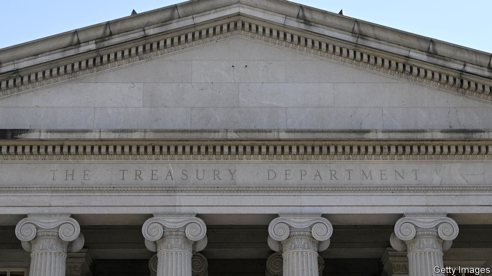
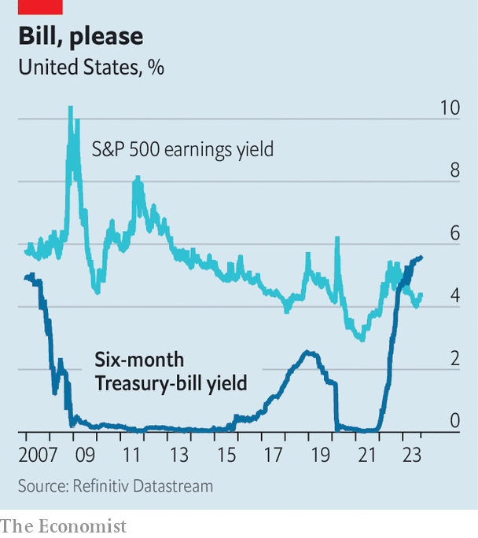

###### Bills, bills, bills

# Retail investors have a surprising new favourite: Treasury bills 

##### Banks face a fresh form of competition 

 

> Oct 12th 2023 

When treasury bonds (or t-bills) last yielded as much as they do today—5.5%—punters were relieved that the world had not been destroyed by the millennium bug, Destiny’s Child were atop the charts and the dotcom bubble was going strong. The recent surge in yields has been remarkable (see chart).

 


Yet bank depositors are seeing just a fraction of these increases. The average American savings account yields just 0.45%. Investors, too, are missing out. For the first time in over two decades, at the end of last year the return offered by six-month Treasuries overtook the earnings yield of s&amp;p 500 companies.

So retail investors are looking elsewhere. Trading platforms have made short-term Treasury products a big part of their offering. Advertisements for Public, one such platform, ask podcast listeners if they are aware of the meagre savings rate on their deposit accounts. Despite only having been available on the platform since March, Treasuries are now its most purchased asset. One in ten new users buy them as their first trade.

Demand for Treasuries reflects a broader move towards safe, high-yielding options. Money-market funds invest in low-risk, short-duration instruments, including Treasuries. More than $880bn has been added to such funds this year, bringing their total value to an all-time high of $5.7trn. As with retail short-dated Treasury accounts, money-market funds are attractive to savers because they are highly liquid, meaning that cash can be withdrawn quickly if required.

The growing popularity of such alternatives is upsetting the logic of retail banking. Banks get away with providing interest rates well below the interest they receive from short-term government debt because—as Public’s advertisements identify—many depositors pay little attention. By sucking deposits from the banking system, money-market funds are thought to have contributed to financial instability in the spring. 

Retail-trading platforms’ expansion has made it easier than ever for depositors to transfer funds into short-dated government debt. That may further erode the discount on savings rates that depositors will accept from banks, and make Treasuries a bigger feature in retail-investment portfolios. Savers will, then, be singing along to one of Destiny’s Child’s better tunes: “Bills, Bills, Bills”.■


