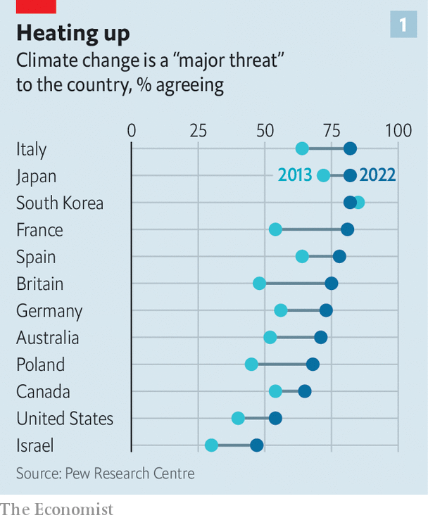
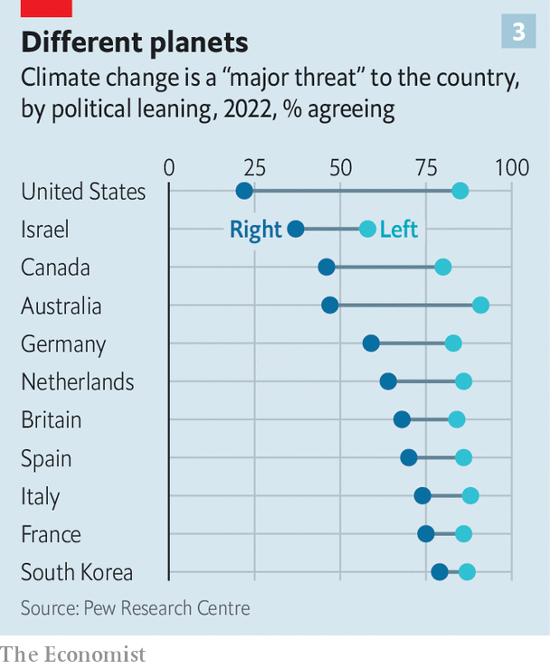

###### It’s not easy being green

# The global backlash against climate policies has begun 

##### Cost, convenience and conspiracy-mongering undercut support for greenery 

 

> Oct 11th 2023 

“We need to be good stewards of our planet. But that doesn’t mean I need to do away with my gas vehicle and drive an electric vehicle with a battery from China,” said Kristina Karamo, the chair of the Republican Party in Michigan, on September 22nd. America’s Democrats, she warned, are trying to “convince us that if we don’t centralise power in the government, the planet is gonna die. That seems like one of the biggest scams [since] Darwinian evolution.” 

It would be tempting to dismiss Ms Karamo as an irrelevant crank, but she is not irrelevant. She represents an extreme wing of a movement that is gathering pace around the world: a backlash against pro-climate policies. One of its more familiar cheerleaders could be America’s next president. On September 27th Donald Trump said: “You can be loyal to American labour or you can be loyal to the environmental lunatics but you can’t really be loyal to both…Crooked Joe [Biden] is siding with the left-wing crazies who will destroy automobile manufacturing and will destroy our country itself.”

On September 20th Rishi Sunak, Britain’s prime minister, announced a weakening of net-zero targets, including a five-year delay of a ban on the sale of new petrol cars. Two weeks earlier, Germany kicked a proposal for stringent green home-heating rules years into the future. France has seen huge protests against high fuel prices, and could one day elect as president Marine Le Pen, who deplores wind farms and thinks the energy transition should be “much slower”. In America climate change has become a culture-war battleground: at a recent debate for Republican presidential candidates, only one admitted that man-made climate change is real. 

How serious an obstacle is all this to curbing global carbon emissions? Michael Jacobs of the University of Sheffield in Britain sees reasons for cautious optimism. The world’s biggest emitter, China, understands the need to decarbonise and is investing massively in solar and wind. The second-biggest emitter, America, has taken a green turn under Mr Biden. Brazil has sacked a rainforest-slashing president; Australia has ditched a coal-coddling prime minister. Nearly a quarter of emissions are now subject to carbon pricing. And the pace of innovation is impressive. Two years ago the International Energy Agency, a global body, estimated that nearly 50% of the emissions reductions needed to reach net zero by 2050 would come from technologies that were not yet commercially available. In September it said that number had fallen to 35%. 

 


The political undercurrents are less reassuring. Voters are realising that remaking the entire global economy will be disruptive. Some—a minority—dispute that man-made climate change is under way. Others object to certain policies deployed to tackle it, because they impose costs on ordinary citizens, or add hassles to their overstretched daily lives. Some, particularly the elderly, do not like change at all, especially when it means fuss today in return for benefits they may not live to see. Even among those who accept that action is needed, views differ as to who should shoulder the burden. Many would prefer it to fall on someone else. 

Awareness of the dangers of climate change seems to have risen over the past wildfire-charred decade. In polls of 12 rich countries by Pew, an American think-tank, the share of respondents who said it was a “major threat” rose in every country except South Korea, where it was already high (see chart 1). Clear majorities everywhere bar Israel agreed with this description. Yet this does not mean they are willing to pay more taxes to help prevent climate change (see chart 2). In a survey of 29 countries by Ipsos, a pollster, only 30% of respondents said they would be willing to cough up. 

Crowding out

Perhaps most alarmingly, a partisan gap has opened even on scientific questions. In all of the 14 rich countries surveyed by Pew in 2022, people on the political right were less likely to see climate change as a major threat than those on the left (see chart 3). In Australia, Canada, Germany, the Netherlands and Sweden the gap was very large: between 22 and 44 percentage points. In America it was a gobsmacking 63 points. And a new poll by YouGov for  found that whereas 87% of Biden voters believed that climate change was caused by human activity, only 21% of Trump voters agreed.

 


In democracies such divisions have consequences. (Public opinion matters in dictatorships, too, but that is beyond the scope of this article.) In rich democracies, especially, divisions over climate are aggravated by populist politicians, who take real problems (such as cost and disruption) and exaggerate them, while claiming that the elite who impose green policies don’t care about ordinary motorists because they cycle to work. 

Populism tends to undermine effective climate policy in several ways. First, populists are often sceptical of experts. When people say “trust the experts”, suggests Ms Karamo, they really mean: “You are too stupid to make decisions about your life.”

Second, populists are suspicious of global institutions and foreigners. “Every subsidy we award to an electric-vehicle manufacturer is really a subsidy to the [Chinese Communist Party], because we depend on them, like a noose around our neck, for the batteries,” says Vivek Ramaswamy, a Republican presidential candidate. Such attitudes are bad for climate mitigation, argues Dan Fiorino of the American University in Washington, DC, because “climate policy is as much a matter of foreign relations as it is of economic policy.”

 


Third, populists encourage people to believe that the elite are plotting against them, thus adding paranoia to public life and making compromise harder. Mr Trump frames policies to promote electric cars as a threat to the American way of life, and does so in ways that make his fans bristle with rage and laugh out loud.

“They say the happiest day when you buy an electric car is the first ten minutes you’re driving it, and then, after that, panic sets in because you’re worried. Where the hell am I gonna get a charge to keep this thing going? Panic!” he told workers in Michigan. “If you want to buy an electric car that’s absolutely fine...But we should not be forcing consumers to buy electric vehicles…There’s no such thing as a fair transition to the end of your way of life.”

If Mr Trump is re-elected in 2024, he would once again pull out of the Paris Agreement on climate change. He would also roll back executive orders on such things as methane emissions. He would probably not be able to repeal Mr Biden’s big climate law (misleadingly called the Inflation Reduction Act), which involves huge subsidies that are popular with recipients in red states as well as blue ones. But he would appoint bureaucrats who could obstruct its implementation. At a minimum, America would cease to offer leadership on climate change at a crucial moment, says Mr Markey. “You cannot preach temperance from a barstool. You cannot tell other countries to do the right thing if you as a country are not.” 

Similar arguments against greenery have taken root in Europe, too. Even where populist parties are not in government, they can influence it. In Sweden, where only 4% of people say climate change is “not a threat”, the centre-right ruling coalition has nonetheless cut taxes on fossil fuels several times in the past year. One reason is that it cannot pass a budget without support from the populist Sweden Democrats, who have 20% of parliamentary seats. The populists want cheaper fuel. So do lots of Swedish voters. 

“Fuel Rebellion”, a Swedish Facebook group, boasts 600,000 members. Peder Blohm Bokenhielm, one of its leaders, says cars “have always been a big part” of his life. His father imported American Mustangs and Corvettes to Sweden. His first word as a child was “car”. And he has practical reasons for objecting to high fuel taxes, too. In a small Swedish village “there are no shops, and just two buses a day,” he says. “If you want to buy groceries, you need a car.” Charging points are not yet everywhere, and a car’s range matters in a country where journeys are long and getting stranded in the snow is hazardous. And don’t get people started on the cost of home-heating. Politicians who keep high fuel prices in place are “making it harder for people to live where they want to live”, Mr Bokenhielm says. 

The right way?

In Germany this year the hard-right Alternative for Germany (AfD) has risen in the polls—and did well in state elections on October 8th—by lambasting the energy policies of the ruling coalition, which includes the Green Party. It says they will “impoverish” the country. The AfD is ostracised by mainstream parties, but the centre-right borrows its talking-points. 

The Greens hurt their own cause with a plan to make green home-heating almost mandatory before there were enough skilled installers to install heat pumps. Householders struggled to book tradesmen. The government backed down in September and extended the deadline—but the political damage had been done. 

Now in Germany it is not just the hard right that bashes the Greens. Their rallies have been pelted with stones, eggs and insults. Martin Huber of the Christian Social Union (CSU), the main centre-right party in Bavaria, told  that all the Greens do is make  (laws that forbid things). At a rally in Andechs, a pretty village 40km from Munich, the head of the CSU, Markus Söder, drew guffaws from a beered-up Oktoberfest crowd with a series of jabs. When the lights suddenly brightened he quipped: “So at least they are still sending us electricity from Berlin.” An elderly supporter said: “I heat my house with wood. How can I afford to change this, and why should I in my old age?” 

Not their cup of tea

In Britain, the Conservative prime minister has adopted the main populist themes. In a speech last month, Mr Sunak stressed that he favours curbing emissions, but decried the way Britain’s climate goals had been set “without any meaningful democratic debate about how we get there”. (His party has been in power since 2010.) He also lamented that green policies “will impose unacceptable costs”. He named specific, frightening sums. “For a family living in a terraced house in Darlington, the upfront cost [of a heat pump] could be around £10,000 ($12,200).” 

He vowed to scrap plans that have never seriously been considered: “taxes on eating meat…compulsory car-sharing [and] a government diktat to sort your rubbish into seven different bins”. And he played the nationalist card. “When our share of global emissions is less than 1%, how can it be right that British citizens are...told to sacrifice even more than others?” (Brits are less than 1% of the global population.)

“Rishi is playing with fire,” says Michael Grubb of University College London. Businesses crave predictable policies in order to plan for the long term. “Making climate change part of a culture war will undermine investor confidence.” 

James Patterson of Utrecht University in the Netherlands argues that anti-green backlashes sometimes occur when environmentalists overreach; for example, by enacting policies so coercive that many people deem them illegitimate. This has happened in the Netherlands. A new populist party, the BoerBurgerBeweging (Farmer-Citizen Movement), shot to prominence when the government began to penalise farms emitting too much nitrogen. 

Nitrogen is not a greenhouse gas; the problem is that big intensive Dutch farms produce enough of it (from fertiliser and cowpats) to threaten important nature reserves. The government wants to buy out farmers, leading to a reduction in the number of livestock of between a fifth and a half. Such bossiness has provoked rustic rage, with tractor protests and farms across the country flying the national flag upside down. The Farmer-Citizen Movement took 20% of the vote in provincial elections this year—in a country where only 2.2% of people farm. At a general election on November 22nd the more eco-friendly parties are expecting a thumping. 

For the most part in developing countries, climate change is a less divisive topic in domestic politics than it is in rich ones. The elite discuss it—governments want to be compensated for the industrialised world’s past emissions and to attract investment for the energy transition. But during elections in India or Africa the topic is barely mentioned. 

However, voters in developing countries are even more sensitive to rises in the cost of living than those in rich countries. So they often resist policies that they think will batter their budgets. Hence the difficulty of cutting fossil-fuel subsidies, which were a staggering $1.3trn (1.3% of global GDP) in 2022, according to the IMF. 

Such handouts are so popular that the harm they do to the environment is seldom motive enough for governments to get rid of them. Nigeria’s new president, Bola Tinubu, scrapped a fuel subsidy this year not because it encouraged people to burn carbon, but because selling petrol at below-market prices was bankrupting the treasury. In 2022 it cost $10bn, leaving the state oil firm with nothing left for the federal government, of which it is usually the biggest bankroller. Abolishing the subsidy frees up billions for public services, with the happy side-effect of reducing emissions. However, there is pressure to reinstate it. As oil prices rise, some fear a subsidy will be quietly reintroduced.

Several middle-income countries, such as Indonesia and India, are burning more fossil fuels even as they try to reinvent themselves as green powers. India’s government plans to triple renewable-electricity-generation capacity by the end of the decade. It has also declared a moratorium on new coal plants and aims to become a big producer of green hydrogen. This is good news, but seems to be driven at least as much by worries about energy security as climate change: last year’s green-hydrogen strategy mentions a plan to be “energy independent” by 2047 before the target to achieve “net zero” by 2070. And despite the moratorium on new coal plants, Indian coal production grew by 14.8% last year. 

National-security arguments can be a spur to green investment. Building wind farms can reduce dependence on energy imports, which is a point that many politicians emphasise. But if such arguments also spur governments to erect barriers to foreign inputs, it will make the energy transition more costly. 

From a green perspective, the big middle-income country that has improved the most in the past year is probably Brazil. Yet it, too, is complicated. Under President Luiz Inácio Lula da Silva, who took office in January, deforestation in the Amazon in the first eight months of the year fell by a cumulative 48% compared with the same period in 2022, when his logger-loving predecessor, Jair Bolsonaro, was in charge. However, Lula also supports a push by Petrobras, the state oil firm, to increase output from 2.9m barrels a day to 5.2m by 2030. And his green plans have met resistance. In Congress 347 out of 594 lawmakers belong to the agri-business caucus, whose members fret that greens block development. Congress has curbed the powers of the environment ministry.

Sowing discontent

In most developing countries, net-zero targets are far in the future and voters have not yet been asked to make big sacrifices to reach them. For many, the harm wrought by climate change itself is a bigger worry. A massive 74% of Indians, for example, say they have experienced the effects of global warming, up from 50% in 2011, according to a survey by Yale University. “We’ve lost crops because of extreme heat and rains and it has got worse in the past few years,” says Shiv Kumari, a farm labourer in Delhi whose fields were flooded this summer. Such trauma translates into greater support for green policies: 55% of Indians say India should reduce its emissions immediately without waiting for other countries to act, up from 36% in 2011. 

Globally, innovation will eventually ease the grumbles that drive so much of the anti-climate backlash. “The clean is already cheaper than the dirty in many parts of the economy, and those parts will just get bigger and bigger,” says Nicholas Stern of the London School of Economics. But it matters immensely how fast this happens. Many green technologies require hefty upfront investment, which is harder when interest rates are high. This particularly affects the poor world. “Look at Africa. If you pay 15% interest, wind and solar are not cheaper than fossil fuels for generating electricity, though they are cheaper at 7% or 8%,” says Professor Stern. He suggests supercharging multilateral lenders to crowd in other sources of finance. “The most unrealistic and dangerous thing of all would be to go slow,” he says. ■


