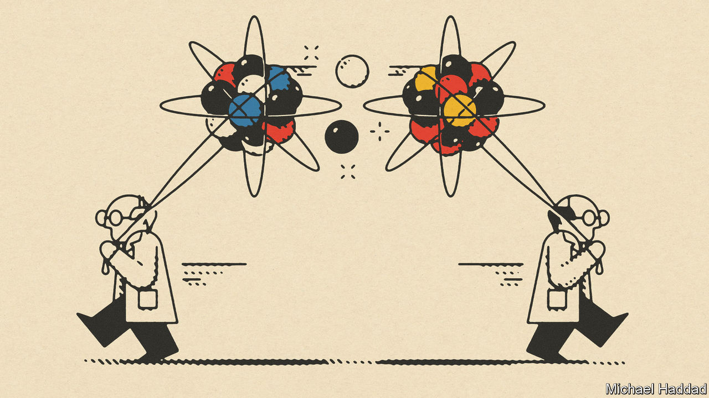

###### The case to STAy

# America and China should keep doing research together 

##### Republicans are wrong to want to scrap the Science and Technology Agreement 

 

> Oct 12th 2023 

Since Deng Xiaoping and Jimmy Carter struck a deal in 1979, American and Chinese academics have co-operated on scientific research. Like so much else about relations between the two countries, that co-operation is now under threat. As we report this week  are writing fewer papers together and the number of Chinese students and researchers entering America has fallen sharply. Now politicians are wavering about whether to renew the Deng-Carter deal, called the Science and Technology Agreement (STA). Republicans want to scrap the pact; Democrats want to renegotiate its terms. 

It is easy to understand America’s fears about boosting China’s technological capability, and therefore its ability to wage war. The widespread fear that China has exploited a naive American belief in openness has also sapped the will to work together. China has a long record of ordering Western companies to hand over technologies as a condition of selling into its vast market, and is often accused of intellectual-property theft. 

Yet quitting or watering down the STA would be a mistake. To begin with there are few, if any, examples of academic collaboration harming America’s interests. Republicans’ chosen example of research gone wrong is a project in 2018 to share data from jointly launched weather balloons, a tale that plays on fears of aerial spying but does not represent a real security failure. In any case, the STA covers academic research that, in America, ends up easily accessible in academic journals, whoever wrote it. True, Chinese scientists—and by extension China—gain expertise from being involved. But other laws, and a recent executive order by President Joe Biden, restrict the sharing of American expertise in sensitive areas.

In addition, it would be a mistake to think that the gains from collaboration are one-way. China’s scholars match and even outdo America’s in some fields, such as batteries, telecommunications and nanoscience. And because China’s research environment is far more opaque than America’s, Uncle Sam may gain more from peering over the wall than China does.

Collaboration also offers opportunities to influence China’s approach to ethically vexing research. Under sway from America, it has gradually adopted Institutional Review Boards, which oversee work that affects human subjects. Innovation in artificial intelligence and other areas in which China is closer to the frontier of knowledge will raise new ethical quandaries for researchers. American scientists can usefully steer China’s approach there, too.

Last, at a time of tensions between China and America, the STA carries important symbolism. It was the first bilateral accord signed after relations between the two countries were restored. Scrapping it without good reason would feed the idea that America views all Chinese researchers with suspicion. If that deterred more talented Chinese from working in America, opportunities for fruitful cross-fertilisation would go up in smoke. American science benefits from its ability to attract the world’s brightest minds. That would be impeded if it created the impression that it is a closed shop. 

Scientific co-operation among rival great powers has a powerful precedent. Joint research by American and Soviet scientists during the cold war led to the detection of gravitational waves, to advances in modelling non-linear dynamics now used to track climate change and to the manufacture of the vaccine that eradicated smallpox. Even as war raged in Vietnam, Soviet scientists were helping build a particle accelerator at Fermilab, 40 miles west of Chicago. The relationship was not symmetrical, but it did bring mutual gains and propel humanity’s progress. Rather than adopting a new model of scientific isolationism, America’s leaders should remember that collaboration in the lab tends to benefit everyone—including America. ■

