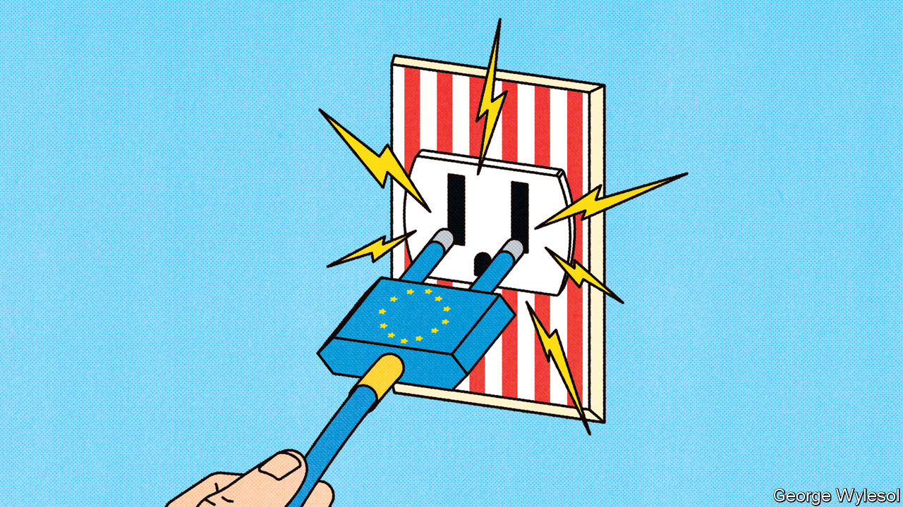
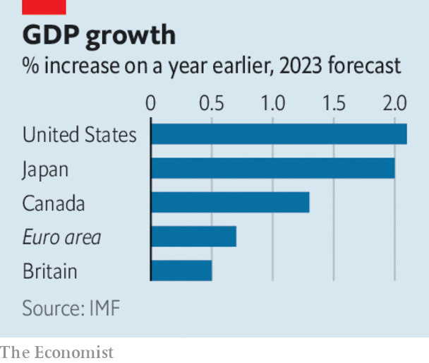

###### A bad example

# Europe should not copy Bidenomics 

##### It needs a deeper, greener single market—not more state handouts 

 

> Oct 12th 2023 

It is not hard to see why Europe feels the urge to copy President Joe Biden’s economic policies. The loss of cheap Russian fossil fuels has made the clean-energy transition feel like a matter of national security. Germany, Europe’s biggest economy, fears its automotive industry will lose market share to state-subsidised electric carmakers in China and America. And the  behind America’s. As we report, the worst-suffering European economies are grappling with inflation of over 10%, rapid ageing, high public and private debts and exposure to autocracies. This week the IMF said the euro-zone economy would grow by only 0.7% in 2023. It expects America to grow three times as fast.

Europeans increasingly see Biden-style industrial policy as the answer. The EU has loosened state-aid rules that restrict subsidised investment, and aims to set targets for the bloc’s production of green goods. France and Germany are at loggerheads over how (not whether) to subsidise electricity for industrial users. , which will probably form its next government in 2024, also aims to spend lavishly on industry. 

 


Yet copying Bidenomics is a mistake. As in America, luring manufacturing with subsidies will waste money and, over time, encourage firms to compete for subsidies rather than customers. And though it is true that France, whose  economic philosophy is in the ascendant in Brussels, has had some successes with industrial policy, the web of institutions and norms that restrain the excesses of French interventionism are difficult to copy—just as Germany’s economic model could not be transplanted elsewhere when it was held up as a paragon. 

Europe’s recent experiences are in fact a case study of the power of markets. After Russia invaded Ukraine, German industry claimed that the loss of Russian gas would cause an economic catastrophe. Instead, industrial production held up as firms quickly adapted. Unlike America, the EU already has a uniform carbon-price mechanism in place. After a rocky start in the 2000s the emissions-trading scheme (ets) has in recent years  for carbon pricing, incentivising the private sector to find the most efficient ways to cut emissions.

The best policies for Europe would build on its past market-friendly approach. The eu should foster a common and contested green single market—including services and capital—which means restraining state aid. It should let the carbon price for new sectors increase faster than planned, and get serious about a climate dividend for citizens. And it should trade freely with allies so that the vast tasks of decarbonisation, de-risking sensitive supply chains and boosting defence can be undertaken at the lowest cost. The EU would be neither more secure nor richer if it had national champions producing 27 different types of tank. 

To boost growth, new government spending should focus on infrastructure, not handouts. Germany should fix a railway system that has rotted to the point of collapse. France should stop blocking interconnectors that could channel solar power from sunny Spain to the rest of Europe. And governments could write procurement rules that insist on greenery or security but which respect the single market and the principles of free trade. 

It might be tempting for Europeans to think that if America is protectionist, everyone else must follow suit or be left in the dust. Actually, America’s long-running economic advantage over the rest of the world stems from the fact that it has been more committed to markets, not less. That makes its recent turn towards statism an aberration rather than an example to follow. ■

