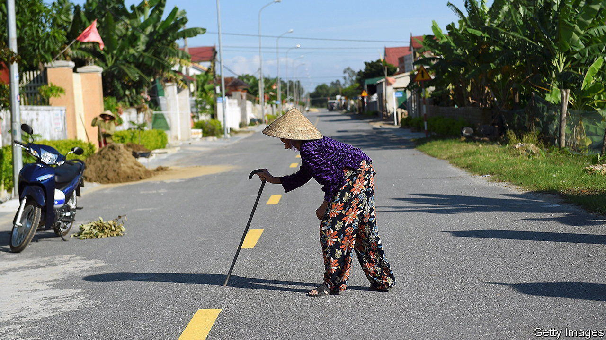
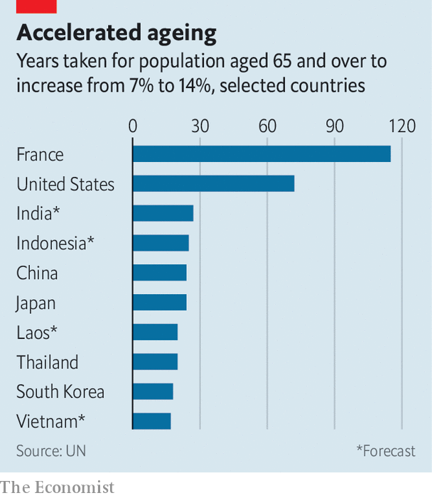

###### Demography

# Large parts of Asia are getting old before they get rich 

##### Even poor countries must start planning for an ageing population 

 

> Oct 12th 2023 

A bulge in a country’s working-age population is a blessing. Lots of workers support relatively few children and retired people. So long as the labour market can absorb a surge of job-seekers, output per head will rise. That can boost savings and investment, leading to higher economic growth, more productivity gains and developmental lift-off. Yet for countries that fail to seize this opportunity, the results can be grim—as many developing countries may soon discover.

Consider Thailand. It is rapidly greying. In 2021 the share of Thais aged 65 or over hit 14%, a threshold that is often used to define an aged society. Soon Thailand will, like Japan, South Korea and most Western countries, see a dwindling supply of workers and, without extraordinary measures, flagging productivity and growth. Yet unlike Japan and the rest, Thailand, with a GDP per person of just $7,000 in 2021, is not a developed country. It has got old before it has got rich. When Japan had a similar portion of oldies, it was roughly five times richer than Thailand is today. 

 


This is a big obstacle to Thailand’s future development. To protect its ageing citizens, many of whom are poor, Thailand’s government will have to spend more on health care and pensions. This will make it harder to invest in productivity-boosting skills and infrastructure. And where Thailand goes, many developing countries will follow. In Asia, where the problem is most advanced, Indonesia and the Philippines are also likely to become aged societies at lower income levels than was the case in the rich world. Sri Lanka, where the average income is a third lower than Thailand’s, will become aged by 2028.

Countries that age before growing rich have failed to seize their demographic opportunity, or aged out of it too rapidly, or suffered both problems. Between 1960 and 1996 (just before the Asian financial crisis), Thailand’s economy grew at an average annual rate of 7.5%. That was impressive, but below Japan’s double-digit clip in its boom years. Meanwhile, thanks to improving life expectancy and other factors, Thailand has aged fast. The share of oldsters in its population doubled, from 7% to 14%, in two decades. It took Japan 24 years to undergo the same change, America 72, and much of western Europe over a century. 

Rapid ageing and slower growth are widespread in the developing world. Vietnamese are about half as rich as Thais and ageing even faster. India’s economy has been one of the world’s fastest-growing, yet not as fast as Thailand’s during its boom. In the decade to 2020 India grew at an average annual rate of 6.6%. 

One conclusion is that countries with a working-age bulge need to wring more growth out of it. India may never have a better chance than the present. Under Narendra Modi it has a strong, pro-business government, which is likely to win re-election next year. There is a consensus on the measures, including privatisation and looser foreign-investment rules, that could raise its growth rate. Such reforms would help India take advantage of Western efforts to shift supply chains out of China. If India needs a cautionary tale to justify action, it need look no further than its own rapidly ageing southern states. In Kerala 17% of the population is 60 or older.

Another conclusion is that developing countries need to start planning for old age earlier. They should reform their pension systems, including by raising retirement ages. They should nurture financial markets, providing options for long-term saving and health insurance. They should create conditions for well-regulated private social care. And they should try harder to increase female participation in the labour force; in India it is a wretched 24%, half the global average. Getting more women into jobs would extend the demographic dividend and help deal with the fact that women live longer than men, but tend to have more meagre savings and pensions, and so are vulnerable in old age.

Finally, developing countries should learn from the errors of rich ones by taking a pragmatic view of immigration. Hard as this can be politically, it is often the easiest way to extend the transition. Building sites in Bangkok already throng with illegal Burmese immigrants. By formalising them, Thai politicians could usher them into more productive roles.

Dividend booster

India provides a happier example of this. A continent-size country, its boom is fuelled by internal migration. Its last census, in 2011, counted 450m internal migrants. Many travel from the poor north to the more prosperous south and west, to seize new opportunities and, increasingly, to take up those being vacated by the south’s ageing workers. It is an inspiring illustration of what relatively unfettered labour markets can do—and a lesson for Japan, Thailand and governments everywhere. ■

