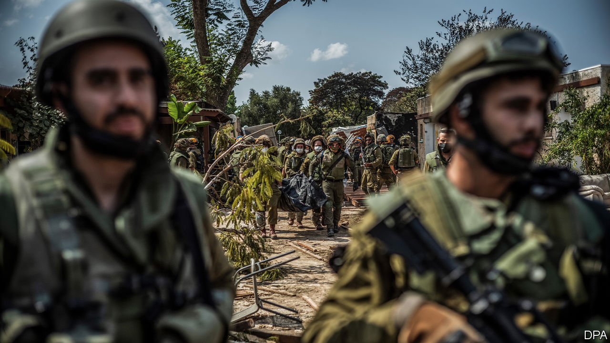

###### The Middle East

# Will Israel’s agony and retribution end in chaos or stability? 

##### Much depends on its offensive in Gaza—and its politicians and neighbours 

 

> Oct 12th 2023 

In a static decades-long conflict that has rotted for the past 20 years, it can be hard to believe that real change is possible. Be in no doubt, however, that Hamas’s murderous assault has blown up the status quo between Israel and the Palestinians. The coming weeks will determine whether war in Gaza sinks the Middle East deeper into chaos or whether, despite Hamas’s atrocities, Israel can begin to create the foundations for regional stability—and, one day, peace.

Change is inevitable because of the . More than 1,200 Israelis, most of them civilians, many of those women and children, were murdered in their homes, on the street, in kibbutzim, at a music festival. Perhaps 150 more have been dragged to Gaza and shut in makeshift dungeons. Israel’s belief that it could indefinitely manage Palestinian hostility with money and air strikes crumpled early on October 7th, as the first Hamas bulldozer breached the security fence. Hamas has chosen mass murder and there is no going back.

Gaza is now awaiting a huge Israeli ground offensive. Its extent and success will determine the legacy of Hamas’s bloody assault. So will the fundamental choice that Israel’s politicians face after the worst catastrophe in their country’s history: do they unite or continue to exploit divisions for their own advantage? A third factor is the choices of Israel’s Middle Eastern neighbours, including Iran.

In the weeks and months ahead Israel’s leaders carry a heavy responsibility to temper their understandable desire for fire and retribution with a hard-headed calculation about their country’s long-term interests and an unwavering respect for the rules of war. They left their people vulnerable by failing to foresee Hamas’s looming attack. They must not compound their error by failing to see ahead clearly for a second time.

The need for vision begins with the imminent ground offensive. The Israel Defence Forces will rightly strike deep and hard at Hamas. But how deep and how hard? Israel will be tempted to unleash a spasm of briefly satisfying violence. Its defence minister has called Hamas fighters “human animals”, and announced a blockade of food, water and energy. Israeli officials—and President Joe Biden—have taken to comparing Hamas to Islamic State, or ISIS, an Islamist group that America vowed to eradicate.

That comparison is dangerous because, although Hamas deserves to be eradicated, achieving that goal in an enclave of 2m impoverished people with nowhere to flee will be impossible. A better comparison than ISIS is the 9/11 attacks in 2001, not just because of Israel’s agony, but also because America’s invasions of Afghanistan and Iraq show how steeply the costs of invasion mount—which is precisely Hamas’s calculation.

At such a moment, self-restraint matters more than ever. It is in Israel’s interest, because street fighting is perilous and the hostages are defenceless. It makes the operation militarily sustainable and preserves international support. It avoids playing into the hands of foes who calculate that dead Palestinian women and children will further their cause. By clinging to its identity as a state that values human life, Israel becomes stronger.

Restraint in the ground offensive depends on the choices of Israel’s politicians. Before the war they were tearing the country apart over a new law curbing the Supreme Court. For now grief and horror have brought people back together, but the left blames the far-right government of Binyamin Netanyahu, the prime minister, for poisoning relations with the army and security services over the court, and neglecting security in Gaza because of a fixation with helping Jewish settlers in the West Bank. The right counters that calls for civil disobedience by senior officials opposed to Mr Netanyahu were a green light for Hamas. 

Mr Netanyahu must try to use his new war cabinet, announced this week, to unite Israel. Only by healing its own politics will the country be able to deal with Gaza. Mr Netanyahu will not want to help his most plausible rivals for office. Yet he was the man in charge when Hamas struck and his political career is ending. Having spent a lifetime seeking power at any price, he should finally put his country before himself.

A unified, centrist government would also be better placed to cope with the last set of challenges: the politics of the Middle East. Israel will be in grave peril if the war in Gaza spreads to its northern border with Lebanon, where tensions with Hizbullah, a formidably armed militia, are already growing ominously. The longer and bloodier the fighting in Gaza, the more Hizbullah will feel it must be seen to support its brethren. There is also a possibility of war with Iran, which has replaced Arab governments as the sponsor of Palestinian violence. Even Iran hawks in the West should not wish for that. 

A wider war would wreck the détente, built on the Abraham accords, between Israel and its Arab neighbours, including Bahrain, Morocco, the United Arab Emirates and potentially Saudi Arabia. This grouping stands for a new Middle East that is pragmatic and focused on economic development rather than ideology. It is still inchoate, but it has the potential to become a force for moderation—and possibly even security.

Simply by surviving, the Abraham accords could emerge from this crisis stronger. However, Hamas has shown that the signatories’ neglect of the Palestinians is a mistake. Israel and its Arab partners need a new, optimistic vision for Gaza and the West Bank, as an alternative to Iran’s cult of violence and killing.

And that leads back to the fighting in Gaza. How does it end? Israel has no good options: occupation is unsustainable, a Hamas government is unacceptable; rule by its rival, Fatah, is untenable; an Arab peacekeeping force is unattainable; and a puppet government is unimaginable. If Israel destroys Hamas in Gaza and pulls out, who knows what destructive forces will fill the vacuum left behind?

Israeli strategists must therefore start thinking about how to create the conditions for life alongside the Palestinians, however remote that seems today. All those elements may have a part: a short period of martial law in Gaza, a search for Palestinian leaders acceptable to both sides, and the good offices of Arab intermediaries. The only way to eradicate Hamas is for Israel and its Arab allies to create stability—and, one day, peace. ■


