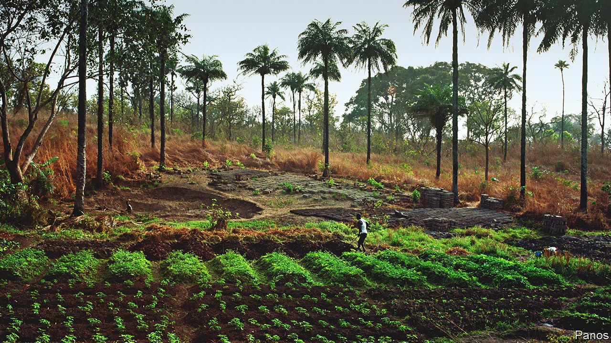

###### Custom redesigned

# Land reform in Africa is challenging the power of chiefs 

##### Activists want to give communities more of a say 

 

> Oct 12th 2023 

Many an investor has taken the road east from Freetown, the capital, into the heart of Sierra Leone seeking land for plantations or mines. Their journey invariably takes them to the door of a local chief. A system based on private land titles reaches no farther inland than the salty sea air.

So it goes in many parts of Africa, where roughly three-quarters of land is under customary ownership. In theory, that means it is managed by communities in line with tradition. But there is no consensus about how that should work in practice. Which community? Whose tradition? Should decisions be made by chiefs, families or individuals? 

These questions are becoming more urgent as the demand for land rises. In 2007 a surge in food prices sparked a land rush. Foreign investors have since concluded large-scale deals for roughly 200,000 square kilometres of land in Africa, an area the size of mainland Britain, estimates Land Matrix, a data platform. That is one reason why many countries are rethinking customary tenure, including Sierra Leone, which rewrote its land laws last year. These do not just change property rights, but also recast political authority.

Access to rural land is often mediated by chiefs, who present themselves as heirs to ancestral tradition. Yet this heritage is somewhat contrived. The British empire, in particular, often strengthened the hand of favoured chiefs over their people. 

That often puts them at the heart of negotiations with investors. Some have staunchly defended their people. Others have struck deals with companies that want land for crops and minerals. “We saw chiefs riding roughshod on communities, insisting on investments even when communities didn’t want it,” says Sonkita Conteh, a lawyer at Namati, a civil-society group that has worked on hundreds of land cases in Sierra Leone.

Chiefs there are elected from historic ruling families by rural notables and serve for life. They often insist they are owners of the land, not mere custodians as the law implies. The new act, which Mr Conteh helped draft, subtly weakens chiefly power. It guarantees women the same land rights as men and for the first time lets descendants of freed slaves own land outside Freetown. Any investment on customary land now needs the consent of 60% of adults in the families who, in effect, own it.

The 14 paramount chiefs, who sit in parliament, complained that an initial draft of the law “effectively abolishes chieftaincy” (the final version was slightly softened). David Farley Keili-Coomber, an urbane engineer and paramount chief, argues that traditional leaders are more responsive to local needs. “Without paramount chiefs, the government in Freetown cannot run this country,” he says.

In many countries governments take on chiefs at their peril. In a survey of 28 countries by Afrobarometer, a pollster, people said that traditional leaders were more trustworthy, less corrupt and better at their jobs than politicians. Half wanted chiefs’ influence to increase.

In Zambia, for instance, traditional leaders walked out of a meeting to discuss the first national land policy, eventually approved in 2021. They have long disliked a law that allows customary land to be converted into leasehold, which in effect transfers authority from chiefs to the state. The growth of cities, national parks and commercial farm blocks have reduced their writ to about half of the country.

Traditional leaders are less popular among South Africans, who tend to say they look after personal interests above those of the people. In Xolobeni, in the Eastern Cape province, a chief supported a proposed titanium mine after he got a directorship and a company car. But a judge ruled in 2018 that the chieftaincy could not override the opposition of the people living there. In general, the power of chiefs to strike deals in the name of communities remains contested. “It’s only the traditional leaders that are seen,” says Wilmien Wicomb, a lawyer who worked on the Xolobeni case. “Everyone under that leader is completely invisible.”

One way to change that is to register ownership. Countries from Burkina Faso to Tanzania have set out on this path. Rwanda has gone furthest. This turns customary land into “something markets can recognise”, says Admos Chimhowu of the University of Manchester, which could also increase land pressures. 

Yet the contest for land need not be a zero-sum game. When an Italian-owned rubber company first came to Ngovokpahun village in Sierra Leone, it exaggerated the benefits it would bring. Now, the locals are negotiating a fairer agreement. At a village meeting they say the relationship with the company has improved. But only because they have learned how to also say no. ■

