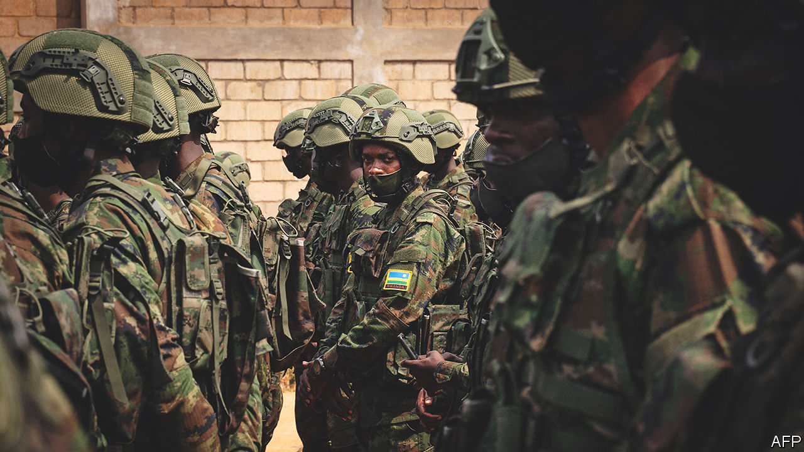
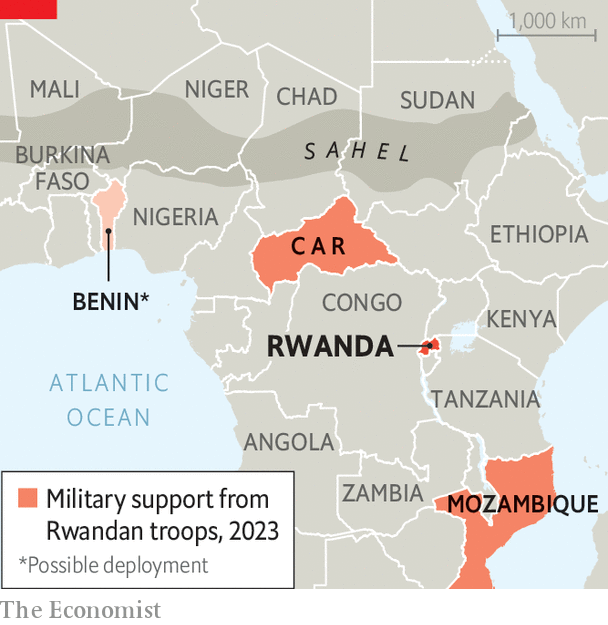

###### Protection racket

# Rwanda wants to be Africa’s new cop on the beat 

##### But it also spreads fear 

 

> Oct 10th 2023 

Paul Kagame may cut a slight figure, yet no one would ever accuse him of lacking stamina—or ambition. He has run Rwanda for almost 30 years since he led a rebel army that toppled its genocidal regime in 1994, but shows no sign of flagging. Last month he said he would run for a fourth presidential term in elections next year. He will almost certainly win because many opponents are  to stand against him, some having been locked up before previous polls. 

If  is going nowhere, his army is certainly on the hoof. Rwandan troops are fighting rebels in the Central African Republic and waging war against jihadists in Mozambique. Now they are thought to be preparing to deploy to Benin, some 3,000km from home, to fight insurgents on the fringes of the Sahel. 

These far-flung troop deployments are at the heart of Mr Kagame’s strategy of making Rwanda an exporter of security across Africa—the neighbourhood cop, if you will. He is filling a vacuum that has emerged amid turmoil. Jihadists are terrorising millions across the Sahel. Western influence is being challenged by China and Russia and by newcomers such as Russia’s Wagner mercenary group. 

Yet the irony of Mr Kagame becoming Africa’s policeman is that his own government is also one of the most thuggish on the block. A report released on October 10th by Human Rights Watch (HRW), an international advocacy group, documents Rwanda’s extraterritorial campaign of intimidation, which includes more than a dozen murders, kidnappings or attempted kidnappings and violent attacks targeting Rwandans living abroad since 2017. 

The government has previously been accused of killing high-profile exiles such as Patrick Karegeya, Mr Kagame’s former intelligence chief, who was found strangled to death in a hotel room in South Africa in 2014. That prompted a rebuke from America. (Mr Kagame has denied Rwanda’s involvement, but with a nod and a wink, telling the : “I actually wish Rwanda did it.”) The report by HRW suggests not just that the abuses are widespread and continuing, but that they may also be facilitated by Mr Kagame’s troop deployments abroad. Rwanda’s government said that “Human Rights Watch continues to present a distorted picture of Rwanda that only exists in their imagination” and added it had made progress in improving people’s well-being.

At first glance, the idea of Rwanda exporting security seems rather odd. It has a population of just 13m, a GDP per person roughly half that of Haiti and only 33,000 regular soldiers. But its troops are tough and well trained and have inflicted crushing defeats on Congo, which is 100 times its size by area. Rwanda is the world’s third-largest contributor to UN peacekeeping missions. The nearly 6,000 blue helmets it sends abroad bring in some $8.5m a month. They have also won the gratitude of Western policymakers, helping Rwanda gain access to training and equipment from NATO members, says J. Peter Pham, a former American diplomat. Over the past few years Mr Kagame has been providing troops directly to embattled governments. 

In 2020 he sent almost 1,000 soldiers to fight rebels threatening Faustin-Archange Touadéra, the president of the Central African Republic, where they fought alongside Wagner mercenaries. The following year Rwanda sent troops to Mozambique, where jihadists have halted a $20bn gas project led by TotalEnergies, a French oil firm. Benin is the latest country to call on Mr Kagame for help, after incursions by jihadists from Burkina Faso and Niger. 

 


These deployments appear to serve two broad aims: to make money and influence people. The European Union has contributed €20m ($22m) to Rwanda’s mission in Mozambique. But that does not buy much. The real payback appears to be through Rwandan firms getting rights to mine minerals. Mr Kagame acknowledged as much in an interview with the , saying that since Mozambique and the Central African Republic had no money, they had agreed to “find another way” to compensate Rwanda. A number of Rwandan companies have piled into both countries, many of them linked to Crystal Ventures, a sprawling holding company that is the investment arm of Rwanda’s ruling party. “Wherever the army goes, Crystal Ventures follows,” says David Himbara, a former economic adviser to the president and now a vocal critic in exile. 

More than 100 Rwandan companies are registered in the Central African Republic, according to the International Crisis Group (ICG), a think-tank, up from about 20 in 2019. A firm linked to the Rwandan government has reportedly been granted 25-year concessions over five mines. Rwandan companies linked to Crystal Ventures are doing deals in Mozambique, too. 

The second pay-off is diplomatic. Some Western countries see Rwanda as a useful counterweight to Wagner. Last year American officials involved the country in secret talks with Mr Touadéra in an effort to displace the Russian mercenaries, according to the ICG. Meanwhile, many suspect Mr Kagame ended a three-decade-long bust-up with France by riding to the rescue of Mozambique, where TotalEnergies operates. In return France announced a €500m aid package for Rwanda, to be disbursed over four years, having given less than €4m as recently as 2019. 

Deploying troops to Benin would make Rwanda an even more valuable ally by helping the West “maintain its influence while decreasing its footprint”, says Mvemba Dizolele, the Africa director at the Centre for Strategic and International Studies, a think-tank in Washington. Yet Rwanda’s diplomatic efforts may well be undermined by its human-rights abuses and other meddling in the region. UN investigators have accused Rwanda of backing the M23, a rebel group that is destabilising parts of eastern Congo. On September 15th America suspended military assistance to Rwanda over this issue. At the core of Rwanda’s appeal for the West is its offer to improve security and stability in the region. That seems less of a bargain if it is also sowing chaos and fear. ■

