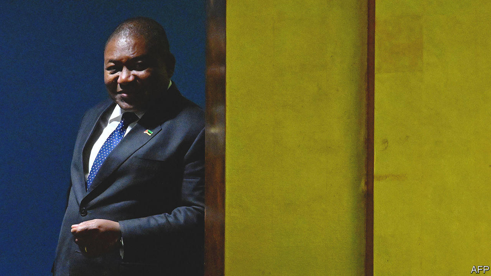

###### The reluctant litigant

# The fallout from Mozambique’s debt scandal reaches a London court 

##### But too much transparency makes the government nervous 

 

> Oct 12th 2023 

It was the biggest corruption scandal in Mozambique’s history, involving more than $2bn of borrowing by three state-backed firms, mostly done in secret, and greased by kickbacks. On October 16th, a decade after the first loan was agreed, the reverberations will reach the High Court in London. There the government of Mozambique is seeking more than $2bn in damages from Privinvest, a group of firms based in Lebanon, and its boss. 

Mozambique, however, seems to have mixed feelings about its case being heard. On October 1st it reached a last-minute settlement with Credit Suisse, the bank that helped arrange two of the deals. The terms are not public, but a person with knowledge of the matter says the bank forgave $440m in debt, although it had already agreed to cancel much of that in a deal with British regulators in 2021. The government will pay less than $50m to other external creditors. It has not yet settled with VTB, a Russian bank that was also involved in the original transactions. UBS, which completed a takeover of Credit Suisse in June, and Mozambique declined to comment on the sum.

The agreement makes sense for UBS, which is trying to clean up the mess it inherited. And Mozambique may have been happy to reduce its debt while also staying out of court, possibly because of the role played by its own officials in the scandal. 

The case now continues against Privinvest, which supplied equipment for maritime security and fishing boats. Mozambique says that Privinvest paid $136m in bribes and secret commissions to Credit Suisse bankers, Mozambican officials and others to procure state guarantees (the firm says that payments it made were lawful). But the government is in a tricky position. Frelimo, the party that presided over the scandal, is still in power. Preparations for the trial in London have been hampered by officials’ reluctance to disclose relevant documents, citing state secrecy.

The knottiest issue is the role of Filipe Nyusi, the president (pictured), who was defence minister when the deals were made. Privinvest says it contributed $1m to his campaign and $10m to his party before elections in 2014. If other payments to Mozambican officials are deemed unlawful, its lawyers argue, then so should these. That would make the president liable for damages sought by his own government. Last month a British judge ruled that Mr Nyusi enjoys immunity as a serving head of state, although Privinvest can appeal. Mr Nyusi has denied any wrongdoing.

The court will no longer evaluate an $830m claim relating to the economic fallout of the scandal, which caused the IMF and foreign donors to suspend support. After settling with Credit Suisse, the government dropped this part of its claim, saying it doubts the other defendants can pay. The tab has been picked up by the people of Mozambique, who are poorer today than they were when the debt deals were struck.

The settlement with Credit Suisse also means that fewer awkward details will be raked over in court. An “opportunity for transparency” has been missed, says Adriano Nuvunga, an anti-corruption campaigner. The settlement was made, he argues, “to protect those in power”.

Although much of the truth has already been exposed, there may still be more to come. One person who could spill the beans is Manuel Chang, the former finance minister. He was arrested five years ago in South Africa and extradited in July to America, accused of taking $18m in bribes (he has pleaded not guilty). 

Other officials are already behind bars. Last year a court in Maputo sentenced 11 people to prison for their role in the scandal, including the son of Armando Guebuza, Mr Nyusi’s predecessor as president, who comes from a rival faction of the party. That trial was broadcast on national television. By comparison the proceedings in London have barely registered with Mozambique’s public. That may be just how the government wants to keep it. ■

