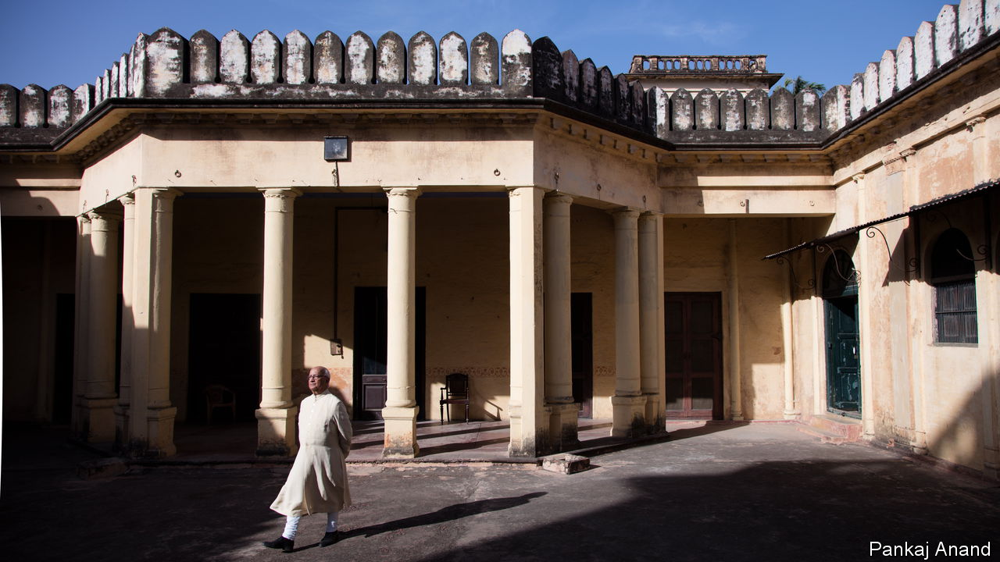

###### A foe who never was

# Muhammad Amir Muhammad Khan fought India’s government for five decades 

##### The still-dispossessed Rajah of Mahmudabad died on October 4th, aged 80 

 

> Oct 12th 2023 

The bad news came when Suleiman was 14. He was at La Martinière College in Lucknow in Uttar Pradesh, where the sons of the wealthy went and where he, being fond already of poetry and philosophy, spent his time discovering and memorising the plangent quotations he later loved to drop into conversations. It was the end of term. The news was that his father, the Rajah of Mahmudabad, had left for Pakistan and become a Pakistani citizen. 

The year was 1957, ten years after Partition had sundered new-formed Pakistan from India. A million people had died; perhaps 10m had been displaced. The family lands were not divided, but his father, a devout Shia Muslim who hosted religious ceremonies at the family Qila, a 17th-century fort-shrine near Lucknow, found himself torn. Before Partition he had become friends with Muhammad Ali Jinnah, Pakistan’s founder, who had spent his honeymoon in the family-owned and celebrity-crowded Hotel Metropole in Nainital. That friendship, and the rajah’s sudden decision to change allegiance, was to cause his son (popularly known as Suleiman) trouble for the rest of his life. 

His mother, though felled by a seizure at this calamity, had refused to follow her husband. She stayed at the family base in a wing of the Qaiserbagh Palace in Lucknow, a splendid Mughal pile with minarets, pediments, columns and lanterns, even though the British in 1857, the year of the Rebellion, had badly knocked it about. The wing was luxurious, with thick Persian carpets, gilded panelling and chandeliers, under which his mother held spark-ling parties. Nearby stood the Butler Palace, a gem of Rajput architecture that housed the library of the Indian Council of Philosophical Research. The family also owned the Halwasiya Market, Lucknow’s teeming commercial hub, and most of Hazratganj, with its bazaars. In all they had 936 properties scattered across north India, a vast span. As for Suleiman, he sailed into a maths tripos at Cambridge and a doctorate on stellar oscillation. 

He was still in Europe when a second piece of bad news reached him. It was worse than the first, but also its consequence. His father had died, and under the Enemy Property Act (EPA), passed in 1968, all the family’s properties had been confiscated by the Indian government. Money was running out fast. Abandoning his telescopes, Suleiman rushed home. 

The confiscation, he knew, was baseless. In the Indo-Pakistan war of 1965 the government had seized assets in India owned by Pakistanis. His father, of course, had become one—though, disillusioned, he quickly left Pakistan for London. But Suleiman had never ceased to be Indian. Nor had he ever gone to Pakistan. When Partition happened his father had taken him, aged four, to the holy city of Karbala in Iraq. When he returned, at nine, fluent in Arabic and Persian as well as Lucknow’s Urdu, it was to resume his life in India. To call his father an “enemy” was outrageous enough, when Mahmudabad money had founded the University of Lucknow, King George’s Medical College and several schools. To ignore his own right and title as an heir compounded the offence. 

Being an aristocrat, his first thought was to go to the top. He spoke to several prime ministers and wrote to others, mostly getting nowhere. Moraji Desai rebuked him for studying astronomy rather than astrology. Frustrated, and knowing he was the largest property-owner affected, he then took his case against the EPA to the Supreme Court. In 2005 it decided categorically in his favour. “Can the property of an Indian citizen be termed as enemy prop-erty...?” the ruling read. “Answer is emphatic No.” 

Clear as that was, the government still resisted. Its own officials now sat in Mahmudabad properties, and rents from the family’s farms and markets now came into its own coffers. It also claimed to be worried about unrest if all the merchants in Hazratganj, for example, were now evicted by Suleiman. In 2010 it simply overrode the Supreme Court’s decision with an emergency decree that allowed it to retake control. 

He was in despair. His properties were crumbling. In the five-year respite he had been given, restoration had not got far. It now got no further. In his rusting white Ambassador car he would be driven from one to the other, his usual smiles eclipsed by gloom. In the Qaiserbagh Palace the carpets, if any, were worn and motheaten, and ochre paint flaked from the walls. Sparse furniture was scattered here and there, and the books were heavy with dust. The Butler Palace was in a pitiful state: the marble ripped out, and the garden, where the family would gather for tea in the evening, waist-high in weeds and rubbish. The Qila, where he continued to manage the shrines and the ceremonies, was a part-locked shell in which his throne stood in an almost empty hall. The Hotel Metropole in Nainital had become a car park. 

What hurt him far more, however, was the label “enemy”. Anyone less like an enemy could hardly be imagined. He barely left India, except for short professorial stints in Europe. For a while he was a state MP. His heart was in Lucknow, once a city of poetry and elegance; his joy remained books. Yet for years his main, obsessive reading had been the Enemy Property Act, with amendments, of which his two sons too knew every clause and line. 

Meanwhile, the government stayed one step ahead. In 2017 the EPA was amended yet again by Narendra Modi’s government to include, retroactively, the legal heirs of Pakistani citizens; even if like him they were, and had always been, Indian. He was made an enemy twice over, and with that non-status he remained. 

Latterly he left his case, as the Koran advised, in God’s hands. But another thought also helped him. It was a patriotic one. In 2005 India had overturned the grave injustice done to him. Being India, a country he deeply loved and respected, it might well find the spirit to do so again. ■

