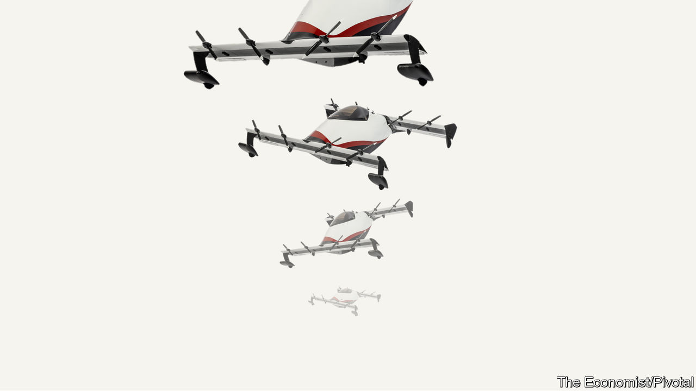

###### Meet George Jetson

# A flying car that anyone can use will soon go on sale 

##### No pilot’s licence will be necessary to fly the Helix 

 

> Oct 10th 2023 

Electrically powered vertical-take-off-and-landing (eVTOL) aircraft—flying cars, to the layman—are an idea whose time has not quite yet come, but is fast approaching. Many firms are jostling with each other, offering designs that range from scaled-up multirotor drones, via things which resemble rigid spiders’ webs, to fixed-wing/helicopter hybrids. None of these, however, will be Jetson-like family saloons with dad (or even mum) at the controls. Those flying them will require a pilot’s licence. Most will probably be used initially as sky-going taxis.

One company has, by contrast, stuck to its guns and carried through its original project to create something which people can purchase and pilot themselves. Helix is a single-seat vehicle, so “flying motorbike” might be a more accurate appellation. It has, however, been carefully crafted by its maker, Pivotal, based in Silicon Valley, to be within America’s rules for microlight aircraft. That means anyone, pilot’s licence or not, can fly it over non-built-up areas. As a result, from next year those with $190,000 stuffed down the back of the sofa will be able to order one for personal use—though they will not be able to take delivery until June.

It has been a hairy ride. Pivotal, known as Opener until October 5th, the day Helix was announced, was founded by Marcus Leng, a Canadian. Mr Leng is a mechanical engineer. In 2011, having built up and sold a manufacturing company, he found himself at a loose end. He had, he says, always been interested in flight, and some back-of-the-envelope calculations he made suggested that electric lift-off of a human-carrying craft, using motors powered by the lithium-ion batteries that were then becoming fashionable, ought to work.

He thus built a prototype and flew it in the garden of his house in Warkworth, Ontario. He called it BlackFly. It was (and still is, for it is preserved in the company’s museum) almost literally a thing of sealing-wax and string. The airframe consisted of carbon-fibre struts held together in at least one place by a chopstick. The propellers were wooden. It rose into the air but once. That flight was, though, the first ever made by a human being in an eVTOL craft. 

Twelve years later, after much tinkering, the firm thinks it has something marketable. On the way, besides changing its location, its name, and the name and livery of its putative product (Helix is largely white, with a red go-faster stripe), it has also changed boss. Mr Leng handed over the reins in 2022, to Ken Karklin, who had previously worked for AeroVironment, a maker of military drones.

The rebaptised aircraft has, nevertheless, changed little in its fundamentals over the years. The struts which held the original together have been replaced by a monocoque body. The chopstick is gone. But it still sports two pairs of wings, one fore and one aft, and eight propellers (two on each wing), meaning it vaguely resembles a squashed “H” when seen in the sky from below. And there is no undercarriage. Instead, its belly is curved in a way reminiscent of a humpback whale’s, so it rocks to stability after landing. 

Pilot’s licence or not, buyers will still need to undertake at least some training to fly a Helix. Pivotal insists on this—not least because it worries that an early accident would be catastrophic for sales. For the same reason, the craft’s software will stop the pilot doing anything that does not fit inside its aerodynamic-safety envelope. And if, despite this, something does go wrong, it is fitted with a parachute. Pull the appropriate knob hard and an explosive charge will blast this clear of the fuselage, allowing its canopy to open and carry the aircraft to terra firma. 

The Helix’s top speed is a respectable 100kph, but its range is only 30km. And refuelling it is a bit of a pain. Filling up from the mains takes 4½ hours, though a special high-power system similar to those employed for electric cars can bring that down to 75 minutes. Not yet quite the Jetsons, then. But a possible step on—or perhaps above—the road. ■

