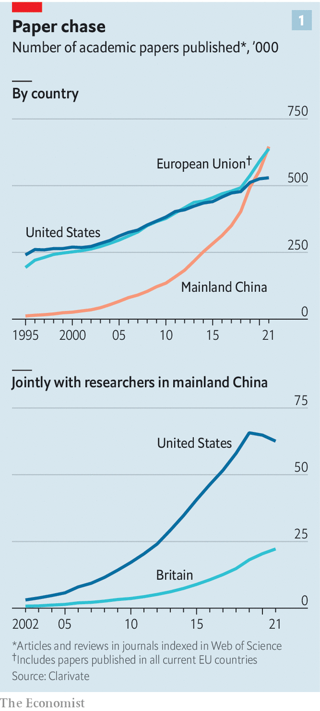
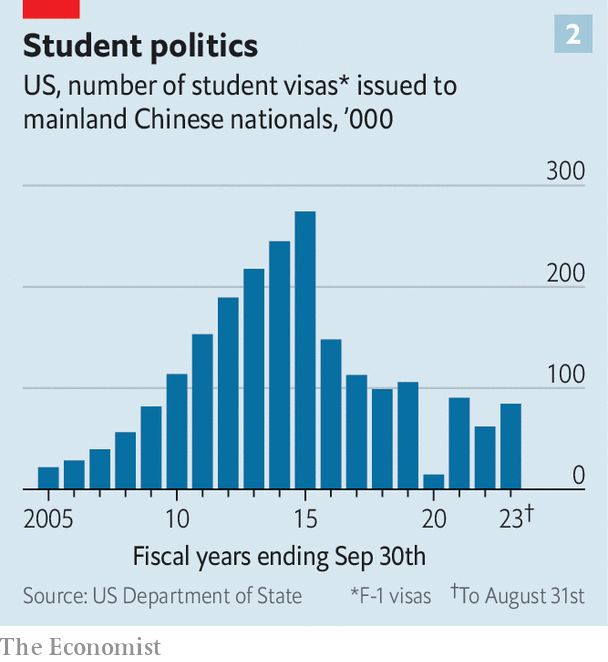

###### It’s all academic

# American and Chinese scientists are decoupling, too 

##### That will be bad for both countries 

 

> Oct 11th 2023 

THERE ARE lots of ways to measure China’s rise. It is the world’s second-biggest economy, its biggest manufacturer and its biggest creditor. In 2021 it passed another milestone. That year, for the first time, Chinese scientists published more papers than their counterparts in America or the European Union (see chart 1). It is not just the quantity that is improving. The  Index, run by the publishers of the journal of the same name, tracks contributions to the world’s best-regarded health and natural-sciences journals. Chinese researchers rank first in the natural sciences, and second overall.

Cause for celebration, no doubt, in Beijing. In Washington, though, the news may have been less welcome. America increasingly dismayed by China’s rise—and especially its growing scientific and technological prowess. Under Donald Trump, the previous Republican president, and Joe Biden, the current Democratic one, it has imposed tariffs, rules and subsidies designed to hobble China’s high-tech firms while boosting its own. China has retaliated, moving against some big American tech companies. Twenty years ago, politicians endorsed globalisation and free trade. Now “decoupling”, national security and “friend-shoring” are the hot topics. 

Conscious uncoupling

Academia is not immune. New rules and chilly politics in both countries are making it harder for researchers to collaborate. In August America agreed on a temporary, six-month extension for a landmark scientific co-operation agreement signed in 1979. Several American politicians want the deal scrapped entirely, claiming in an open letter that, by collaborating with Chinese researchers, America was “fuelling its own destruction.” 

 


The strains can be seen in the figures. In 2020 the number of papers jointly written by American and Chinese researchers fell for the first time. It fell again the following year, the most recent for which data are available, though it is still rising for some other countries, such as Britain. The number of visas America awards to Chinese students and academics is down as well, to around a third of its peak in 2015 (see chart 2). Scientifically as well as politically, the countries are drawing apart.

The Science and Technology Agreement, as the 1979 pact is called, was the first bilateral treaty signed between America and China after they re-established diplomatic relations. Several landmark studies have come under its umbrella. A long-running project following 285,000 Chinese women, begun in 1983, helped demonstrate that folic acid could prevent spina bifida, a rare birth defect. These days folic acid is added to flour, bread, cereal and other staple foods; pregnant women are encouraged to take more. Co-operation in influenza research helps anticipate which strains of flu are likely to be dominant each year, improving vaccines. 

Even superpower rivals can agree that medical research is a good thing. But China’s advances in other areas of science, such as computing, materials science and AI, have made American policymakers uneasy. Critics argue that science in China has benefited from American academic transparency and know-how—but that China has not always returned the favour. Doubters also point to China’s policy of “civil-military fusion”, in which the fruits of civilian research are scrutinised for any useful military applications.

China retorts that America’s worries about national security have led to the unfair targeting of Chinese researchers at American universities. One frequent target of complaint is the Department of Justice’s “China Initiative”, which ran between 2018 and 2022 and was designed to investigate alleged instances of Chinese technological espionage. But cases seem to have been thin on the ground. The initiative investigated at least 150 academics of Chinese origin, but managed to secure only a handful of convictions. Some were for less offences such as grant fraud. 

 


Some of the investigations have become very public fiascos, as with the case of Gang Chen, a well regarded mechanical engineer of Chinese origin who is now at the Massachusetts Institute of Technology. Dr Chen was arrested in 2021. He spent a year on academic leave before all the charges against him were dropped. Other researchers have been sacked by their universities and found themselves on no-fly lists. Academics say the initiative led to an atmosphere of suspicion and mistrust. 

China, meanwhile, has national-security concerns of its own, which can likewise impede co-operation. Rules introduced in recent years all but prohibit the export of many different kinds of data. Officials have banned the collection of genomic data by non-Chinese entities, for instance. Foreign social-science researchers are rarely given access to economic and social surveys without a friend in the government. The rules are vague, leaving even researchers keen to work with colleagues overseas unsure what they are allowed to share.

A cooling of ties will make life harder for both sides. Chinese academics will find it harder to get experience in American universities, which still dominate the world rankings in almost every subject. And because China is now a scientific power in its own right, with cutting-edge researchers in several fields, American science will suffer, too. 

The benefits of collaboration are “significant,” and benefit American institutions slightly more than Chinese ones, says Jonathan Adams, who tracks academic information at Clarivate, a data provider. A study published in 2020 by Jenny Lee and John Haupt at the University of Arizona, found that, when papers co-written with Chinese scientists were excluded, the number of American publications in science and engineering fell slightly between 2014 and 2018. 

Give me your brainy masses

America’s scientific pre-eminence has been built at least partly on its ability to attract the world’s best. Before the pandemic around 16% of graduate students in science, technology, engineering and mathematics at American universities were Chinese. The grad students of today often become the professors of tomorrow. Like Dr Chen, many Chinese students choose to stay in America after completing their degrees. That is something America’s leaders should be keen to encourage. ■


