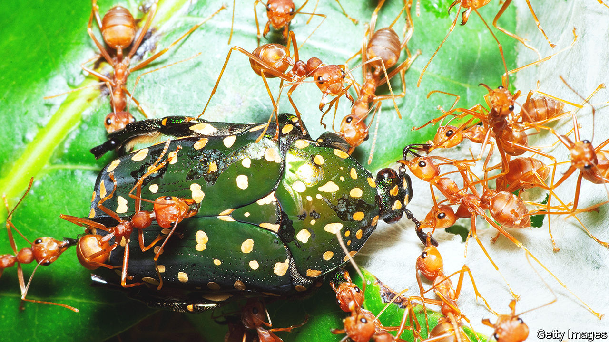

###### Camp followers

# Like human armies, army ants trail crowds of hangers-on 

##### One insect’s leavings is another’s dinner 

 

> Oct 11th 2023 

Like human armies, army ants spell trouble for anything that finds itself in their path. The insects make a habit of , often much larger than themselves, breaking them into pieces and dragging the morsels back to their bivouacs. But they do not eat everything. Rubbish piles full with discarded bits of prey are a feature of army ant bases. 

Where there is carrion, there are usually scavengers. But little is known about which animals scavenge on army ant leavings. As recounted in a paper in , Christoph von Beeren at the Technical University of Darmstadt and Daniel Kronauer at the Rockefeller University in New York, both entomologists, went to the rainforests of Costa Rica to find out. They found an entire ecosystem in miniature thriving among the leftovers. 

Tracking scavengers such as vultures or hyenas on the savannah can be done with a folding chair and a pair of binoculars. Monitoring tiny insects in a rainforest is much trickier—one reason why ant scavengers had not been examined before. But the researchers hoped modern DNA analysis techniques might make the job manageable. Working with a team of colleagues, they followed ant trails back to their bivouacs, finding 34 sites in total. 

The researchers used a handheld vacuum cleaner to suck up all the bugs at each refuse pile and brought the sucked up samples back to a field laboratory for sorting. To keep the task manageable, the team confined themselves to examining only the beetles they had collected, leaving the other critters for later work. They identified the beetles they could and ran DNA analyses on those that they could not. 

In total, they collected 8,364 adult beetles, 511 beetle larvae and 24 beetle eggs. Those were spread across 91 species, several of which were entirely new to science. Aside from that being far more than anyone had expected, the presence of the larvae and eggs indicates that the refuse piles are not so much convenient restaurants as full-on homes, where the beetles live out their entire lives.

Precisely how these species manage to avoid being eaten themselves by their army-ant hosts remains to be determined. Dr von Beeren speculates that a hygiene instinct that keeps the ants from eating material that has been taken to their refuse piles is at least partially responsible. And many species of beetles are able to produce compounds that smell repulsive to ants.

The research only scratches the surface of what is going on in the rubbish piles. Besides a bewildering variety of beetles, the middens were rife with mites, springtails (whose ability to jump long distance often sees them confused with fleas), as well as other varieties of scavenging insect that the team simply did not have time to include in their analysis. With so many different species present, the chances are high that among these insects are some predators too, seeking to feed on unsuspecting scavengers in turn. 

Before mechanised transport and long supply lines, human armies were followed around by cooks, merchants, beer-sellers and prostitutes, all of whom made a living off the activities of the soldiers. It seems that army ants, with their own host of hangers-on, are not . ■


