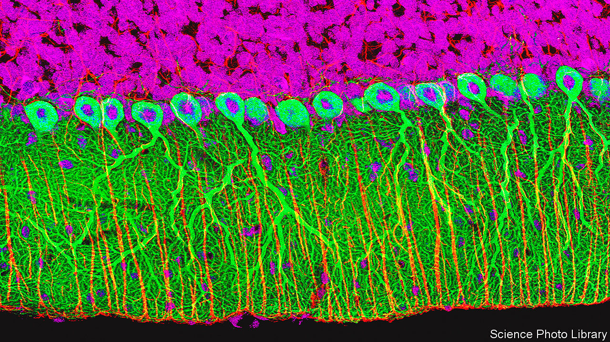

###### Neuro-philately

# Scientists have published an atlas of the brain 

##### Cataloguing its components may help understand how it works 

 

> Oct 12th 2023 

Lord Rutherford, the discoverer of the atomic nucleus, divided science into physics and stamp collecting. (He was, after all, a physicist.) But he had a point. Other sciences, such as astronomy, chemistry, geology and, most notably, biology, rely a lot on collecting things (not literally, in the case of astronomy) and classifying them in various ways that would delight philatelists. Physics, by contrast, relies on analysing phenomena.

That said, the philatelist branches of science have been pretty successful, biology especially. And this week sees the addition of a new album to biology’s collection, in the form of 21 papers about the brain and its cells. The work was done under the purview of the BRAIN Initiative Cell Census Network, which is organised by the National Institutes of Health, in America. The papers are published in various bits of the American Association for the Advancement of Science’s empire of journals,  and its spin-offs. They are intended to help answer three, related questions: what and where are a brain’s cellular components; which cells are involved in neurological and psychiatric illnesses; and what makes the brains of  different from those of other animals?

Brains, particularly human ones, are the most complex objects in the known universe. That complexity is emphasised by the fact that, as these papers confirm, they are reckoned (depending on how you define such things) to contain about 3,000 different types of cell. For comparison, it was not so long ago that entire human bodies, brains included, were estimated to be built from just 300 cell types.

The estimate was confirmed by a team of researchers at the Karolinska Institute, in Stockholm, and the Allen Institute for Brain Science, in Seattle. They studied, post mortem, the brains of three men and a woman, taking 606 samples from nine regions of the organ and also one from the spinal cord. They then extracted the nuclei of individual cells and looked at the RNA molecules therein.

RNA is chemically similar to DNA, and comes in many varieties, each with a different job. One of the most important is to act as a messenger, carrying instructions for how to make particular proteins from the nucleus, where the genes that encode protein recipes are stored as DNA, to the cellular factories, called ribosomes, which churn those proteins out. Analysing those RNA messengers reveals which proteins are being made. And the proteins a cell produces determine what type of cell it is. 

On that basis, the two institutes’ researchers found 31 “superclusters” of cells with similar patterns of RNA expression. These, in turn, divided into 461 clusters and 3,313 subclusters—in effect, individual cell types. Superclusters tended to be concentrated in one or a few brain regions (for example, the cerebral cortex had 16, the hippocampus had 12 and the cerebellum six). But there was an exception. This was a supercluster the team called “splatter neurons”. These turned up all over the place.

Other groups dug into the details. Bing Ren of the University of California, San Diego and his colleagues, for example, attempted to characterise cells not directly by their messenger RNA but rather by differences in the way the DNA in their chromosomes was packaged. By allowing—or forbidding—access to the DNA, such packaging helps regulate which genes are transcribed into RNA messengers. 

This yielded 107 recognisable patterns. Intriguingly, some of these patterns could be correlated with neurological traits and illnesses. The team compared the locations of pieces of DNA that control gene transcription, and which are known to have disease-associated variants, with the DNA-packaging patterns of different sorts of cells. They found correlations with 19 conditions, including schizophrenia, depression, bipolar disorder, Alzheimer’s disease and various forms of addiction.

A third group, meanwhile, led by Rebecca Hodge and Trygve Bakken of the Allen Institute, compared the brains of humans with those of chimpanzees, gorillas, macaques (a group of old-world monkeys) and marmosets (a group of new-world monkeys), looking for clues to the elusive question of what makes human brains human. They found that part of the answer may lie not in the neurons themselves, but in the supporting cast of non-neuronal brain cells, called glial cells.

Clues to humanity’s essence are likely to be found in parts of the genome called HARs and hCONDELs. HARs stands for “human accelerated regions”. These are bits of the genome that have remained unchanged in apes and monkeys, but which are altered in humans. hCONDELs—“human-conserved deletions”—are the opposite: places where DNA found in apes and monkeys is missing in people. The team found that genes in and around both areas are often particularly active or particularly inactive in glial cells.

Glial cells come in three varieties: astrocytes, which regulate the flow of information across junctions between neurons; microglia, which prune links between neurons to keep the network in order; and oligodendrocytes, which insulate nerve fibres and tweak signals running along them. That suggests part of what gives human brains their humanness lies in these microscopic details of their architecture.

A good start, then. But this work only scratches the surface of the brain’s true complexity. To understand that properly requires not only listing and describing the various components, but also elucidating out how they are wired together into functional units. Collecting stamps is fine. But you need more than that to work out how a postal service operates. ■


