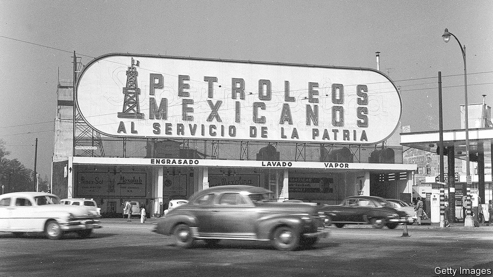
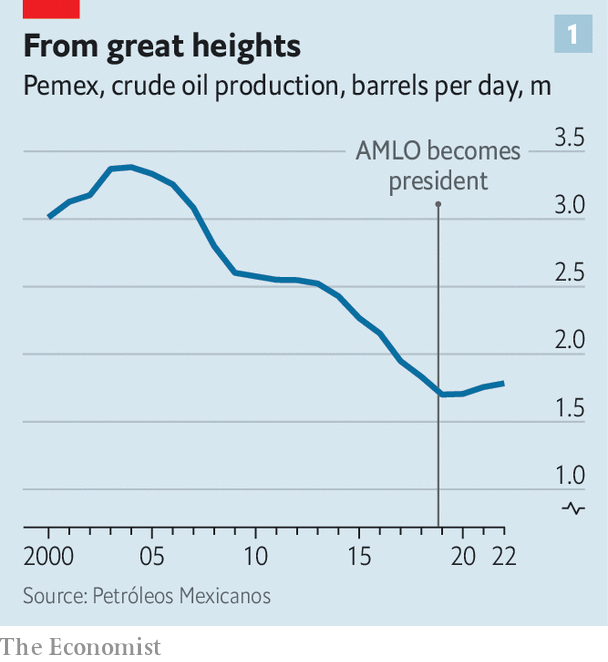
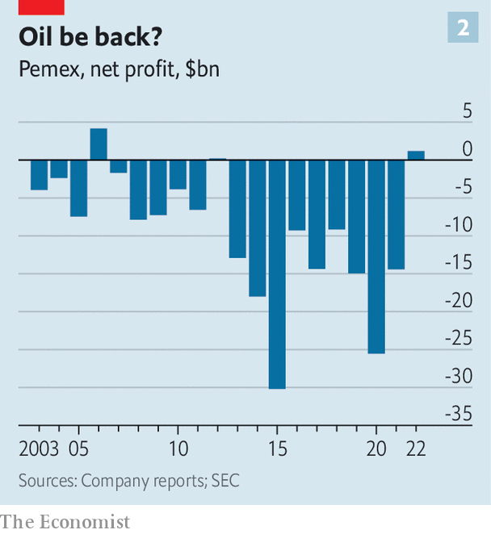

###### Back to the future

# Pemex is the world’s most indebted oil company 

##### Why is the Mexican government propping it up? 

 

> Oct 12th 2023 

It is rare for the CEO of a company to admit to being anxious. But when, on October 9th, Octavio Romero, head of Pemex, Mexico’s national oil company, appeared before lawmakers, he came close to doing so. Mr Romero confirmed the substance of a letter leaked in September, in which Pemex informed Mexico’s treasury that it was unable to pay over $500m owed to three suppliers, one of which has started a dispute-resolution process. “We are busy, rather than worried,” Mr Romero claimed, not entirely convincingly. 

Pemex has been the world’s most indebted oil company for several years. Its debt is over $100bn, equivalent to 8% of Mexico’s GDP. While Pemex’s exploration and production arm is profitable, the company is facing losses elsewhere, particularly from its refining operations. In July Fitch, a credit-rating firm, downgraded Pemex. The company’s debt is a risk to the country, too. Moody’s, another ratings agency, mentioned it as a factor in its decision in 2022 to downgrade Mexico’s rating. The recent affair over the $500m means Pemex will need more financial support from the government. For how much longer can the oil giant rely on bail-outs to stay afloat? 

Some of Pemex’s problems have a long history. In the 1970s after Cantarell, one of the world’s largest oil fields, was discovered in the Gulf of Mexico, Pemex was the motor of the Mexican economy. But governments viewed it as a cash cow “and milked it to death”, says Jorge Castañeda Morales, an analyst. 

Successive governments also imposed exorbitantly high taxes on Pemex, limiting its ability to invest. They compelled the company to take decisions that were not always sound from a business perspective. As a result Pemex never properly ventured into gas exploration and has an underdeveloped petrochemicals operation. Carlos Elizondo, a former member of Pemex’s board, describes the relationship between the state and the oil giant as a “marriage full of problems”.

Enrique Peña Nieto, Mexico’s president between 2012 and 2018, tried to make Pemex more independent and profitable, as part of his shake-up of the energy sector. He removed oil subsidies and opened the sector up to private companies. This led to some successes, such as the discovery of new fields. However, during his administration, Pemex’s debt ballooned, from $61bn in 2012 to $106bn in 2018. The company became riddled with corruption. Pemex was embroiled in the Odebrecht scandal, in which a Brazilian construction giant paid millions of dollars in bribes to secure contracts. Emilio Lozoya, a former head of Pemex, is in prison awaiting trial for corruption (he has pleaded not guilty). 

Playing with fire

Since coming to power in 2018 President Andrés Manuel López Obrador has set out not only to rescue the company but to restore its former glory. He wants to slash the company’s debt, make Mexico self-sufficient in petroleum and increase oil output by 45%. His government has injected over 1.3trn pesos ($73bn) cumulatively into Pemex, with plans to hand it a further 4.6bn pesos in the 2024 budget. Pemex’s tax rate has been reduced from 65% in 2018 to 40% today, and will fall to 35% in 2024.

Mr López Obrador is concerned about energy security, as Mexico imports some 60% of its natural gas from the United States alone. But he also wants to turn back the clock and ensure that oil is powering the economy. As a result, the government is pouring money into the company without demanding it carry out substantial reforms. “The problem is Pemex is still Pemex,” says an oil executive who has spent decades working with the company. 

 


But it is not just Pemex’s huge debt that makes it impossible for Mr López Obrador to resurrect the oil behemoth to its former state. Mexico is no longer an oil economy, and does not need to be, thanks to its successful manufacturing base, which accounts for around a third of GDP. In 2021 oil receipts accounted for just 16% of government revenues. 

The country’s ageing oil fields are in decline, including Cantarell. Mexico’s total oil production peaked in 2004 and has fallen by roughly half since then, to just below 2m barrels per day in 2022 (see chart 1). Discovering significant new finds in shallow water is unlikely, but Pemex lacks the expertise to explore deep water. 

 


Both the president and Mr Romero argue their strategy to boost Pemex’s fortunes is proving successful. Pemex’s debt has fallen from 2.25trn pesos in 2021 to 2.09trn pesos in 2022. In 2022 Pemex turned a profit for the first time in a decade (see chart 2). This was helped by the increasing oil price, which was $100 a barrel on average in 2022, and is $80 a barrel on average this year. But although the fall in oil production has been stemmed, it is far from the 45% increase in oil output that Mr López Obrador has long aimed for. Production of natural gas has fallen. The president has also drastically limited the number of private-sector competitors, who shared expertise and costs with Pemex.

In 2022 Mr López Obrador’s administration bought Deer Park, a refinery in Texas. Previously Mexico paid it to process much of its crude. But rather than buying other refineries abroad or improving the capacity of ones at home, the president insisted on building a new one, too. Located in his home state of Tabasco, Dos Bocas has cost at least 18bn pesos since work started on it in 2019. That is more than double the original estimate. “All in all, government policy has been a failure,” says Mr Elizondo.

Pemex is also to blame for its current bloated and indebted state. It has cost-cutting programmes, but in a bid to slim down it has got rid of many of its talented people. The cost of its pensions has soared. It continues to have accidents. In May its refineries operated at less than half their capacity. Meanwhile Pemex is not prepared for the global move to clean energy. Demand for oil during the transition will remain, but it will have to be extracted cheaply and relatively cleanly. 

Fuel on the flames

Mr López Obrador’s time in power is coming to an end next year. It will fall to the next president to sort out the mess. This will almost certainly be Claudia Sheinbaum, the candidate for Mr López Obrador’s party. Ms Sheinbaum has not laid out a policy for Pemex. She is the president’s protegée and has cheered his energy policy. But, with a doctorate in environmental engineering, she is more interested in renewable energy than her mentor. Her government will probably have to start by taking on some of Pemex’s debt. The oil company cannot refinance it and the government transfers to Pemex are inefficient because the oil company’s debt is more expensive than the government’s. 

Ms Sheinbaum will also need to work out what role Pemex should play in modern Mexico. Pemex has limited room to transform itself, unlike Brazil’s Petrobras and Argentina’s YPF, which have diversified into deep-water production and shale, respectively. The chances are that it does not have the geological luck, nous or government green light to do something similar. Pemex’s proper place is likely to be more modest, involving far less refining and more private partners. ■

