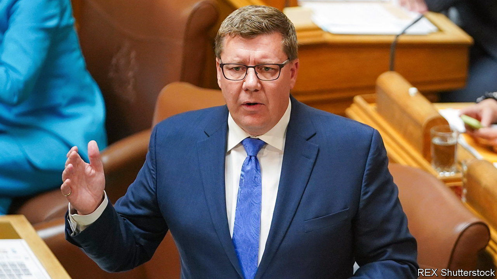

###### Pronoun politics

# The culture wars have come to Canada 

##### Scott Moe invokes a rarely used clause to impose his pronoun policy 

 

> Oct 12th 2023 

On October 10th Scott Moe, the conservative premier of Saskatchewan, Canada’s breadbasket province, summoned lawmakers back to their legislature two weeks early to deal with an emergency. No withering blight had tainted the province’s vital grain stores. There was no looming peril to its vital potash industry. The threat was more mundane: that pupils under 16 can choose their preferred name or pronoun at school, without having to get the consent of their parents.

According to Statistics Canada, just 0.19% of Canadians over the age of 15 identify as transgender. Even fewer, 0.14%, are non-binary. Yet pronouns are becoming a big issue for right-wingers across the country. Doug Ford, the conservative premier of Ontario, has claimed that school boards are indoctrinating children by letting them choose their pronouns without asking their parents. Similarly, earlier this summer Blaine Higgs, the conservative premier of New Brunswick, retroactively changed his province’s education policy to ensure parental consent is mandatory before a student changes their pronoun. 

Mr Moe is going much further. His provincial government introduced a new policy requiring parental consent in August. In September Michael Megaw, a judge, decided to delay the legislation as it could cause “irreparable harm”. According to Mr Megaw, there was little evidence that the education ministry had discussed the policy with teachers, parents or students. 

In response, Mr Moe has invoked Canada’s “notwithstanding clause”. This refers to Section 33 of the Canadian Charter of Rights and Freedoms, which allows the federal parliament or any provincial legislature to pre-emptively stop a law from being invalidated by a judge. Some of Canadians’ fundamental rights, such as freedom of expression or religion, can be suspended using the clause. Until recently, it was rarely used, although populists such as Mr Ford have increasingly turned to it for different matters. 

Mr Moe argues that the judicial injunction fails to consider the rights of parents. As  went to press, the legislation was due to be passed by the provincial government. Further legal challenges may follow.■

