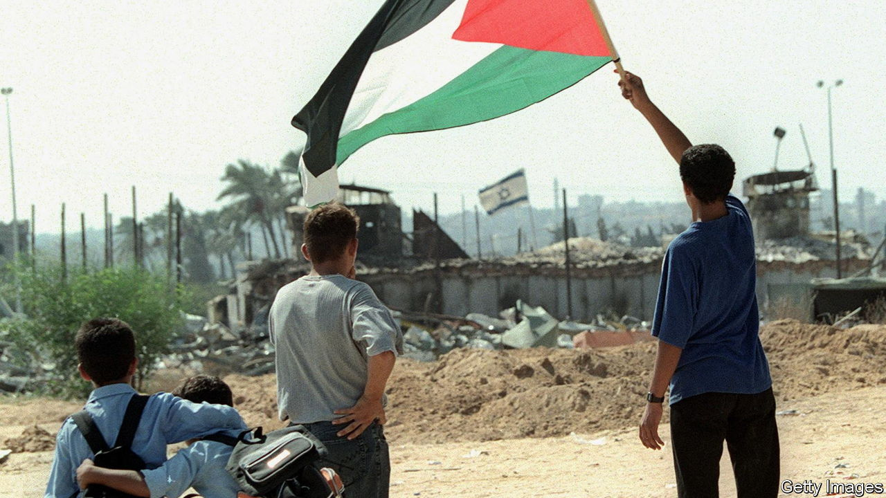
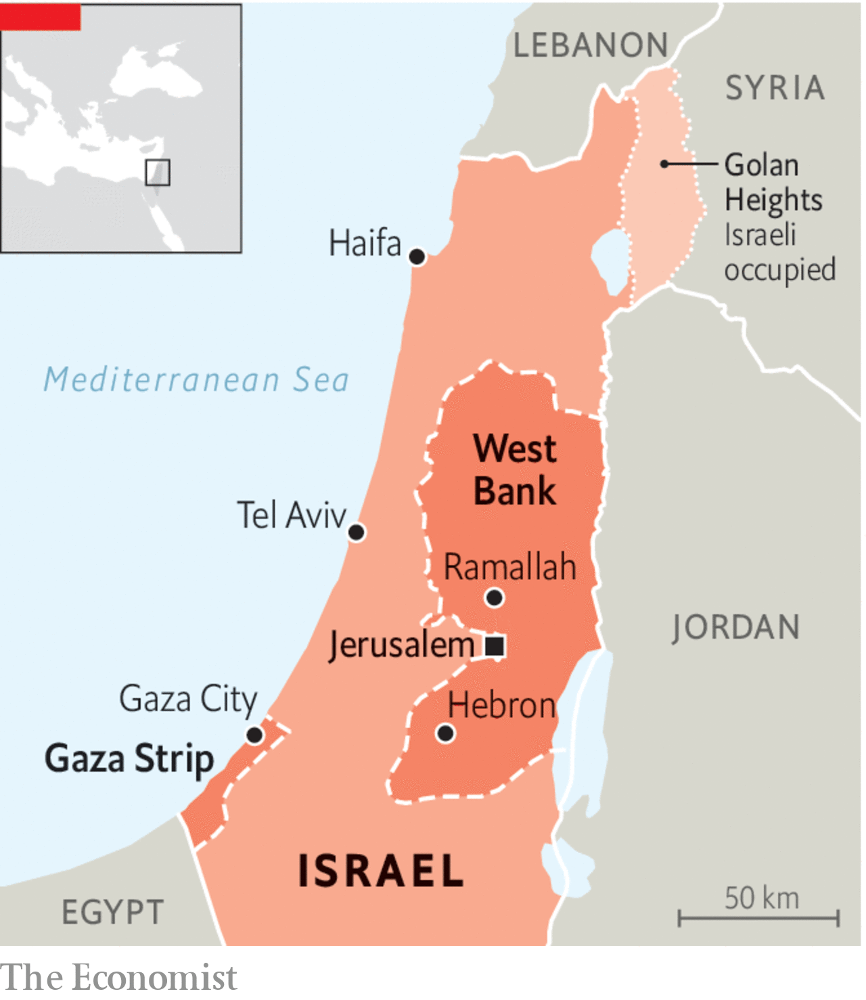

###### The Economist explains

# A short history of Gaza 

##### To understand this war, consider the territory’s past 

 

> Oct 12th 2023 

ON OCTOBER 7TH Hamas, the militant group that runs the Gaza Strip, , killing 1,300 people and taking  Israel has responded with force: strikes on Gaza had killed around 1,400 Palestinians by October 12th. Residents of the strip, a 360-square-kilometre block of land wedged between Egypt, Israel and the Mediterranean, are . Since 2007 they have suffered a stifling blockade and a series of wars. How has the history of Gaza shaped its people?

Palestine, which had been part of the Ottoman Empire for the better part of four centuries, was seized by the British in 1917, during the first world war. That year Britain issued the Balfour Declaration, pledging vague support for a Jewish “homeland” in Palestine. After the war Palestine was administered by Britain, and Zionist immigration, which had begun in the late 19th century, increased. Tensions between Jewish and Arab residents rose and in 1936 the Arabs revolted. By 1939 their uprising had been suppressed—but Britain palmed off the problem to the United Nations, which voted to partition the land. Britain soon withdrew. In 1948 the state of Israel was created. 

 


Five Arab countries immediately invaded and Israel triumphed in the nine-month war that followed. About 750,000 Palestinian Arabs were uprooted. Many ended up in the two pockets of land retained by the Arabs: Gaza, controlled by Egypt, and the West Bank, administered by Jordan. Conditions in Gaza were dire: many people slept in barracks, schools and mosques. Refugees in the strip were not allowed to enter Egypt, nor to return to Israel. They were trapped and stateless.

In 1967, during a six-day war with Egypt, Jordan and Syria, Israel seized Gaza and the West Bank. Life in Gaza improved little under Israeli occupation. By the mid-1980s about 250,000 Palestinians, 10% of the population of the occupied territories, had been detained or interrogated, says Ian Black in “Enemies and Neighbours: Arabs and Jews in Palestine and Israel, 1917-2017”. Israel established Jewish settlements in Gaza, angering Arab residents. In 1987 Palestinians rose up, in what became known as the first , a sustained movement of violent protests that lasted years. 

In 1993 Israel and the Palestinians signed the Oslo peace accords, a five-year interim agreement that was meant to give the Palestinian people the right to self-determination. The  (PA), a new entity, assumed limited control of Gaza and the West Bank, although the Israeli occupation continued. Negotiators could not agree on the thorniest of issues, such as settlement expansion and who would control Jerusalem, and Hamas, which had emerged during the , embarked on a campaign of suicide-bombings to oppose the accords. The peace process ran aground. In 2000 Palestinians rose up again in the second . 

Israel withdrew from Gaza in 2005, in part because it was so costly to hold. A year later Hamas won a majority in a Palestinian election and formed a unity government with Fatah, its political rival. In June 2007, after a brief civil war, the militants assumed sole control of Gaza, leaving Fatah to run the PA in the West Bank. In response Israel and Egypt imposed a blockade on the coastal strip, strangling its economy. Although the Israeli government has issued thousands of work permits in recent years, allowing Palestinians in Gaza to cross the border to earn money, conditions in the strip have improved little. In 2022 the unemployment rate was 47%, and 70% for the young; eight-hour blackouts are a daily occurrence. 

As well as the blockade, people in Gaza have suffered the consequences of four wars, waged by Hamas and Israel. Between 2008 and 2023, these conflicts and various other outbursts of violence killed 5,360 Palestinians in Gaza and injured 63,000. The latest conflict promises yet more misery. Israel has imposed a “full siege” on the strip, limiting access to fuel, electricity and food. A  appears imminent. Civilians in Gaza have already suffered much, but the worst may be yet to come. ■

