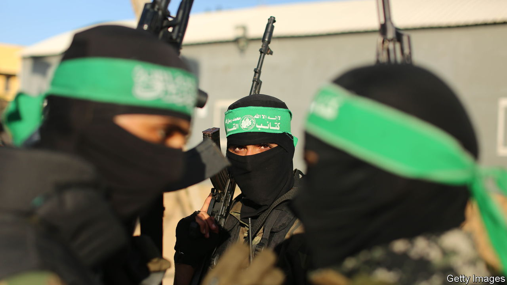

###### The Economist explains

# How powerful is Hamas? 

##### Long politically dominant in Gaza, it has become better equipped militarily 

 

> Oct 10th 2023 

IN THE EARLY hours of October 7th , the Palestinian Islamist organisation that runs Gaza, launched more than 2,000 rockets towards Israel. Over a thousand Hamas fighters, some in motorised gliders, crossed the border between Israel and Gaza. They attacked civilians on the streets of small Israeli towns and in their homes. In the next 48 hours they killed more than 900 Israelis, a figure far surpassing the deaths in the previous 19 years of conflict, and took around 150 hostages. Israel was  partly because Hamas had never carried out such a large attack. The country’s defence establishment had assumed that in recent years Hamas had decided to refrain from wide-scale confrontation—and that its capacity to do so was limited. They were wrong. Just how powerful is Hamas? 

Hamas was founded in 1987 by Sheikh Ahmed Yassin, a Palestinian cleric, after the first , when thousands of Palestinians fought against Israel’s occupation of the West Bank and Gaza. Yassin, who had joined the Muslim Brotherhood, the world’s oldest Islamist movement, in Cairo, intended Hamas to be the Brotherhood’s political spin-off in Gaza. In its first charter, published in 1988, the “Islamic Resistance Movement”—“HMS” are its initials in Arabic—proclaimed its duty to liberate Palestine from Israel, which it declared illegitimate. It carried out its first attacks on Israeli military targets in 1989 and formally established a military wing in the early 1990s. It expressed its opposition to the Oslo accords, which were aimed at establishing peace between Israel and the Palestinians, by carrying out suicide-bombings within Israel. 


At first the group was weak both politically and militarily. But its political strength among Palestinians grew. In 2006, a year after Israel withdrew from Gaza, Hamas won a majority of seats in a Palestinian election and later formed a new unity government with Fatah, its nationalist rival. In June 2007, after a brief civil war, it assumed sole control of Gaza, leaving Fatah to run the Palestinian Authority (PA) in the West Bank. In response Israel and Egypt imposed a suffocating blockade on the coastal strip in 2007, strangling its economy and in effect confining its people in an open-air prison. There have been no elections since. Hamas has run Gaza as an oppressive one-party state, leaving some Palestinians there disenchanted with its leadership. Nevertheless Palestinians widely consider it to be more competent than the ailing, corrupt PA. 

Despite the blockade, Hamas was able to slowly build its military capacity. By 2008, when the group began its first war against Israel, it had developed a military structure and trained thousands of fighters, with smuggled support from Iran, Syria and Hizbullah, an Iran-backed militant group in Lebanon, and had been launching makeshift rockets for a year. But the rocket attacks achieved little militarily, and Israel’s subsequent strikes on Gaza killed an estimated 1,200-1,400 Palestinians.

Hamas has innovated since then. In 2014, when it began its third war against Israel (after a second in 2012), it had a much wider range of combat capabilities. Its rockets had grown in number and range and it had got better at concealing its military infrastructure. It developed a system of offensive tunnels into Israel, and another through which it transported weapons from Egypt. It increased the efficiency of its ground combat forces, who continued fighting for 50 days. By 2021 Hamas was able to fire 4,300 rockets at Israel in an 11-day burst. (In 2014 it had fired around 4,500 in 50 days.) But Hamas was still no match for its foe. After its barrages in 2021 killed a dozen people, Israel’s retaliatory jets and helicopters pummelled an already decrepit Gaza, killing over 200. 

For two years Hamas avoided escalating the conflict with Israel. That led many to wrongly assume that the dominant forces within the group’s leaders were focusing on bolstering their rule in Gaza. But the attack on October 7th was far more sophisticated than any that came before it. Hamas attacked Israel’s sensors and disabled its security cameras. It made use of advanced electronic warfare and jammed Israeli communications systems, according to a report by Reuters. All this would suggest that Hamas has been bolstering its military technologies for some time, with at least some outside support, possibly from Iran. 

Hamas was able to launch its attack despite a huge asymmetry: Israel’s Defence Forces far outweigh it, in both numbers and equipment. Israel puts Hamas’s military force at about 30,000 fighters; Israel on Monday called up 300,000 reservists, to add to its 170,000 or so active soldiers. The IDF’s much larger arsenal includes missile boats and tanks. The 2m civilians in Gaza will be preparing for the worst. ■

