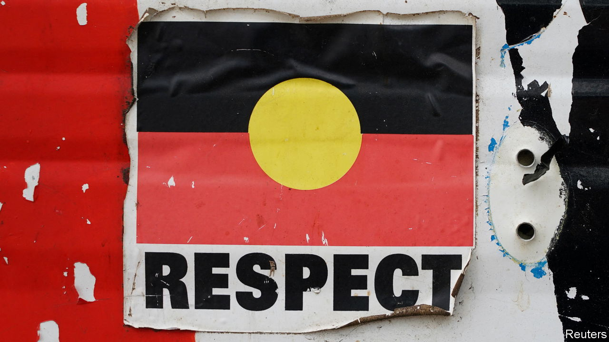

###### The Economist reads

# What to read (and watch) about indigenous Australians 

##### Four books and a film that show why they want recognition of rights in the constitution 

 

> Oct 12th 2023 

ON OCTOBER 14th nearly 18m Australians will vote in a referendum on whether to give indigenous people a “Voice to Parliament”. They will decide whether to enshrine in their constitution the establishment of a  that would advise the legislature on issues that affect them. Anthony Albanese, the prime minister, has billed the referendum as “a once-in-a-generation chance to bring our country together”. Indigenous Australians are  of the measure. Polling commissioned by the “Vote Yes” campaign puts their support for the amendment at around 80%. Yet it is . Just 42% of Australians overall intend to vote for the Voice. Opposition parties are campaigning against it. Some opponents argue that giving special constitutional rights to any group would be divisive. Here are four books and a film that help show why Aboriginal Australians think that such recognition is necessary. 

 By Thomas Mayo. 

In 2017 a group of Aboriginal and Torres Strait Islander leaders met in the middle of the country at Uluru, once commonly called Ayers Rock, to call for reforms to protect existing indigenous rights. One outcome of those discussions was the “Uluru Statement from the Heart”, which included a demand for an indigenous Voice to Parliament. Thomas Mayo was a signatory to that statement. He spent a year and a half carrying the canvas on which the agreement was written around Australia, garnering support for its proposals. This book is a collection of conversations with indigenous Australians he met on his travels. His subjects are politicians, health workers, artists and elders. They speak about their ancestors, their connection to the land and the challenges facing their communities. In a second edition, published in 2022, Mr Mayo, a Torres Strait Islander born in Larrakia country in Darwin, adds a section on the political and legal implications of creating the Voice to Parliament.

. By Bruce Chatwin. 

Few settlers in Australia have had much understanding of Aboriginals’ complex cosmology. Bruce Chatwin, a travel writer from England, made a serious attempt at comprehension in “The Songlines”, a part-fictional travelogue published in 1987. He follows Arkady, a Russian anthropologist, into rural Australia as he maps “songlines” so that the builders of a railway track will lay it away from places of cultural significance to indigenous Australians. Chatwin writes of songlines, also called Dreamtime or : “each totemic ancestor, while travelling through the country, was thought to have scattered a trail of words and musical notes along the line of his footprints…as ‘ways’ of communication between the most far-flung tribes”. Chatwin is an outsider, and his travelogue does not fully explain the nuances of this tradition.But it remains after three decades the most popular account of the multidimensional relationship between indigenous Australians and the land. 

. By Evelyn Araluen. 

An anthology published in 1992, “Australian Poetry in the Twentieth Century”, does not contain one poem by an indigenous Australian. Australia “had no poets but it had thirst and rage and dreaming”, writes Evelyn Araluen, a member of the Bundjalung people of eastern Australia. “Dropbear”, a collection of essays and poetry, is a corrective. It expresses thirst and rage, as well as grief and love, but it also has plenty of humour. The title refers to a made-up carnivorous koala that “drops” on unwary perambulators. Ms Araluen mocks the kitsch, like cork hats and vegemite, that have come to represent Australia in the minds of non-Aboriginal people. She writes sardonically of Aboriginal culture “available for purchase in a wide range of hand-dyed linens”. Yet polemic is a stronger note than playfulness. In her poem “The Trope Speaks” Ms Araluen describes a nation with “a ghostly spectre haunting the land”, which is smothered with “fence and field and church”. Through such works she shows how Australians reinforce a national identity that puts settlers at its centre and confines indigenous Australians to the margins. 

 Directed and produced by Phillip Noyce. 

“What if the government kidnapped your daughter? It happened every week in Australia from 1905 to 1971”. That claim appeared on a poster for “The Rabbit-Proof Fence”, a film released in 2002. It so angered some Australians that one politician threatened to use federal funds to finance a publicity campaign against it. But the government was guilty as charged. It removed part-Aboriginal children from their families and placed them in institutions. It claimed to be protecting children “at risk” but was in fact attempting to stamp out indigenous culture and languages. Canada and America carried out similar programmes. Perhaps one in ten “half-caste” Australian children were taken from their families. They are known as the Stolen Generation. The film is adapted from a book by Doris Pilkington Garimara, from Jigalong in Western Australia. Both are based on the story of the author’s mother, Molly Craig, who with two other girls escaped from Moore River Native Settlement to return to their families. They follow a fence along the length of Australia that was built to contain a rabbit infestation. An official whose job is to carry out the policy of forced removal, played by Kenneth Branagh, justifies it thus: “the bush natives have to be protected against themselves,” he says, “if they would only understand what we are trying to do for them.” This film shows, heartbreakingly, how wrong he was. 

. By Tara June Winch. 

“When we were being gathered up to be taken away…some disguised their babies as full-blood by painting them dark with the  [sap of trees]”. The word is an entry in a dictionary of Wiradjuri, a language and a people from what is now New South Wales. Its author is Poppy Albert Gondiwindi, a member of the Stolen Generation. His lexicography plays a role–just how is not explained at first–in opposing the development of a tin mine on his property. “The Yield”, which in 2020 won the Miles Franklin Award, Australia’s most prestigious literary prize, is a novel of three intertwined strands, which deal with many of the traumas that Aboriginal Australians have suffered, including the poverty and dysfunction that now afflict indigenous communities. Poppy’s granddaughter, August, who returns to Australia from England for his funeral, struggles to come to terms with the upheaval in her hometown, Massacre Plains, provoked by the proposed mine. A third narrative, set in the early 20th century, is told through letters from Ferdinand Greenleaf to George Cross, a British ethnographer. Reverend Greenleaf, once a missionary in Massacre Plains, seeks “to tell how wrongs became accepted as rights”. Tara June Winch, whose father is from the Wiradjuri nation, is a masterful storyteller who sums up the Aboriginal experience from its time-misted origins to today.


We have explained Australia’s proposed Voice to Parliament and why it is unlikely to pass. This chart-based article shows how opinion on the constitutional proposal varies by age and political ideology. Here we write about the effects on places with large Aboriginal populations of banning–and unbanning– alcohol. More cheerfully, Australia is beginning to change place names to acknowledge the country’s Aboriginal heritage. ■

