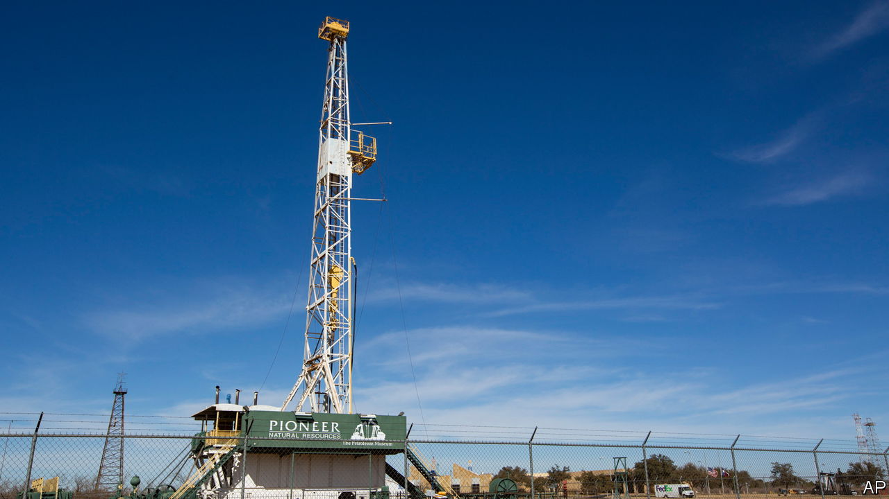
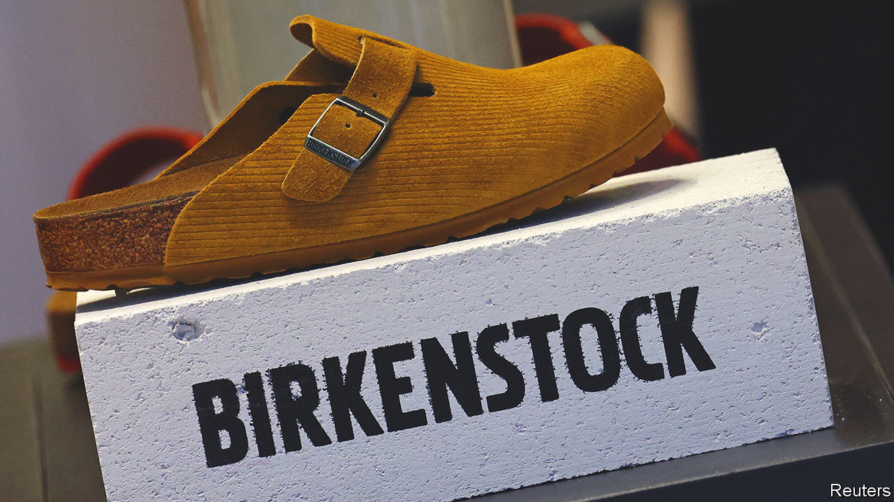

###### The world this week

# Business 

#####  

 

> Oct 12th 2023 

 announced an agreement to take over , the largest operator in the lucrative Permian Basin shale field, in a deal valued at $59.5bn. The acquisition, Exxon’s biggest since Mobil Oil in 1998, is sure to spur more consolidation. Chevron and ConocoPhillips are also reportedly searching the shale patch for firms they could buy, though the prospect of oil giants gobbling up small drillers may stir antitrust regulators into action. 

 told investors that it was still committed to cutting oil and gas production and transitioning towards renewables despite its recent leadership turmoil. Bernard Looney quit as chief executive in September after failing to disclose fully his past personal relationships with female employees. A few weeks later BP’s most senior executive in America said he was leaving the company to pursue other career opportunities. 

A rebound in the  is in danger of fading, according to the latest forecasts from the IMF. The fund said this was in part explained by households having to “contend with a still-elevated cost of living” as savings they had accumulated during the pandemic dwindle. America’s economy is proving to be resilient, and will grow by 2.1% this year. But growth in the euro area is expected to be only 0.7%, dragged down by Germany’s economy, which could shrink by 0.5%. 

The IMF also said that expectations of  remaining higher for longer are squeezing borrowers, leaving small and medium-sized firms with barely enough cash to pay their interest expenses. Meanwhile the  on American government debt retreated from recent highs. They had surged after news that American employers created 336,000  in September, almost double the number that markets had forecast. Investors think a buoyant labour market makes it less likely that the Federal Reserve will cut interest rates.

A foot in the market

 


took a misstep in its IPO. The stock was down by almost 13% at the close of the first day of trading on the New York Stock Exchange, giving the German sandal-maker a lower valuation than it had hoped for when it priced the shares. Other big stockmarket listings this year have been successful on their debut, though the share prices of Arm, Instacart and Klaviyo have all since fallen back.

, the world’s biggest luxury-goods company and a substantial investor in Birkenstock, reported a sharp slowdown in quarterly sales, a possible sign that the boom in luxury goods since the pandemic is over. It’s “an end to the roaring 20s”, declared analysts at Berenberg, a privately owned bank. 

 reached a pay deal with its union in Canada, bringing a swift end to a strike that had only just begun. The agreement increases hourly wages by 20-25%. Meanwhile Ford, GM and Stellantis announced more lay-offs in the United States as a result of the ongoing strike by the United Auto Workers. The UAW escalated its dispute by walking out of Ford’s biggest plant.

 is gearing up for another proxy fight with  and has increased his stake in the company, according to reports. In February the activist investor’s firm, Trian Partners, abandoned its push for a seat on the board after Disney laid out a restructuring plan that seeks to make its streaming service profitable. Since then Disney’s earnings have continued to highlight the underlying weaknesses in its streaming business, causing its stock to fall by 25%.

 issued another debt-default warning. The Chinese property developer has so far managed to weather the storm that has battered the industry. With sales slumping, the company said its “liquidity position is expected to remain very tight”.

The OECD published the text of a treaty that would make multinational companies, notably tech firms, pay tax in countries where they do business but do not have a physical presence. The alluringly titled Multilateral Convention to Implement Amount A of Pillar One would reallocate $200bn-worth of , which is expected to benefit poorer countries the most. Meanwhile,  said it had received a demand for $28.9bn in back taxes from America’s Internal Revenue Service. 

Cheers!

 reported a pre-tax profit for the 12 months ending July 30th, its first annual profit since the pandemic. The British pub chain, derided by some for catering to the lower end of the beer-drinking market, likes to point out that it has 200 pubs listed in the ale-drinkers’ bible, the “Good Beer Guide”, more than any other company. Its pubs are also good for government revenues. Each hostelry generated an average £6.8m ($9.3m) in tax (VAT, alcohol duty and so on) over the past ten years. 

