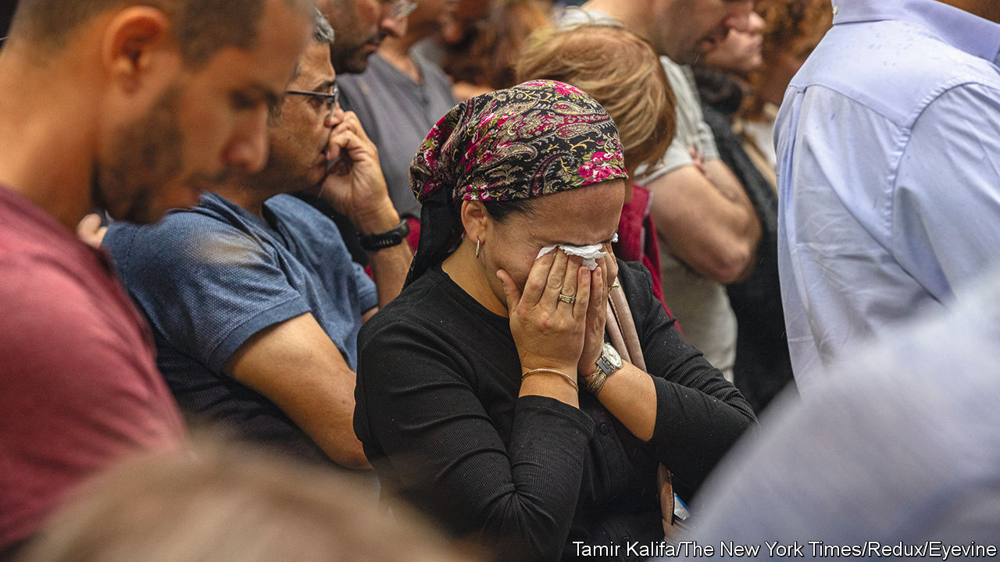
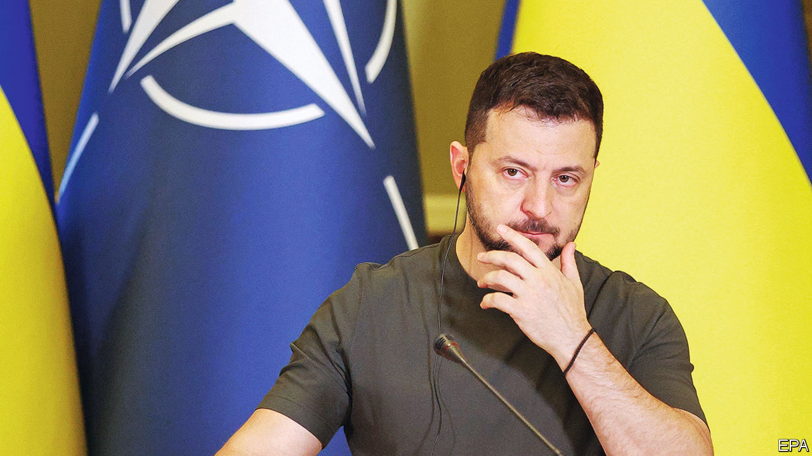

###### The world this week

# Politics 

#####  

 

> Oct 12th 2023 

 came under a sustained attack on its territory, when hordes of Hamas militants broke through the border from Gaza and went on a murderous rampage in the surrounding area. At least 1,200 people were slaughtered, including 260 at a music festival. Hamas massacred whole families in villages and kibbutzim, including babies. Survivors said women were raped before they were murdered. Scores of hostages, including children, were seized by Hamas. The scale of the assault shocked the world. The bodies of 1,500 Hamas terrorists were recovered by the Israeli army. 

It took Israel three days to secure its border with , though Hamas still attacked Israel with rockets. As the Israeli army amassed forces for a massive ground assault the air force pounded the densely populated area. Over a thousand Gazans have already been killed; 340,000 have already fled their homes. Israel cut off energy and water supplies until its hostages are released. Violence also flared in the West Bank, killing dozens of Palestinians. Hizbullah, another Iranian-backed militia, attacked Israel’s north by firing rockets from Lebanon. 

Binyamin Netanyahu told Israelis to prepare for a long conflict. The prime minister and Benny Gantz, an opposition leader, formed an  and a war-management cabinet, which will include Gadi Eisenkot. Mr Gantz and Mr Eisenkot are former heads of the Israel Defence Forces. Mr Netanyahu has been criticised for ignoring experienced military leaders while courting far-right coalition partners. The new government promised to change the “strategic reality” of dealing with Hamas. 

The leaders of America, Britain, France, Germany and Italy issued a  expressing “our unequivocal condemnation of Hamas and its appalling acts of terrorism”. Joe Biden called the attack “an act of sheer evil”. America redirected an aircraft-carrier and other naval ships already in the Mediterranean to the eastern part of the sea, closer to Israel. The Pentagon is increasing its number of fighter jets in the region and will send more weapons to Israel. 

The  response was more muddled. The bloc issued a statement saying development aid to Palestinians would not be suspended, correcting a remark by a European commissioner that it would be. 

The day after the attack on Israel an Egyptian policeman opened fire on a group of tourists in Alexandria, killing two Israelis and their Egyptian tour guide. Countries around the world stepped up . 

America formally declared that the ousting of  elected government in July was a coup, which will trigger a halt to military assistance and aid programmes. Meanwhile France began withdrawing its troops from the west African country after they were told to leave by the junta. 

Seven inmates, six of them Colombian, were killed in prison in . They were being held on suspicion of murdering Fernando Villavicencio, a presidential candidate who ran on an anti- corruption platform, in August. A presidential run-off will be held on October 15th. 

A series of earthquakes killed more than 2,000 people in . The quakes struck Herat province, flattening whole villages. 

At least 29 people were killed when  army carried out an artillery strike on a camp for displaced people in the state of Kachin, where separatists are waging an insurgency. Since seizing power in 2021 the military junta has been fighting multiple ethnic armed groups. 

Glitter ball

The annual conference of  opposition Labour Party outlined several polices, including commitments to reform planning rules and build more housing, and concluded with a well-received speech from , the party’s leader. The conference capped a good week for Labour, which scored a big victory over the Scottish National Party in a by-election. Taking ground from the SNP in Scotland would significantly increase Labour’s chances of winning Britain’s next general election. 

 


Volodymyr Zelensky paid his first visit to NATO’s headquarters in Brussels since the start of Russia’s war on  20 months ago. The Ukrainian president is seeking more support, especially for air defence. His trip came six days after 52 people were killed by a Russian missile attack on Hroza, in north-east Ukraine. 

An investigation got under way into a leak on an  between Finland and Estonia. Finland said the damage may have been deliberate. Speculation swirled that Russia may have sabotaged the conduit in revenge for Finland joining NATO. An attack on the Nord Stream 2 pipeline last year remains unexplained. 

The hard-right Alternative for Germany (AfD) performed well in two state elections in . The party came third in Bavaria and second in Hesse, breaking out of its traditional areas of support in poorer east Germany. The Greens and the Free Democrats, coalition partners to the Social Democrats, fared badly.

The Greens also lost ground in  general election, their support falling by seven percentage points, to 8.6%. The ruling left-of-centre coalition was severely weakened by the result, leaving the way open for the centre right to form a government. 

An Australian journalist, Cheng Lei, returned to  after spending more than three years in custody in  on espionage charges. China had accused Ms Cheng, a reporter for China’s English-language television station, CGTN, of leaking state secrets overseas. Another Australian, Yang Hengjun, remains imprisoned in China for alleged spying.

, a congressman from the suburbs of New Orleans, was nominated by Republicans to be the next  of the House of Representatives following the defenestration of Kevin McCarthy. Several hard-right conservatives declined to back Mr Scalise in a floor vote before the whole House to confirm the appointment. 

Tilting at windmills

 ditched his maverick run against Joe Biden in the Democratic presidential primary to stand instead as an independent candidate in the election next year. Mr Kennedy says he defies left-right labels, and has railed against covid vaccinations, Wall Street and the military-industrial complex. If he stays the course he could pick up support from dissatisfied Democratic and Republican voters, of whom there are many. 

