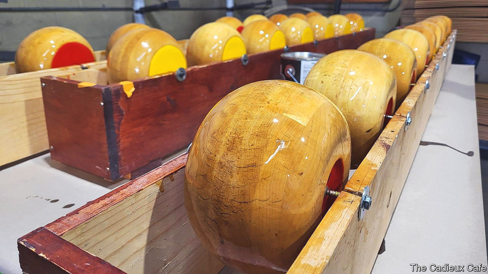

###### In fine feather

# Could feather bowling be the next pickleball? 

##### One Belgian bar in Detroit has kept it alive for a century 

 

> Oct 12th 2023 

People in Detroit take their sport seriously. Downtown, Comerica Park, the home of the Tigers, a baseball team, and the Little Caesars Arena, where the Red Wings play ice hockey and the Pistons basketball, draw enormous crowds. As revered arenas go however, far older than both is the Cadieux Cafe, on the eastern edge of the city. There, most nights, but especially on Tuesdays, Wednesdays and Thursdays, locals take part in a game called “feather bowling”. 

Derived from , a game with origins in Flanders, the rules are a little like curling. Players roll a wooden wheel along a rough earth lane towards a pigeon feather planted at the other end. The idea is to get yours as close as possible—while blocking those of the opposing team or knocking them out of the way.

According to Tim Dinan, a lawyer who plays with a team called the “Hoppy Yeastheads”, “just about everyone in Grosse Pointe” (a suburb that starts a few blocks away) plays or has played feather bowling. The Thursday-night men’s league has been going since the 1930s. Portraits of champions line the wall of the Cadieux. The café was founded at around that time by Belgian immigrants, says John Rutherford, a musician who has co-owned the place since 2019. Many came to work in car factories, joining an earlier wave of migrants who farmed strips of land stretching down to the Detroit river. Little else Belgian now remains in the neighbourhood except street names, but at the Cadieux, visitors can still get a decent  with a sour ale 500 miles away from the ocean.

Having been preserved for the best part of a century, feather bowling is now spreading. A few other bars in Michigan have set up their own lanes. Last year, a bar with the game even opened up in Dumbo, a neighbourhood in New York City. Dave Plate, the co-owner of that bar, which is called Randolph Beer, says the inspiration came directly from Detroit. Having seen a video of people playing feather bowling at the Cadieux, he decided it was exactly the game to bring to a large space he had rented, and flew out to Michigan to learn it. The lanes are now booked up for weekends in advance. Most of the players are young hipsters, says Mr Plate, but a growing number of parents are bringing their children too.

Mr Rutherford welcomes the copycats. The Cadieux café, he says, could become to feather bowling what St Andrews in Scotland is to golf: somewhere true fans will always want to play, even if the game spreads all over. But he is critical of what competitors are offering—not least because they tend to have Astroturf lanes. “The others are like putt-putt golf,” he says. For it to be truly feather bowling, “you need a real dirt course like ours.” Even worldwide, Detroit may now be the pre-eminent place to play the game. “In Belgium they probably don’t even know what this is any more,” jokes Mr Dinan. It’s a low-country blow.■


