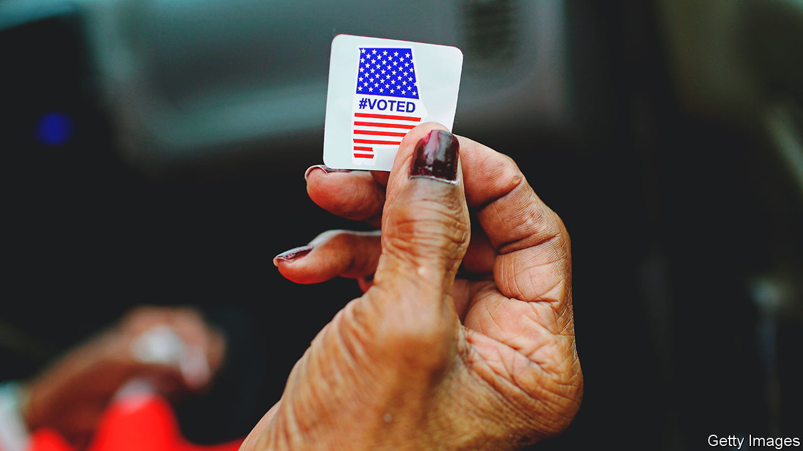
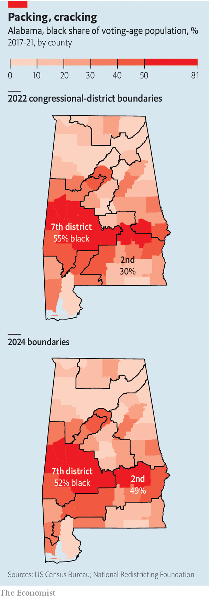

###### Southern gerrymandering

# It’s OK to gerrymander, as long you discriminate by politics 

##### Courts take up brazen redistricting cases from across the Bible belt 

 

> Oct 12th 2023 

After almost two years and two trips to the Supreme Court, Alabama got a slap on the wrist. On October 5th a trio of federal judges barred the state from using the congressional map it drew ahead of the 2022 midterms in 2024, on the basis that it violates the Voting Rights Act of 1965 by suppressing black voters. The court insisted it instead adopt one that creates a second district (out of seven) favouring black constituents, who make up a quarter of the state’s eligible voters (see map). The ruling nearly guarantees that a Republican seat in the House of Representatives will go to a Democrat next year—an array of left-leaning black politicos are pondering bids. Democrats need to flip just five seats nationally to clinch control of the chamber.

 


Though the case is not over—the map that Alabama was ordered to use is a temporary solution and a full trial is scheduled for 2025—the rulings that have come out of  set a precedent. When the Supreme Court upheld the district court’s veto of the state’s map in June, it spurned the claim that the Voting Rights Act, the crown jewel of civil-rights law, was unconstitutional. In refusing to dilute its potency the high court reaffirmed its relevance. 

That matters a great deal, as states have indulged in some flagrant gerrymandering. The partisan gyrations following the 2020 census in the Deep South are the direct result of a 2013 Supreme Court decision. struck down the formula used to determine which jurisdictions came under the pre-clearance regime of the Voting Rights Act, which forced places that historically had voter-literacy tests or low turnout to submit proposed election changes to the federal government for approval. For decades Alabama, Alaska, Arizona, Georgia, Louisiana, Mississippi, South Carolina, Texas and Virginia, could not tweak a map without federal consent. The verdict upended that. Though Congress has the authority to decide which places should now be covered, it has failed to do so in a decade. Without the feds’ foot on the brake Republicans went for gold. 

Arduous litigation followed. When it comes to voting rights “Alabama is the poster child for defying federal law”, says Deuel Ross, the plaintiffs’ lawyer. But the feat of its civil-rights lawyers has emboldened a wave of redistricting challenges across the Bible belt. Louisiana legislators were reluctantly sketching new maps after courts nixed their old one until an appeals court gave them relief in late September. Litigators in Texas say recent non-white arrivals ought to be better represented; in Georgia they are arguing black Atlantans need more sway. (A win there, as in Alabama, could flip a Republican House seat.)

Perhaps the most high-profile case is one from South Carolina that came before the Supreme Court on October 11th. It differs from those in Alabama and Louisiana. The NAACP, a civil-rights organisation, argued that the state’s new map, which shuffled 193,000 voters between districts but maintained the same share of black voters in each, breached the Equal Protection Clause of the constitution, which prohibits diluting votes by race. 

Here the justices are not tasked with diagnosing whether black voters have sufficient influence, but whether the state Senate cartographer had skin colour on his mind when drawing maps. Though it sounds more like something drug lords do to process narcotics, the court ruled in 2018 that “cracking and packing”—the art of moving voters of a certain group into several districts to quell their power or stuffing them into one, making others less competitive—is perfectly legal as long as it is done with partisan, not racial, intent. 

During oral arguments Justice Elena Kagan noted that this is the first racial gerrymandering case to come before the court since it licensed partisan redistricting. For observers in the gallery it seemed the justices had handed themselves a tall order. Disentangling demography from political affiliation is tricky nationwide. But “in some parts of the Deep South”, reckons David Lublin, a redistricting researcher, “voting starts to resemble a racial census.” ■


