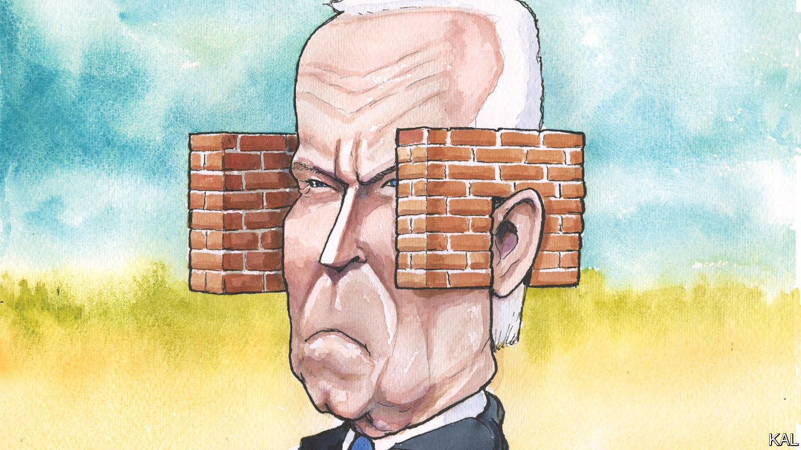

###### Lexington

# Joe Biden should admit Republicans are (partly) right about border security 

##### The witless politics of polarisation is jeopardising support for legal immigration 

 

> Oct 12th 2023 

If there were ever a good case for a centrist third party in American presidential elections—and right now there is not—the strongest reason would be the mass migration under way in the western hemisphere, which is prompting both major parties to take foolish and even inhumane positions. The surge in illegal crossings of the southern border is a complex problem. But having fed it through the polarisation machine, Democrats and Republicans have come up with simple, reciprocally stymying answers that defy not only compromise but common sense, too. 

The latest demonstration came in early October, when the Department of Homeland Security (DHS) published plans to install 20 new miles of barriers along the Rio Grande in south-eastern Texas. As a candidate Joe Biden promised to build “not another foot” of wall, so reporters sensed the dangling shape of a favourite piñata, hypocrisy, and prepared to swing away. 

But when they bearded the president in the Oval Office, he had an explanation: Congress made him do it. True enough. In 2019 Congress appropriated $1.375bn for a “barrier system along the south-west border”. Having tried to persuade Congress to redirect what remains of that money, the Biden administration was at risk of breaking the law if it did not act. Asked if he believed a border wall “works”, Mr Biden replied, flatly, “No”. The problem turned out, in other words, to be worse than hypocrisy. It was inanity. Mr Biden could not give an answer that would strike any child as obviously true: walls do work, but only sometimes. 

Mr Biden could have pointed to the case study surrounding him, in the form of the fence around the White House. Such efficacy in impeding ingress, he might have said, explained why as a senator he voted to build border barriers under a Democratic president, Bill Clinton, and a Republican one, George W. Bush. He might have added that it also explained why, when he was Barack Obama’s vice-president, that administration added more new miles of barrier than Donald Trump. (Although Mr Trump built 458 miles of wall, all but 87 replaced existing barriers; Mr Obama built 130 incremental miles.) Mr Biden might even have pointed out that the DHS’s 2023 budget states that barriers can work: “The border wall system impedes and denies illicit cross-border activity by allowing law enforcement an increased response time.”

But Mr Biden could permit himself no such nuance. Mr Trump has vowed to build a giant wall along the entire border, which stretches nearly 2,000 miles. This would be a boondoggle. A wall is unnecessary where natural barriers exist, and easily defeated in remote areas where patrols will not spot smugglers as they cut through, as they have done thousands of times. But despite Mr Biden’s past positions, to acknowledge now that barriers can play a part in securing the border would be to say Mr Trump is not entirely wrong. And that, Mr Biden’s advisers know, is anathema to the Democrats’ progressive base. 

The new bits of wall are to run through Starr County, Texas, in the district of Representative Henry Cuellar, a Democrat. Mr Cuellar thinks the barriers will be ineffective there; he favours more border agents and surveillance equipment instead. He is frustrated by Democrats’ reluctance to secure the border. In early October he was carjacked at gunpoint in Washington. Unharmed and admirably unruffled—though annoyed to have his sushi stolen with his car—he seized the opportunity when Mr Biden called to express concern. “I said, ‘Mr President, we as Democrats can be strong on border security and still be respectful of immigrants’ rights’,” he recalls, adding, “We’ve got to find a balance.” He says Mr Biden understood and asked to follow up. 

In fact, writes Franklin Foer in “The Last Politician”, a new book about Mr Biden, immigration was “where he was most out of step with his evolving party’s leftward trajectory”. As a candidate, Mr Biden worried that progressive politics “might cost Democrats the rustbelt”, but to win nomination he felt he had “to commit himself to a wholesale reversal of Trump immigration policy”.

Until recently, Mr Biden seemed content with that calculation, looking away as the border grew more chaotic. Mr Trump remained so noxious that suburban voters were unlikely to defect to him. Indeed, as though to remind them why they turned to Mr Biden in 2020—and why a centrist third-party is a terrible idea now, when it might elect Mr Trump—the former president recently said migrants were “poisoning the blood of our country”. 

Blue state blues

But migrants by the tens of thousands are arriving in cities and states represented by Democrats. America’s immigration system was built to manage single men from Mexico looking for work, not families travelling from Venezuela or farther afield. Unlike past migrants, the newcomers tend not to have contacts in America; rather than melt into the country they remain in shelters, weighing on public budgets. America needs more agents, asylum officials and beds at the border, more flexibility to send migrants to other safe countries, and harsher consequences for those crossing illegally without legitimate claims. Mr Biden could do some of this on his own, but much of it requires Congress to act. 

Andrew Selee of the Migration Policy Institute, a think-tank in Washington, says the approaching budget negotiations might lead to a compromise. A deal is not probable, he says, but “there is definitely more of a pathway forward now than there was a month ago”. He cites more “willingness from the administration to explore some tougher options” and more concern from Republicans about unfilled jobs. Enhanced border security might also prove to be the price of the Ukraine funding Mr Biden wants.

The president should see this as an opportunity. Illegal immigration is eroding support for legal immigration. And most Americans would respect a politician big enough to acknowledge when the other guy has a point, even if his name is Trump. ■


