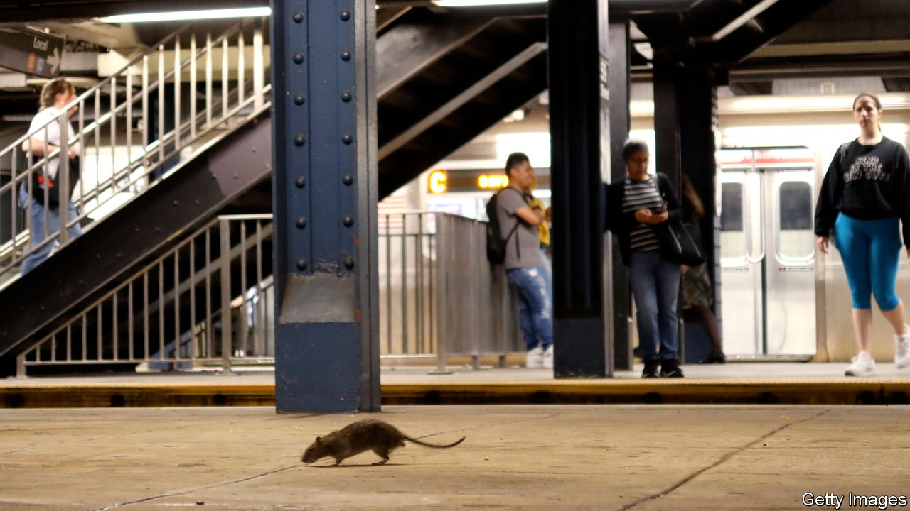
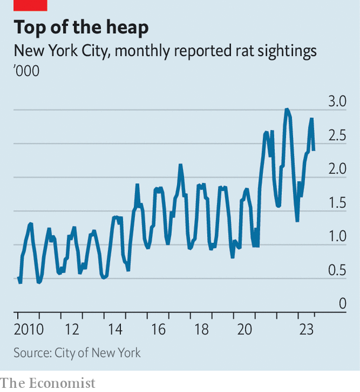

###### Trash talk

# New York City discovers a revolutionary technology: the bin 

##### Using crime fighting tactics, the city is taking on its rats and rubbish 

 

> Oct 12th 2023 

AH NEW YORK, how it sparkles—from afar. Street level is a different experience. Smelly rubbish mounds create trash-fjords on city pavements, with buildings on one side and piles of black bin-bags on the other. New Yorkers know to lift their feet to avoid the garbage juice that leaks from the bags. Rats feed on the bags, startling even the hardiest citizens. For decades New York endured this, nay accepted it, but no more. A massive “containerisation programme” is under way. The piles of black bin-bags are being replaced by a technology new to the city: secure bins. 

On October 11th Eric Adams, New York City’s mayor, and Jessica Tisch, his sanitation commissioner, announced that from autumn of 2024 buildings with nine or fewer residential units will be required to place all trash in secure containers. That will cover 765,000 buildings, or 95% of the city’s residential properties. It follows similar measures for commercial trash, which amounts to roughly 20m pounds (9m kg) a day, announced last month. Container rules for the city’s 40,000 food-related businesses, including restaurants, grocers and bodegas, were implemented over the summer. Altogether 70% of the city’s waste is heading into containers. 

 


Containerisation is the norm for cities like Barcelona, Milan and Paris. Cities in South Korea and the Netherlands use submerged ones, something out of reach for New York, where the realm below the pavement is a crowded maze of sewage pipes, gas pipes, power cables, fibre optics and the subway. “We are playing a massive game of catch-up with the rest of the world,” says Ms Tisch. “New York City is not going to be the first city to containerise trash; we’re going to be one of the last.”

Containerisation seems revolutionary. But it is also a return to old ways. Metal containers, like the one Oscar the Grouch, a character on Sesame Street, lives in, had been used since the 1930s to keep rats at bay and the city’s streets clean. Their use faded after a 1968 strike saw piles of rubbish uncollected for nine days. The stench and mess became so bad the city distributed plastic bags for the overflow. They soon became a formal part of rubbish collection. 

The bags also helped the growth of the rat population. Mr Adams, a former police captain who promised to fight both crime and rats, declared rats “Public Enemy No 1”. This is more than just rhetoric. The Sanitation Department draws inspiration from the Police Department. Three decades ago city crime began to fall when policing changed from responsive to preventive tactics and enforcement, relying on crime statistics to spot problem areas. This CompStat programme entails weekly crime-control strategy meetings among the NYPD’s commanders.

Ms Tisch, who worked in the Police Department for 12 years, launched TrashDash in May, inspired by CompStat. Every week sanitation leaders meet to create strategies to deal with upticks they see in rubbish data from 311 calls (a sort of municipal customer service). For example, if they see a spike in missed collections, they will dig into the complaints to see what they have in common. The department has also stepped up enforcement of current rules. At the same time it is cleaning highways, enforcing rules for street vendors and implementing citywide compost collection. 

“We absolutely and emphatically reject the status quo,” says Ms Tisch. She has overhauled operations so that trash in high-density areas is collected earlier. The rats appear to be in retreat (though they could be regrouping). This summer brought a 20% decrease citywide in rat complaints to 311. “Rat-mitigation zones” saw a 45% decrease. A pilot containerisation programme was launched last month in Hamilton Heights, in Manhattan’s West Harlem, a neighbourhood with a large number of rat complaints. Rodent-resistant containers were put on the streets for residents. Rubbish collection increased to six days a week in August. Schools in the area are also using containers.

Most New Yorkers are on board but, this being New York, unanimity is elusive. Andrew Rigie of the New York Hospitality Alliance, which represents restaurants and bars, points out that they do not have space inside for bins, while leaving them outside reduces sidewalk eating space. Clare Miflin of the Centre for Zero Waste Design worries that people will turn against the containerisation if the pilot scheme is not done well, or if it ends up being too expensive. 

Sanitation is one of the few things that is firmly under municipal control, unlike the MTA (which runs the subway). So the city has a lot of power, says Justin Wood of New York Lawyers for the Public Interest. Ms Tisch is well aware of her agency’s impact: “If we don’t do our job for one day, everyone notices. If we don’t do our job for two or three days, that’s a public-health crisis.” If she succeeds, New Yorkers will no longer have to sniff trash baking in the summer heat. And the all-night, all-you-can-eat rat buffet will be closed. ■


