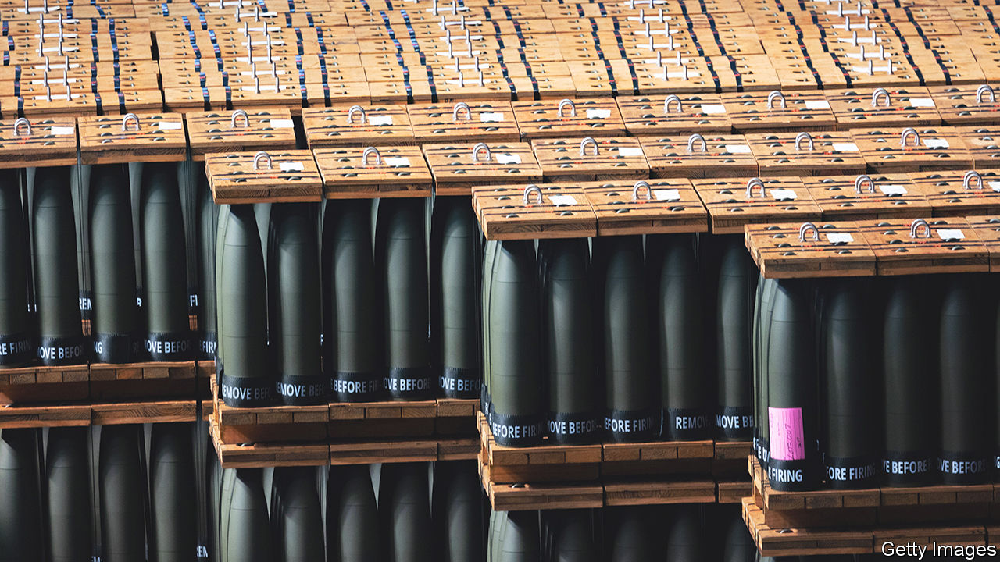

###### The home and foreign fronts

# Paralysis in Congress makes America a dysfunctional superpower 

##### Wars in Ukraine and Israel, and the risk of one over Taiwan, test American staying power 

 

> Oct 12th 2023 

ROBERT GATES, a former defence secretary who served Republican and Democratic presidents alike, recently issued a bleak warning. America faces an unholy alliance of China, Russia, Iran and North Korea, yet cannot muster a coherent response. “Dysfunction has made American power erratic and unreliable, practically inviting risk-prone autocrats to place dangerous bets—with potentially catastrophic consequences,” he wrote in .

The next day, Congress seemed to prove him right. Having danced on the brink of a government shutdown, on September 30th lawmakers adopted a stopgap budget to keep the federal government open for another 45 days. The reprieve came at the cost of halting further military and economic aid to Ukraine, at least temporarily. And despite worries about war over Taiwan, new Pentagon programmes are also on hold. Now Israel, too, is asking for American help to fight back against Hamas, after a  killed more than 1,200 people. At least 22 Americans died, and an unknown number are held hostage.

Plane-loads of munitions have started arriving in Israel and weapons are still flowing to Ukraine. At some point, perhaps in a few weeks or months, both will need more money from Congress. But it is unlikely to act until a new speaker of the House of Representatives is chosen to replace Kevin McCarthy, who was defenestrated. The disarray is caused, in part, by the fact that Republicans in the House hold only a narrow majority and are bitterly divided, not least over support for Ukraine.

Their paralysis raises questions about America’s global leadership—doubts that will be redoubled if Donald Trump, the previous president, wins back the White House. “When Congress returns, we’re going to ask them to take urgent action to fund the national-security requirements of our critical partners,” said President Joe Biden. “This is not about party or politics. It’s about the security of our world, the security of the United States of America.” His speech was intended to signal that America “has Israel’s back”, but Mr Biden is casting Israel’s need in broader terms. 

The White House may well bundle aid to Israel and Ukraine in a single supplemental budget request. The hope is that sympathy for Israel will make Ukraine aid more palatable for at least some sceptics. Some in Congress suggest aid for Taiwan might also be added. And Republicans talk of including funds to  with Mexico. On October 9th John Kirby, a White House spokesman, said there was no question of having to choose between helping Ukraine or Israel. “Both are important,” he insisted. “We are a large enough, big enough, economically viable and vibrant enough country to be able to support both.”

America has provided about $70bn in economic and military aid to Ukraine since February 2022. The Pentagon has about $5bn-worth of remaining authority to draw down weapons from its military stocks, but only another $1.6bn to replenish the arsenal. Israel receives at least $3.3bn a year. Some of the weapons it is receiving are from accelerated deliveries of equipment already on order. The Pentagon is looking at other ways to help. Separately, it announced a drawdown of arms for Taiwan worth $345m earlier this year, with a plea that Congress should appropriate funds to replenish stocks. 

The biggest portion of any new money will be for Ukraine. Support remains high among Democrats, but has eroded among Republicans. In September a majority of House Republicans—117 against 101—voted against a slice of Ukraine aid worth just $300m. It passed because Democrats voted 210-0 in favour.

Rather than vote on short-term supplementals, such as Mr Biden’s request for $24bn until the end of the year, Ukraine’s supporters in Congress are pushing for a large package, lasting a year, to avoid having to vote again in election season. Some speak of something close to $100bn, in effect multiplying Mr Biden’s request for the quarter by four.

Military assistance for allies could be pushed onto another “continuing resolution” that will probably be needed to avert a shutdown in mid-November, or even be included in an all-encompassing omnibus budget in December. Much will depend on voting rules that House Republicans use and, more important, whether and when , the Republicans’ choice and a consistent supporter of Ukraine, can secure the gavel.

Precisely what weapons America has provided to whom, and what’s left, is mostly secret. Broadly speaking, though, the arms most needed by Ukraine, Israel and Taiwan are different. Ukraine is hungriest for 155mm artillery shells and air-defence interceptors. Israel is seeking mainly precision-guided bombs for jets and interceptors for its Iron Dome air-defence system. Taiwan needs lots of anti-ship weapons. 

But some demands overlap: Israel is using the same artillery shells as Ukraine does (American shells held in reserve in Israel have been sent to Ukraine); it may also need more air defences if war spreads beyond Gaza. Taiwan uses the same Stinger missiles (shoulder-held anti-aircraft weapons) that have been supplied to Ukraine. The Pentagon is worried about its ability to support allies and replenish American military stocks. Until Congress acts, officials will be scraping together what funds and kit can still be found.

Many in Congress have lost faith in a seemingly indefinite war in Europe. Yet that is precisely what Mr Biden is asking them to fund, to make clear to Russia that the West is serious about supporting Ukraine “for as long as it takes”. The plan this year had been to help Ukraine recover sufficient territory to force Russia to the negotiating table on favourable terms. That hope is being dashed by the slow progress of Ukraine’s counter-offensive. 

Few expect either Russia or Ukraine to be able to mount another big offensive for months. Vladimir Putin probably does not want to order another mobilisation before his re-election in March 2024, if at all. The West’s push to increase weapons production may not bear much fruit before 2025. 

With no military breakthrough in sight, Plan B is to give Ukraine long-term security commitments to persuade Mr Putin that “he cannot wait us out”, as American officials put it. These were promised by Western countries in June, but have yet to materialise. The West would have two aims. First, build Ukraine’s “army of the future”, not least with the introduction of American-made F-16 fighter jets. Second, establish air-defence bubbles around big cities to allow economic activity to resume and some refugees to return. 

But all this requires the Ukrainian army to be able to hold the front, and enough air defences to withstand the coming winter onslaught of missiles and drones against Ukraine’s electricity-generation infrastructure. And it relies on having credible, long-term Western support. As for a “theory of victory”, demanded by some Republicans, it is mostly the hope that time, military pressure and sanctions will eventually crack the regime of Mr Putin. Earlier this year, during the short-lived revolt of the Wagner mercenary group, that seemed plausible. Of late, though, it is America’s Congress that has fractured most visibly.

Plan C, if American aid is severely curtailed, is anybody’s guess. “Just imagine if the deliveries were discontinued tomorrow: they would have just one week to go until they used up all ammunition,” Mr Putin gleefully said earlier this month. Some countries, such as Britain, insist they will help Ukraine regardless of what America does. Of late European countries have committed more aid to Ukraine than America has. But Europeans admit they could not replace American military support. And without American leadership, European support could crumble, too. 

Some Western diplomats are hinting at the option of seeking a diplomatic deal. There are two drawbacks. First, Mr Putin seems uninterested in negotiations before the American elections. Second, if Ukraine cannot hold the front, any settlement will be on Russia’s terms, not Ukraine’s.

The bloodshed in Israel and Gaza could divert funds and attention from Ukraine. But if it spurs Congress into action it may in fact help Ukraine. Confronted by multiple crises, the danger is that America’s foes will see it as a power in “irreversible decline”, as Mr Gates put it. It is also possible to see how the opposite could be true. ■


