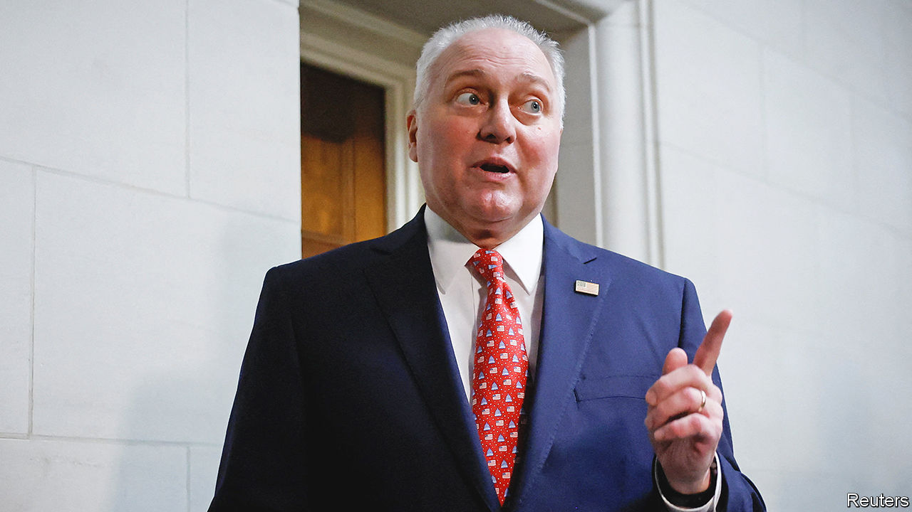

###### Pelican swoop

# The worst job in Washington is within Steve Scalise’s grasp 

##### How the next speaker of the House of Representatives may play his hand 

 

> Oct 12th 2023 

It is hard to predict precisely when the vacancy for the worst job in Washington will be filled. Yet Steve Scalise, a congressman from Louisiana, appeared likely to replace Kevin McCarthy as speaker of America’s House of Representatives at the time this issue went to press. It also remained unclear how much humiliation he might have to endure to secure the job, which will be a difficult one, whoever holds the speaker’s gavel next.

On October 11th Mr Scalise beat Jim Jordan, a Donald Trump-endorsed congressman from Ohio for the Republican nomination, 113-99. Mr Jordan then endorsed his rival, but enough spurned McCarthy allies and hard-right Republicans held out to prevent a speedy victory for Mr Scalise in the full House. His predecessor faced an embarrassing 15 rounds of voting, and no doubt Mr Scalise would like to avoid that. Should he become speaker, Mr Scalise certainly will have made concessions to various factions of his fractious party.

Mr Scalise, aged 58, is a survivor—politically and physically. He has spent the past decade climbing the greasy pole of the House Republican leadership. In 2017 a left-wing activist shot and nearly killed Mr Scalise as he practised baseball with other Republicans. Now he is receiving chemotherapy for multiple myeloma, a blood cancer, though he returned to the Capitol last month and has been working.

Mr Scalise remains generally well-liked in the Republican conference. He was the preferred choice of many moderates, and even Matt Gaetz, the Florida congressman who effected Mr McCarthy’s defenestration on October 3rd, declared “long live speaker Scalise” after the intraparty vote. Perhaps Mr Scalise’s greatest Republican foe was Mr McCarthy, who perceived a lack of support and loyalty when the former served underneath him as the second-ranked House Republican.

If he has the job, the beef with Mr McCarthy will matter little compared with the legislative battles to come. Shortly after winning the Republican conference contest, Mr Scalise, wearing a US-Israel flag pin, said the first vote he would call as speaker would be a resolution expressing support for Israel. Passing that legislation, which already has more than 400 co-sponsors in the 435-seat House, is not the same as funding the government. 

“He’s aware of the dynamics of legislating and the need for compromise. He is also a steadfast conservative,” says Matthew Green, a politics professor at the Catholic University of America. “I would expect him to be pushing hard for conservative legislative outcomes, but at the same time open to compromise if it avoids things like a government shutdown.”

Mr McCarthy lost his job after he had cut a deal with Democrats to temporarily fund the government through November 17th. Mr Scalise will now have to find a way to pass a budget that covers more than a few weeks and is acceptable to the White House and Democrat-controlled Senate. Mr McCarthy had enough baggage for an early polar expedition, but even as a light packer Mr Scalise could find trouble pushing through fiscal legislation deemed insufficiently conservative.

Perhaps the legislative process will become a bit less rocky with a new speaker. But Dan Lipinski, a former eight-term Democratic congressman, says underlying House dysfunction is driven by an “identity crisis” among Republicans that hasn’t gone away. Many want to legislate and pursue incremental conservative gains while others simply prefer nothing happen in Congress. Mr Lipinski also believes his own party, seeking political advantage from Republican chaos, has missed opportunities to change the tone on Capitol Hill.

He noted that House Democrats joined forces with nihilist Republicans to oust Mr McCarthy after his dealmaking to avoid a shutdown. “They were punishing Kevin McCarthy for finally doing the right thing, for doing what they wanted him to do,” Mr Lipinski says. “I think that is bad for the institution.” If the next speaker works with Democrats to pass a responsible bill to fund the government and assist Ukraine, will they once again help dispose of the Republican leader?■


