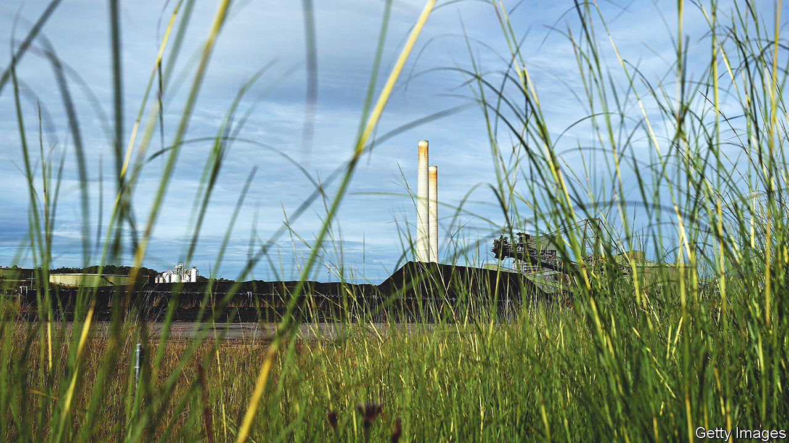

###### Lucky but sooty

# Australia’s energy transition is in trouble 

##### The government is suddenly rushing to prop up coal 

 

> Oct 19th 2023 

HUGE OPEN-CUT coal mines carve up the Hunter Valley in New South Wales. For decades the fuel extracted from them has been hauled by train to nearby power stations, keeping lights on across south-eastern Australia. But their turbines are winding down. One ageing coal plant shut in April. Three others in New South Wales are due to close within a decade. The state is jettisoning coal so fast it is attempting an “industrial revolution in 15 years”, said its energy minister, Penny Sharpe.

Australia, the world’s second biggest coal exporter, is finally trying to clean up its power sector, its biggest source of greenhouse-gas emissions. It still relies on coal for 57% of electricity generation and emits more from burning it, per person, than any other G20 country. But its states and centre-left federal government have set targets to slash emissions to net zero by 2050 or earlier. The Labor prime minister, Anthony Albanese, aims to get 82% of electricity from renewables by 2030. That is ambitious—and the transition is already running into problems.

The most pressing is that Australia has deployed enough cheap renewables to undercut its ageing coal plants, but not to replace them. Clean power generation, mostly from wind and solar, has more than doubled in a decade, to 37% of the total. One in three Aussie households has installed PV panels on its roof—more, per person, than any other nation. By comparison, Australia’s coal plants are old, expensive to maintain and power firms are hastening their closure. Over half the 15 stations on the eastern seaboard are due to shut by 2035.

That could leave a big generation gap. State governments which share responsibility for energy with the commonwealth, are stepping in to prop up ailing coal plants to avert blackouts. On September 5th the Labor government of New South Wales said it would negotiate to keep its biggest coal power station, Eraring, open beyond 2025, which is when its owner, Origin Energy, wants to close it. Victoria, another Labor-held state, is paying two power companies not to close their stations early.

Australia’s bounteous renewables resources should help it adjust. It is as rich in sun and wind as fossil fuels. Yet the task is daunting. The federal government estimates that to meet its targets, Australia must install around 44GW of renewables, plus batteries and reliable sources of power such as hydro. Meanwhile, investment in green energy is flagging. 

That is partly due to years of stop-start climate policy, which tied up parliament and toppled three Australian prime ministers. Between 2013 and 2022, conservative governments tore up a carbon price scheme created by Labor and resisted emissions cuts. “The problems we face now are a legacy of that dysfunction,” argues Kane Thornton of the Clean Energy Council, a renewables association. Australia still lacks an overarching policy to support its renewable targets, relying instead on a tangle of state and federal incentives.

Power lines are another problem. The national grid may need 10,000km of new cables to link up solar and wind farms. The federal government has allocated A$20bn ($13bn) in low-cost debt to draw investment. But Australia’s size makes the project hard and NIMBY-ist farmers are fighting it. Some protested in tractors at Victoria’s parliament in August, waving signs saying “don’t fight the hand that feeds you”. Landowners are a “human toll” in a “reckless race to renewables”, said David Littleproud of the rural National Party. 

The hold-ups leave state governments little choice but to prop up coal plants. “I don’t think anyone appreciated how difficult this would be,” says Tony Wood of the Grattan Institute, a think-tank. He argues for a policy to boost renewables investments, for example by putting a price on carbon emitted from coal plants, or making retailers buy more clean power. “We need levels of co-ordination between the states, industry and government that we haven’t seen since wartime”, he says. Indeed it is hard to match Australia’s ambitions on the energy transition with its progress. It will not become a renewables superpower if it cannot keep the lights on. ■

