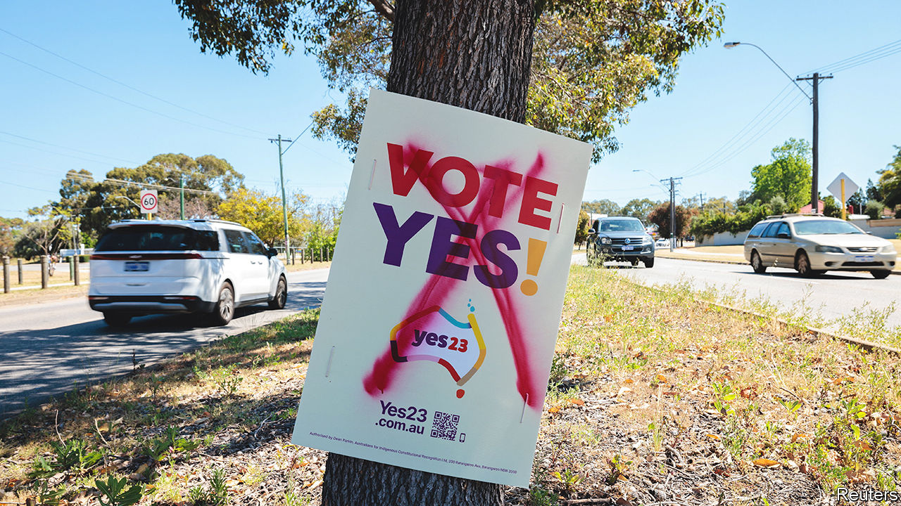

###### No special measures

# Has Australasia lurched right on race? 

##### Indigenous relations have taken a beating in votes in both Australia and New Zealand 

 

> Oct 19th 2023 

Indigenous people in Australasia have had a tough month. In a referendum on October 14th Australian voters rejected their Labor government’s proposal to establish an indigenous advisory body, or “Voice to Parliament”. On the same day New Zealanders elected the most conservative governing coalition since the adoption of proportional representation in 1993. The new prime minister, Chris Luxon, pledges to scrap policies designed to boost Maori influence in politics. Have the two countries moved right on race? 

Australians certainly moved against the “Voice”, which was meant to give Aboriginal people more say in policymaking. Polls last year suggested two-thirds would approve the necessary constitutional amendments. Yet over 60% voted “no”, rejecting the proposal in every state. Similarly, in dismissing their Labour government, New Zealanders rejected its schemes to promote the Maori language and hazy plans to “co-govern” with tribes. The country’s right-wing minor parties, ACT New Zealand and New Zealand First, called these “divisive race-based policies”. Both increased their vote. Results are still coming in, but Mr Luxon’s centre-right National Party may need both minnows for a majority.

Critics on both sides of the Tasman had the same complaint, that “indigenous policies risk dividing the nation along racial lines”, notes Dominic O’Sullivan of Charles Sturt University in New South Wales. These naysayers (some of them indigenous) objected to special rules for any group. The opposition campaigns also saw “an awful lot of race-baiting”, notes Mr O’Sullivan. Maori leaders complained in September of “dog whistling and outright public displays of racism from political candidates”. Australians displayed “contempt for us”, said an Aboriginal academic, Marcia Langton, after the referendum. Decades-long reconciliation efforts are in ruins, she and other activists say.

Yet many Australians see the verdict differently. It “doesn’t indicate that Australians are unsympathetic” to Aboriginal people, argues Greg Melleuish of the University of Wollongong, but that “they did not think this was the way to solve their problems.” Aussies are always reluctant to change their constitution; only eight of 45 referendums on doing so have succeeded. And no-campaigners could cite particular reasons for caution in this case. Important details of the Voice were unclear, they noted, including the issue of how its members would be elected and held accountable. Had the government of Anthony Albanese been more willing to negotiate on such issues, the centre-right parties might have been persuaded to back it.

The debate is in a sense starker in New Zealand, because it has made far more progress on relations with indigenous people. It had been almost two decades since race was a big electoral issue there. In contrast to Australia, New Zealand’s 19th-century colonists signed a treaty with Maori leaders, recognising Maori rights. Though they were flouted, this provided a legal basis, way back in 1970, for New Zealand to investigate and provide redress. It has reached settlements with almost 90 Maori tribes, or , offering apologies and compensation of NZ$2.6bn ($1.6bn). The process has had bipartisan support for decades—yet now faces scrutiny. ACT New Zealand’s leader, David Seymour, wants a referendum on the extent of its powers. “No one should be treated differently based on who their ancestors were,” he says. 

The final make-up of New Zealand’s coalition will not emerge until November. But Mr Luxon is already expected to axe a new Maori Health Authority, intended to give tribes more power over health policy and close a seven-year life-expectancy gap. He will also scrap unpopular plans to share management of water infrastructure with . Whether he might end some of his predecessor’s more cosmetic measures, such as pushing civil servants to speak Maori, is unclear—but many Labour supporters would not mind if he did. “Labour brought the race issue to the forefront because they moved at a pace that is not in line with the public,” says Sir John Key, a former conservative prime minister. Much the same happened in Australia. ■

