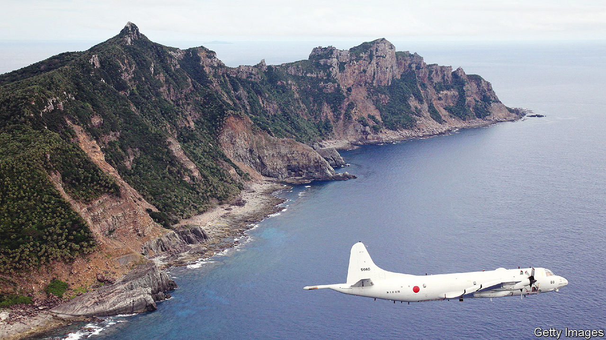
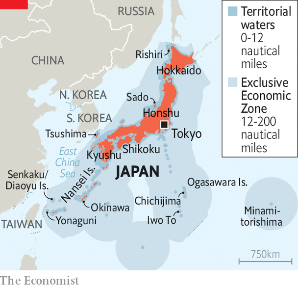

###### Japanese geography

# How remote islands underpin Japan’s maritime power 

##### And why those far-flung outposts face mounting pressures 

 

> Oct 19th 2023 

From afar, the Japanese archipelago appears to consist of just a few islands. Zoom in and more come into view, dotting the map like the ink splatters of a calligraphy brush. Japan has around 14,000 islands, some 400 of which are inhabited. These often-remote abodes, known as , define the country’s borders. Though small, and sometimes tiny, together they shape Japan’s identity as an ocean nation and underpin its maritime power.

 


The  are often overlooked. Fewer than 1% of Japan’s 125m people live outside its five main islands, Honshu, Kyushu, Shikoku, Hokkaido and Okinawa. Remote islands make up about 2% of Japan’s land mass. Yet they account for half of the exclusive economic zone (EEZ) which helps Japan punch above its weight at sea: it is the world’s 62nd-largest country yet has the sixth-largest marine area (see map). The combined coastlines of the , 20% of Japan’s total, are longer than the whole of Brazil’s. They are also storehouses of cultural and biological diversity.

Yet these quietly consequential islands face mounting pressures. On islands like Sado, off the northern coast of Honshu, or Rishiri, near Hokkaido, demographic change is hollowing out communities. Climate change threatens the already fragile supply chains of places like the Ogasawara, a group of islands halfway to Guam, which rely on ferries to connect them to the mainland. In the Nansei, the islands that stretch between Taiwan and Kyushu, residents are making flight plans in case of a war with China.

Remote islands closer to the mainlands have been Japanese for centuries. Visitors to Sado can find dozens of thatched-roof Noh theatres, a testament to the influence of Zeami Motokiyo, Noh’s pre-eminent playwright, who was exiled to the island in the early 15th century. Those farther afield, including the Nansei, the Ogasawara and the islets around Hokkaido, are relatively recent additions. Incorporating them played a “crucial role in the Japanese nation-building process” of the mid-to-late 19th century, says Ishihara Shun of Meiji Gakuin University in Tokyo. Their strategic value came to the fore during the second world war, when Iwo To, a speck in the Ogasawara, became the site of a terrible, legendary battle. (Iwo Jima, its widely known anglicised name, resulted from a Japanese military mispronunciation.)

After the war, the  struggled to keep up as Japan boomed. (The Nansei and the Ogasawara remained under American occupation for decades.) Many in Tokyo considered them an encumbrance. But perceptions changed as international maritime law evolved. In 1982, the United Nations Convention on the Law of the Sea granted states exclusive rights over marine resources extending 200 nautical miles (370km) beyond their territorial waters. That “changed the shape of the nation” and helped Japan become a “maritime great power”, says Iwashita Akihiro of Hokkaido University. The conferred it with vast fishing waters and undersea resources. 

Marine riches draw China’s attention. Oil and gas reserves are one reason that it covets a group of uninhabited islands in the East China Sea that Japan controls and calls the Senkaku (China claims them and calls them the Diaoyu). Deposits of rare-earth minerals, perhaps equivalent to hundreds of years’ worth of global demand, have been discovered in hard-to-extract mud on the sea floor near Minamitorishima, which belongs to the Ogasawara; Chinese research ships have been spotted surveying the sea floor nearby. On distant Chichijima, the main island of the Ogasawara, locals recall with horror a night in 2014 when hundreds of large Chinese fishing boats descended on the island to harvest its coral. “The fact that China is interfering in these areas is a testament to their value,” says Itokazu Kenichi, the mayor of Yonaguni. China’s threats to nearby Taiwan have also spurred Japan to reinforce defences on some remote islands in the south-west. 

Yet the biggest challenge for most  is a severe version of one that much of Japan faces: shrinking, ageing populations. “They cling to the memory of their golden age,” says Saito Jun, an author who has visited hundreds of islands. The population of remote islands shrank by nearly 60% between 1955 and 2010 (excluding those occupied by America). By contrast, Japan’s overall population began declining only in 2008. On the 300-odd inhabited  not linked to the mainland by bridge, 37% of the population was over 65 years old in 2020, compared with 29% nationally. If they were a prefecture, it would have been one of the most aged in the country. These trends worry security-conscious officials. “It’s important that people live there—it serves to patrol the borders,” says Tsukamoto Kuniyoshi of the remote-islands department at the infrastructure ministry.

Decades of state-backed investments have sought to make remote-island life more attractive. Yet health care remains far more precarious even than in rural areas on the mainland, acknowledges Kosaka Katsuya, a town-hall official on Rishiri. Locals there must trek to bigger islands to give birth; helicopters evacuate those who need emergency surgery. Many remote islands do not have high schools, and some are losing elementary and middle schools. Complex logistics mean higher prices for consumers. Businesses struggle with tiny local markets—some 70% of the  have fewer than 500 inhabitants.

Many islands hope simply to arrest the slide. On Sado, the population of 49,000 is projected to drop to 19,000 by 2060; the local government’s goal is to keep the decline to 30,000. Government subsidies aim to encourage migration to the island. But they are up against powerful social forces that are pushing young people away. “They hear from their parents and grandparents that there’s no point in staying, that you should leave, go make it in Tokyo,” laments Watanabe Kazuya, a local official. 

Remoteness is not in and of itself a death sentence. Take the Ogasawara, the most remote of all the inhabited , accessible only by a ferry that takes 24 hours to travel one way. The population has been stable for years; if anything, housing is in scarce supply. The internet keeps islanders connected to modern services; what cannot be found in the small handful of shops can be ordered from Amazon. Tropical weather, stunning vistas and an open-minded community attract many newcomers. For many of them, living so far off the map has its own wonderful appeal. ■

