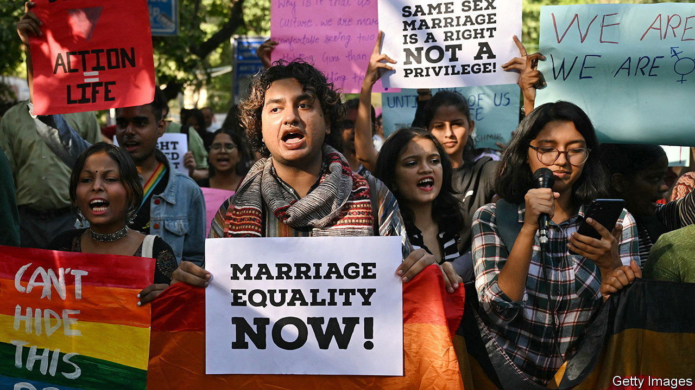

###### Don’t rely on the courts

# India’s Supreme Court refuses to recognise same-sex marriage 

##### The decision is a devastating setback for equal rights in the country 

 

> Oct 19th 2023 

THE MOOD in India’s gay community was hopeful on October 17th as the Supreme Court in Delhi began to deliver its verdict on a raft of petitions asking it to allow same-sex couples to marry. Yet it soon became clear that the five judges would not recognise gay unions. Instead they sided with the government’s view that changing the institution of marriage was a job for Parliament rather than the court.

The verdict is a bitter setback for gay rights. It is a victory for India’s Hindu-nationalist government, which considers same-sex marriage an “urban elitist” idea at odds with Indian culture. It also casts a shadow over the Supreme Court’s record of advancing personal rights and social progress despite conservative opposition.

The petitioners argued that marriage was a fundamental right guaranteed by India’s constitution, which should therefore be available to all. To make it so, they asked the court to tinker with the Special Marriage Act, which governs unions between people from different faiths or countries (Indian personal laws being largely religion-based, with different rules for people of different faiths). If the act referred to “spouses” rather than husband and wife, they said, it would cover same-sex couples. 

There was reason to think the court would be sympathetic. D. Y. Chandrachud, the chief justice, is an outspoken advocate of liberal values. Many of the court’s recent decisions have challenged prevailing conservative attitudes to sex and relationships in India and expanded rights against fierce government opposition. In 2014 the court recognised a third gender; in 2018 it decriminalised gay sex. A ruling in 2017 overturned the law that made adultery a criminal offence, emphasising the sexual autonomy of women within a marriage.

Mr Chandrachud rejected the government’s censorious depiction of same-sex marriage and recommended some recognition for same-sex unions in his minority opinion. Even so, he and the other judges agreed with the government that it was up to the legislature to make appropriate changes to the laws that regulate marriage. 

That was a cop-out. There will be no law to recognise same-sex marriage under the ruling Bharatiya Janata Party. Even if the opposition wins the election in 2024, which is unlikely, it will not be a priority. The court’s decision precludes most future attempts at legal challenge. ■

