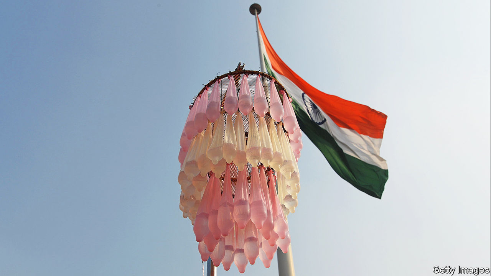

###### India and free love

# Social-media influencers are battling to educate young Indians about sex 

##### Condom sales are rising during the Navratri festival 

 

> Oct 19th 2023 

THIS WEEK marks the start of Navratri, a Hindu festival spanning nine nights that honours the goddess Durga. In western India, men and women celebrants will re-enact the fight between good and evil by clanking wooden sticks and swaying in circles together to loud music. Some go further. Navratri’s emphasis upon heady mingling between the sexes has long been associated with free love. The Hindu nationalist government of Gujarat once attributed a rise in abortions in the state to the festival. Condom sales are reported to soar ahead of it.

“We stock up a few weeks beforehand and sell 30-40% more than usual during Navratri”, says Mahendra Kumavat of K&amp;S Pharmacy in the Gujarati city of Ahmedabad. The growing scale of the festivities, as India gets richer, is creating opportunities for surreptitious coupling. Reduced family sizes have meanwhile made parents less able to rely on one of their offspring to police libidinous teens. Some go so far as to hire detectives instead. “On two occasions we do great business: one is Valentine’s Day and another is Navratri”, says Lalit Raval, a former air force officer, who runs a private detective agency in Gujarat.

Some condom sellers are seizing the opportunity. In 2021 Nykaa, an e-commerce outfit, slashed prices of condoms and lubes as part of a “Navratri sale”. A few years earlier Manforce, an Indian condom maker, ran hoardings featuring a former porn star called Sunny Leone with the slogan, “This Navratri, play, but with love”. The signs were castigated by Hindu activist groups and taken down.

India’s rulers are generally averse to talking about sex. Condom advertisements deemed explicit by the government were subsequently banished from daytime television across the country. Gujarat, Karnataka, Madhya Pradesh, Maharashtra and Rajasthan have all banned sex education in schools—with predictable results. According to a survey published in 2021, 78% of young men had had unprotected sex with their last partner. The incidence of venereal disease among adolescents is growing.

This is a chronic failing. Social-media influencers such as Tanaya Narendra, an embryologist with 1.1m followers on Instagram, are at least trying to fill the gap. “I am an ordinary girl from a small town in Uttar Pradesh. So people are not intimidated by me,” she explains. A study among teenage girls in northern India last year found a higher understanding of sex, birth control and pregnancy among social-media users than non-users. If they want to play with love this Navratri, they are likelier to do so safely.■


