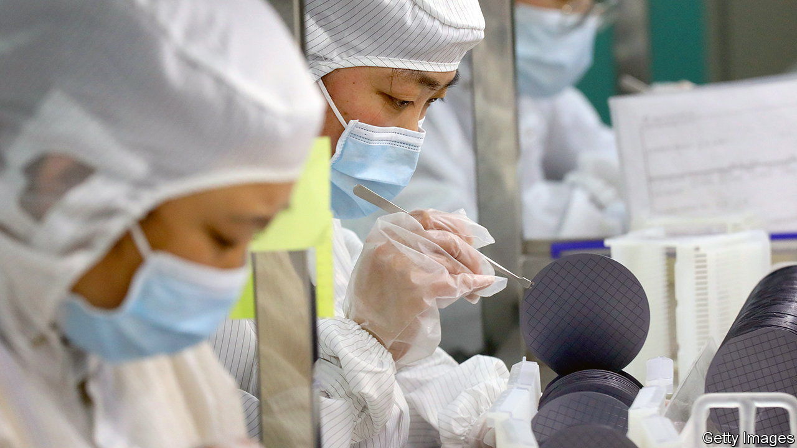

###### Chipping away

# South Korean chipmakers get a reprieve 

##### But the pressure from geopolitical tension and China’s domestic manufacturing drive will increase 

 

> Oct 19th 2023 

It has been an anxious year for Samsung Electronics and SK Hynix, South Korea’s leading chipmakers. Last October America restricted exports of advanced chipmaking equipment to China in an attempt to cripple its ability to procure or produce chips for weapons systems. The South Korean firms, which rely on China as both a manufacturing base and market, received a year-long exemption, but fretted about what might happen after it expires.

On October 9th their minds were put somewhat at ease. South Korea’s government announced that, thanks to “close co-operation” with America, the waivers would become indefinite. Yet the unpredictability of the  and China’s attempts to bolster domestic manufacturers mean South Korea’s most important industry may still have to look beyond China. 

Chips made up some 19% of South Korea’s total exports in 2022, more than any other product. Memory chips, which store information, make up almost 60% of that total, and South Korean companies control about the same percentage of the global market. Factories in China are key to this dominance. Samsung manufactures 40% of its NAND chips in the country, while SK makes 20% of its NAND chips and 40% of its DRAM chips there. China is a big market for both, accounting for 16% and 44% of their respective sales in 2021. So the exemption is hugely valuable; it allows the firms to keep sending spare parts to their factories in China. 

Chey Tae-won, the head of SK Group, has said it is “not possible to give up the Chinese market”. Yet even with the exemption it may be harder to make chips there. The details of the extended regime are not public, but if they constrain the use of specific types of equipment it might be difficult for South Korean companies to upgrade their factories beyond a certain point. Japanese and Dutch export restrictions on semiconductor technology used by Samsung and SK Hynix remain in place. And if companies want to receive tax incentives offered by America’s CHIPS Act, a law designed to encourage semiconductor manufacturers to set up shop in America, they may be constrained by limits it puts on the expansion of production in China. 

Chinese demand for South Korean chips is also uncertain. China’s sluggish economic recovery from the pandemic, and the stockpiles of chips that semiconductor firms have built up as a result, mean South Korean exports of semiconductors to China are down this year. And China has been pumping money into its own semiconductor industry. As a result YMTC, China’s memory-making champion, has survived being cut off from global chipmaking tool supply chains by American export controls. It is due to complete a new factory this year, relying on Chinese machine tools instead of foreign ones. Almost 56% of South Korean semiconductor firms surveyed by the Bank of Korea in June said unhelpful market conditions, China’s industrial policy and its advancing chip industry mean export levels are unlikely to recover.

The unpredictability of the Sino-American tech war creates further risk. South Korean officials like to say the row highlights the relative closeness of America and South Korea. It also reveals America’s tendency to design industrial policy without consulting allies. Its roll-out last August of the Inflation Reduction Act, which incentivises EV and battery manufacturers to reroute supply chains away from China and towards America, was a particular shock to South Korea. If America makes another such move to hamstring China’s semiconductor development, Samsung and SK could again face being collateral damage. 

For these reasons, both firms will probably try to reduce their dependence on China as a manufacturing location. Both are already looking to open more facilities in America and South Korea. Manufacturing costs are higher there than in China, despite the inducements both countries are offering chipmakers. That is the new reality chipmakers, and ultimately their customers, will increasingly face. ■

