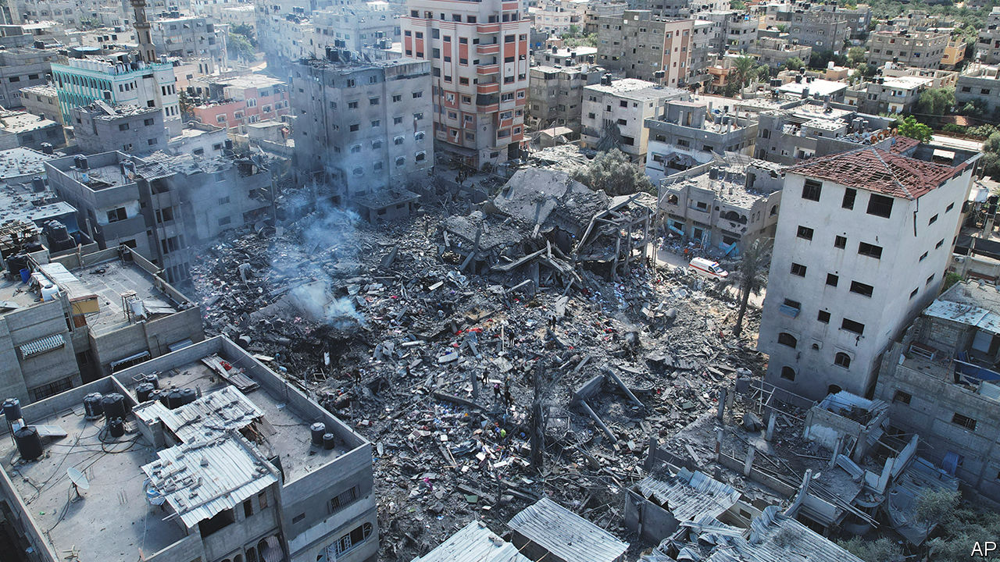
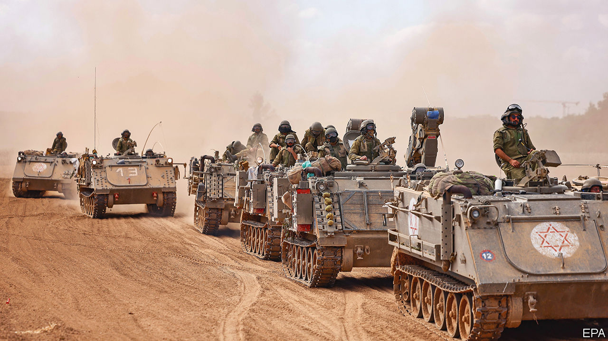
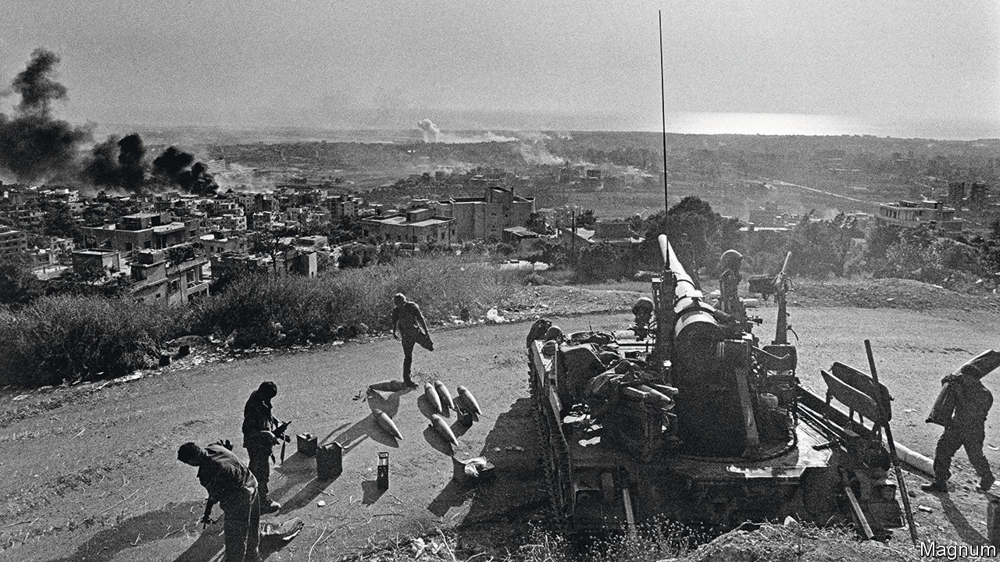

###### No place for a war

# As Israel’s invasion of Gaza nears, the obstacles get more daunting 

##### It must avoid a second front, protect civilians and save hostages while fighting at close quarters 

 

> Oct 19th 2023 

FOR THE first time in more than 40 years, the Israeli Defence Forces (IDF) have called up their entire armoured corps, thought to number more than 1,000 tanks. Fully 360,000 reservists have also been mustered, including a civil-defence force of 20,000 people. The additional manpower is intended to bolster the IDF’s full-time personnel, of roughly 170,000. Although some of these troops are deployed along Israel’s northern border, to ward off a potential attack from Lebanon by the militants of Hizbullah, more are massing in the south, near the Gaza Strip. Israel is poised to begin what is expected to be its biggest military operation since the invasion of Lebanon in 1982. Its leaders have said they are determined to destroy Hamas, the militant group that controls Gaza, in retaliation for its bloodthirsty rampage across southern Israel on October 7th.

As  went to press, no assault had materialised. The most obvious reason for the delay was the brief visit to Israel on October 18th of Joe Biden, America’s president. His presence was intended both to show support for Israel and to try to broker some sort of agreement to help Palestinian civilians trapped in Gaza.

As it happened, just as Mr Biden was boarding Air Force One on October 17th to head to the region, a deadly explosion racked a hospital in Gaza. The territory’s health ministry said that hundreds of people had been killed. Hamas blamed bombing by the IDF. Israel said a rocket fired by another Palestinian militant group, Islamic Jihad, had malfunctioned and fallen on the hospital compound. 

Analysis of images and video footage by independent researchers suggested that Israel’s explanation was more plausible. The IDF also released tracking data on rocket launches and intercepted communications among Palestinians that appeared to bear out its account. Palestinian rockets are built in makeshift workshops in Gaza to Iranian designs. Mid-air malfunctions are common: the IDF claims that of over 7,000 rockets fired at Israel since October 7th, at least 450 have fallen within Gaza. Israel points out that the images of the explosion’s aftermath show a charred car park at the centre of the hospital compound, and lots of damage to adjacent buildings, but no crater or structural devastation of the sort that would be expected from the munitions it uses in air strikes. 

Mr Biden backed Israel’s version of events. American officials cited their own infra-red satellite data and intercepts as evidence. But the tragedy nonetheless scotched his hopes of reaching a sweeping deal with Arab leaders to get aid into Gaza and at least some civilians out, despite Israel’s blockade of the territory. 

Timing is all

Any agreement depends on the acquiescence of Egypt, with which Gaza has a short border and where deliveries of food and medical equipment are piling up. But the carnage at the Ahli Arab hospital caused such outrage in the Arab world that Jordan quickly cancelled a summit where Mr Biden was to meet Abdel-Fattah al-Sisi, Egypt’s president, and Mahmoud Abbas, the leader of the Palestinian Authority (PA).

“There is no point in doing anything at this time other than stopping this war,” said Ayman Safadi, Jordan’s foreign minister. In the end the best Mr Biden could do was secure an Israeli pledge not to obstruct aid deliveries and an Egyptian one to let 20 trucks a day into Gaza. He also announced that America itself would provide $100m in aid to ease the Palestinians’ plight.

The tragedy at the hospital underlined the slow progress of Israel’s effort to encourage Palestinian civilians to move to the southern part of the Gaza Strip to escape the brunt of the looming battle. The IDF says that only 600,000 or so of the 1.1m residents of northern Gaza have heeded its call. By delaying a wide-ranging deal on humanitarian aid or safe zones where civilians can take shelter, the explosion at Ahli Arab will have set back efforts to persuade the holdouts. As it is, more Gazans have already been killed just by  since October 7th than in any previous conflict involving the territory. Inevitably, a ground assault will lead to far more deaths.

Southern Gaza has become extremely overcrowded, with no organised provision of food or shelter for arrivals from the north. Hamas has told Gazans to stay put. What is more, Israeli bombing continues in southern Gaza as well, with reports of refugees from the north being killed in air strikes. A common refrain among Gazans is that nowhere in the territory is safe, and that they might as well stay in the relative comfort of their homes. 

 


Another worry for Israel’s generals is the risk of a war on two fronts. Iran, an ally of Hamas, was caught by surprise on October 7th, according to people familiar with the situation. But it has since urged Hizbullah, a big militant group in Lebanon, to enter the fray. Hizbullah has an arsenal of some 150,000 rockets and missiles, including more accurate ones than Hamas can deploy, which would severely tax Israel’s missile-defence systems.

The possibility of war with Hizbullah is looking likelier by the day, say Israeli insiders. Although Hizbullah might prefer not to invite Israeli retaliation against Lebanon, which is gripped by a dire economic slump, it ultimately answers to its Iranian paymasters, not ordinary Lebanese. On October 16th Hossein Amir-Abdollahian, Iran’s foreign minister, made an ominous warning: “The possibility of pre-emptive action…is expected in the coming hours,” he told Iranian state television. The same day Israel’s government issued an unprecedented order to evacuate 28 Israeli villages within 2km of the border with Lebanon. On October 17th the IDF killed four people attempting to cross a security fence.

Some ministers and defence officials have suggested that it may be better for Israel to attack Hizbullah pre-emptively, rather than wait for another surprise attack, this time from the north. Israel’s war cabinet, which includes both Binyamin Netanyahu, the prime minister, and various political rivals, including former generals, seems inclined to wait while sending more troops to the border.

Israel may also be waiting for more American firepower to arrive in the region. A flotilla led by an aircraft-carrier is already in the eastern Mediterranean. Another is en route. These forces are intended to deter Iran, Hizbullah and other Iran-aligned militias in Iraq, Syria and Yemen from entering the war, or attacking American interests in the Gulf. The American ships’ air-defence systems may also be able to provide Israel with additional warning of missile strikes, if not a degree of protection. 

Another potential disruption to Israel’s preparations for war is the West Bank, the other slice of Palestinian territory, with roughly 2.7m inhabitants. The 40% of it that Israel does not administer directly are in the hands of the PA. But Mr Abbas is weak and unpopular. After the tragedy at the Ahli Arab hospital widespread protests broke out against his government. The IDF’s fear is not so much of a third front, in the form of a popular uprising against Israel, so much as chaos that requires the presence of more Israeli troops. There is also the constant threat of violence between Palestinians and the almost 700,000 Israeli settlers in the West Bank and the eastern part of Jerusalem.

A final reason for Israel to delay its offensive was an effort to free at least some of the Israeli hostages captured on October 7th. The IDF believes that Hamas, Islamic Jihad and other groups hold 203 of them. Israeli spies have been trying to gather intelligence about where they are being held.

Discussions disrupted

Quiet talks to secure the release of hostages had been under way. Qatar, which hosts Hamas’s political leadership and has strong ties to the group, had been acting as a go-between. But those diplomatic efforts appeared to collapse on October 17th after the tragedy at the Ahli Arab hospital. Most Arab states, including those who had previously appeared somewhat sympathetic to Israel, such as the United Arab Emirates, blamed the IDF for the disaster, despite Israel’s detailed disavowal of responsibility. That both makes it much harder for Israel to build diplomatic support for a ground war and gives it less reason to delay, now that Mr Biden has left the region. 

Israeli commanders, at any rate, are getting itchy feet. The IDF began mustering within hours of the atrocities of October 7th. Its forces have been largely in place for almost a week.“We really should get going this weekend,” says a colonel. “You can maintain this level of readiness for two weeks at the most.” 

The invasion, when it comes, will be hard-fought and bloody. Israel’s leaders have loudly and repeatedly promised to destroy Hamas’s military capabilities for good and end its 16-year rule. That means a campaign of a different order from previous incursions into Gaza, in 2009 and 2014, which aimed merely to diminish Hamas’s military capacity and were followed by a gradual return to the status quo. 

But the Gaza Strip is a difficult place to fight, for several reasons. First, it is full of dense cities, composed of tightly packed apartment blocks. Such places will limit the invaders’ lines of sight and hamper their communications, with the tall buildings impeding radio signals. Civilians could be anywhere, and there will be endless places for Hamas’s fighters to hide.

What is more, Hamas has built a 500km network of tunnels under Gaza—a territory only 40km long and 10km wide. The intention was in part to undercut Israel’s technological advantage in seeing and striking from the air. Even the most sophisticated drones cannot provide much information about what is happening underground. Troops entering the tunnels cannot navigate by GPS or communicate by radio.

 


In its invasion of Gaza in 2014 the IDF struggled to deal with such tunnels. It has since invested heavily in subterranean warfare, setting up special units for the task and constructing a simulacrum of Hamas tunnels for training. It has developed various technical means to hunt for them, including some modelled on the underground surveys conducted by the oil industry, as well as methods based on old-fashioned intelligence—looking for spots where militants’ mobile-phone signals suddenly disappear, for instance. Even so, finding and demolishing the tunnel network will be the work of months, if not years, and certainly not a few days. 

A second concern is the presence of so many Palestinian civilians. American-led assaults on cities during the Iraq war and the Iraqi-led, Western-backed capture of Mosul from Islamic State in 2016-17, were painstakingly planned and conducted with the benefit of copious intelligence. Large numbers of civilians died nonetheless—perhaps as many as 10,000 in the battle for Mosul alone.

In theory, international humanitarian law, which governs the conduct of armies once they are waging a war, demands that soldiers distinguish between combatants and military objects on the one hand and civilians and civilian objects on the other. Targeting those on purpose is always illegal. But an attack that kills civilians—even lots of them—can be legal if it is necessary for some military purpose and proportionate “in relation to the concrete and direct military advantage anticipated”. In other words, Israel can legally justify the deaths of civilians as long as they are killed in the crossfire in operations that did not use disproportionate force.

Whatever international law might say, however, as civilian casualties mount, so will pressure on Israel to withdraw and accept a ceasefire. Its previous invasions of Gaza, in 2009 and 2014, were quite brief. In both cases, the IDF remained on the ground for about 18 days. That would not be nearly enough time to achieve Israel’s stated goals this time around. It took Iraqi troops nine months of house-to-house combat to subdue Mosul.

That points to perhaps the biggest challenge for Israeli forces in Gaza: not getting bogged down. America’s invasions of Afghanistan and Iraq after the terrorist attacks of 9/11 and Israel’s war in Lebanon in 1982 (the last time all those tanks were deployed) provide cautionary tales. 

America’s “global war on terror” started triumphantly. Just two months after al-Qaeda’s attacks on America in September 2001, American-led forces were in control of Kabul, the capital of Afghanistan. The Taliban government was gone. Al-Qaeda was hounded. Its leader, Osama bin Laden, was tracked to Pakistan and killed in 2011. But the Taliban fought a growing insurgency. Having lost more than 2,400 military personnel, America left in 2021. The Afghan government collapsed almost immediately and the Taliban returned to power.

The war in Iraq was inglorious, too, and far bloodier. Once again, American forces quickly took the capital, Baghdad, in April 2003. President George W. Bush strutted on the flight deck of the , an aircraft-carrier, under the sign: “Mission Accomplished”. In fact, the country was about to slip into civil war. American forces captured Saddam Hussein, Iraq’s dictator, but soon faced bloody insurgencies by both Sunni and Shia militias. All told, America lost some 4,500 service members, not to mention some 300,000 Iraqis who died, most of them civilians.

History lessons

Israel’s own history offers similar warnings. In 1982, amid a series of attacks by the Palestine Liberation Organisation (plo), the nationalist umbrella group, gunmen shot and wounded Israel’s ambassador in London. The Israeli government took the killing as a to invade Lebanon and dismantle the plo, even though it was attributed to militants from a rival, the Abu Nidal group. Israeli forces besieged the plo in west Beirut, forcing its leader, Yasser Arafat, and thousands of fighters, to sail into exile. Israel’s Christian ally, Bachir Gemayel, was elected Lebanon’s president.

Then it all fell apart. Gemayel was blown up. In sight of Israeli forces, his Phalangist fighters exacted revenge by killing Palestinians in the Sabra and Chatila refugee camps. An Israeli commission of inquiry found Ariel Sharon, Israel’s defence minister, indirectly responsible. Within a year, under pressure from anti-war protests, Menachem Begin, the prime minister, announced his resignation.

One effect of the Lebanese imbroglio was that the plo was replaced by Hizbullah, a more formidable, Shia militia, which succeeded in pushing Israel out of Lebanon in 2000. Another impact was on Palestinians within the Israeli-occupied West Bank and Gaza Strip. Their first intifada, or “shaking off”, a stone-throwing uprising that started in 1987, set the stage for the Oslo accords between Israel and the plo of 1993. Arafat made a triumphant return to Gaza the following year.

Hamas emerged as the main force of violent rejectionism and did much to destroy the Oslo accords. It forced Israel out of Gaza in 2005 and won the Palestinian legislative elections in 2006. The following year it pushed out the PA.

For Hussein Ibish of the Arab Gulf States Institute, an American think-tank, the lessons are clear. Terrorist and insurgent groups, he argues, resort to spectacular violence to provoke an irrational response. “They know that the harm that they can do to the dominant power is limited,” he says. “They understand that the harm that the dominant power can do to itself is infinitely greater.” ■

