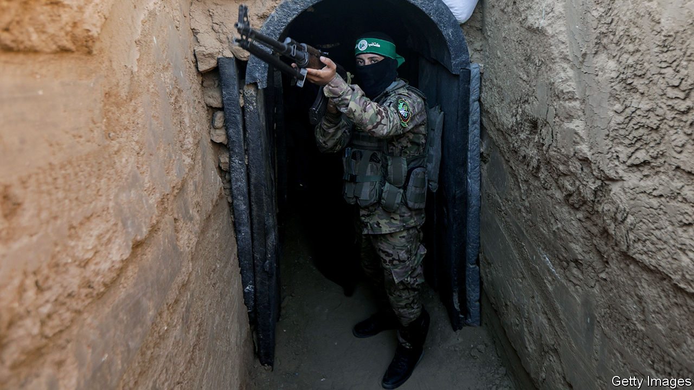

###### Tunnel vision

# Hamas tunnels under Gaza will be a key battlefield for Israel 

##### Underground warfare is terrifying, claustrophobic and slow 

 

> Oct 17th 2023 

STUDENTS OF urban  divide the battlefield into four planes. One is the sky above cities, increasingly thick with drones. Next are the buildings that extend upwards, offering vantage points and hiding places. A third is the streetscape: the lattice of roads, alleys and paths that form a city’s peacetime arteries. It is the fourth—the tunnels lying beneath—that will present the greatest challenge to the Israel Defence Forces (IDF) when they begin  of the Gaza Strip in the coming days.


The first smuggling tunnels in the area were built by Bedouin clans on both sides of the Egypt-Gaza border after 1981, when Israel and Egypt demarcated the border. The first known tunnel attack from the strip occurred in 1989. But it was in 2001 that Hamas, the militant group that would later take over the territory, after Israel withdrew in 2005, began construction of a remarkable subterranean network. Its initial aim was to smuggle in material and arms from Egypt. But the tunnels had manifold other uses.

Commanders could hide in them and use them to communicate without relying on Gaza’s phone network, tapped by Israel. They provided hiding places for weapons and ammunition. Hamas could use them for ambushes during Israeli ground wars in Gaza. And they allowed cross-border raids into Israel for attacks and abductions—such as the kidnapping of Corporal Gilad Shalit in 2006, a raid that later helped Hamas secure the release of more than 1,000 Palestinian prisoners. Hizbullah, the Lebanese militant group, built similar tunnels on the Israel-Lebanon border, though most were destroyed in 2018-19. 

The military rationale of such tunnels was ultimately to erode Israel’s way of war. “In 2008”, said a Hamas commander, reflecting on a brief but intense war over Gaza that winter, “the air strike and air surveillance [by Israel] took us by surprise…so we made strategic plans to move the battle from the surface to underground.” By 2014 the group’s tunnelling effort employed 900 full-time staff, with each tunnel taking three months and an average of $100,000 to build, according to a study by the RAND Corporation, a think-tank. Hamas raised capital for the tunnels, pitching them as commercial investment schemes, complete with contracts drafted by lawyers, through mosques in Gaza. Iran and North Korea are thought to have helped with construction, supplying money and engineers. 


In 2014 the IDF launched Operation Protective Edge, an air and ground war targeting the tunnels. It destroyed around 32 of them, stretching for 100km in total, 14 of which penetrated Israeli territory. That was a tiny fraction of the whole network, which was thought to number 1,300 tunnels extending, according to Hamas, 500km in all—more than ten times the length of Gaza itself. A commission of inquiry after the war found that the IDF was unprepared for the danger presented by the tunnels, despite having warned the country’s political leadership that they presented one of the five most serious threats to the state. Israel’s defence minister at the time boasted that it would take just a few days for the IDF to destroy the tunnels it had targeted; it took weeks. 

Locating tunnels proved extremely difficult. “We were familiar with the tunnels mainly in theory,” noted General Nadav Padan, who commanded a division in 2014. “We did not have operational experience.” (General Padan, since retired in New York, returned to Israel on October 8th to rejoin the IDF.) The IDF used “geophones”, as well as ground-penetrating radar, which turn ground vibrations into voltage, and detection of echoes from controlled explosions, a technique honed in the oil industry. But many tunnels were discovered thanks to human intelligence—sources inside Gaza—or infantry patrols that happened to find the entrances. Israeli signals-intelligence units also looked for occasions when Palestinian phone signals would suddenly disappear.

Even when a tunnel was found, destroying it was another matter. Israel’s air force attempted to drop precision bombs along the tunnel’s route, a practice dubbed “kinetic drilling”, but some failed to detonate at the right depth. The IDF also used “Emulsa”, a gel-like explosive, but each tunnel required nine to 11 tonnes of the stuff on average, notes RAND, with ground troops forced to secure entrances for long periods. Units often had to improvise; some borrowed trolleys and agricultural equipment from Israeli border villages to shuttle explosives into Gaza.

In the past, IDF personnel generally sought to avoid fighting in tunnels, many of which were booby-trapped. The army’s high command barred troops from entering them unless one end had been blown up or secured; this order was disregarded only once, in 2014, when an Israeli officer’s body was snatched into a tunnel in Rafah, Gaza’s southern crossing with Egypt. The prohibition made sense. In many ways, subterranean warfare epitomises the trickiest aspects of urban warfare.

Cities involve limited lines of sight, close-quarters battle and poor communications, with radio signals travelling poorly between tall buildings. Tunnels exacerbate all those things. Even the most sophisticated drones cannot see underground. Navigating by GPS is impossible. Radio signals for communication do not penetrate far. 

The experience of British soldiers involved in a recent tunnel exercise in Leeds, a northern city in England, highlighted the challenges that IDF soldiers are likely to face. The total darkness made night-vision goggles all but useless, for instance, since such devices rely on amplifying the faint ambient light that is present above ground even at night. Disturbing stagnant water risks releasing toxic gases into the air. The air is colder than above ground by as much as ten degrees Celsius. “You realise that unless you are properly drilled, and have spent a long time down there, you’re not moving fast,” noted one British soldier in the Leeds exercise. 

The sound of weapons fire is also amplified in an enclosed space, observes Joe Vega, the US Army’s top expert on underground warfare. That, he says, is why larger teams are needed to clear tunnels, “because you have to continually replace people in and out—they just can’t last.” The effect, known as overpressure, also causes weapons fire to kick up dust and dirt, reducing visibility. 

The techniques once used to clear tunnels—America used tear gas in Vietnam; the Soviets a variety of chemical agents in Afghanistan—“would likely be regarded as unlawful today”, says Daphné Richemond-Barak in “Underground Warfare”, a book on the topic. (Despite its frequent use against domestic protesters, tear gas is largely illegal in war.)

The IDF increasingly relies on technology to help. It has remote-controlled ground robots, for instance, which can look for booby traps or ambushes lying in wait. “To enter a tunnel after a robot has combed through it…makes the situation a lot less stressful,” says a soldier from the IDF’s elite Samur (weasel in Hebrew) tunnelling unit, quoted in a recent study. “It lowers the tension and the environment becomes much more sterile.” But tech is unreliable. “More than once a soldier was operating a robot that got stuck inside a tunnel,” complained another officer. “Now try and go in and retrieve a robot that is 400 metres inside a tunnel complex. It’s like running 150 metres where each metre is like crossing a desert for a month.”

In the nine years since Operation Protective Edge, the IDF has invested heavily in tunnel operations; it has introduced new doctrine, techniques and specialised units. It has constructed its own version of Hamas tunnels for training. Its Yahalom battalion, an elite combat engineering unit, which includes Samur, was reorganised, notes Omer Dostri of the Jerusalem Institute for Strategy & Security, a think-tank, with its size doubled from 400 to 900 personnel and new tunnel reconnaissance units attached to the IDF’s Gaza division. 

It faces a forbidding task. On October 16th Lieutenant-General Herzi Halevi, the IDF’s chief of staff, promised “to enter Gaza, to go to the places where Hamas is preparing, acting, planning, launching” and to “attack them everywhere, every commander, every operative, destroy infrastructure.” In practice, identifying, clearing and collapsing several hundred kilometres of underground warrens will be the work of years—not weeks or months. ■

