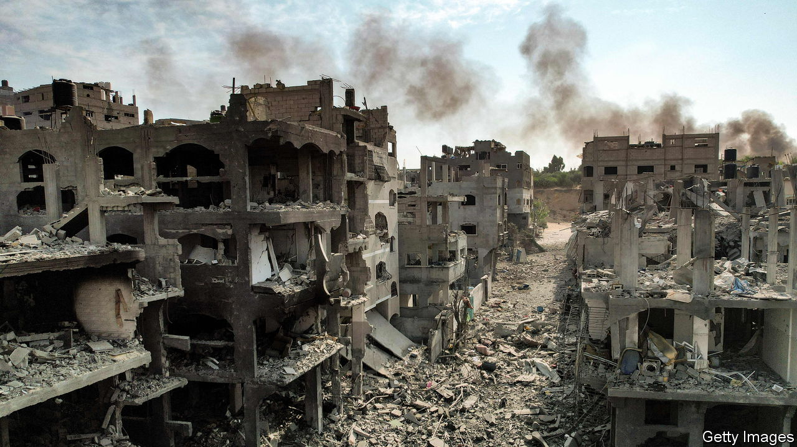
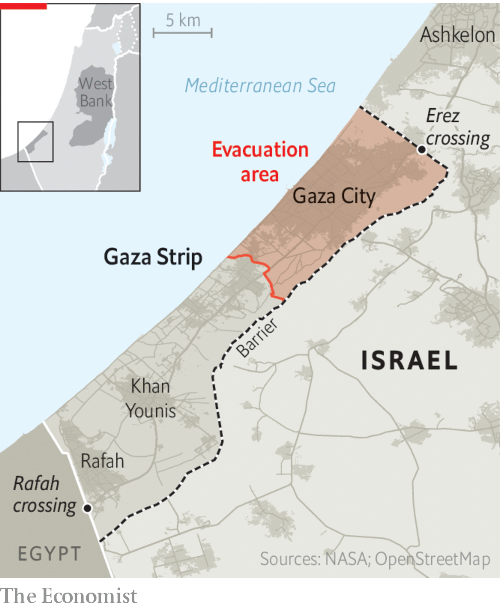
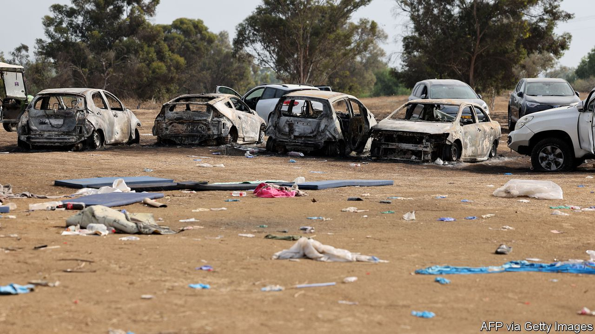

###### The coming ground invasion

# Is Israel acting within the laws of war? 

##### Even lawful evacuations and attacks on Hamas will exact a heavy civilian toll in Gaza 

 

> Oct 14th 2023 

MORE THAN 1,900 Palestinians have been  on Gaza since October 7th, when Hamas terrorists  in southern Israel. Israeli jets and artillery have been pounding the coastal enclave. “The scenes out of Gaza will be hard to stomach,” warned a spokesman for the Israel Defence Forces (IDF) on October 12th. Hamas, which has deliberately massacred civilians, and whose founding charter commits it to the destruction of Israel, is undoubtedly guilty of war crimes. How far can Israel go in response? 


Israel’s initial actions have prompted a wave of criticism. B’tselem, an Israeli human-rights group, has accused Israel of “a criminal policy of revenge”, arguing that the scale of its air strikes and blockade constitute “war crimes openly ordered by top Israeli officials”. Médecins Sans Frontières, a humanitarian organisation, has accused Israel of unlawful “collective punishment” of Gaza “in the form of total siege, indiscriminate bombing, and the pending threat of a ground battle.”

In practice, though, international law and the specific rules that govern warfare—the law of armed conflict (LOAC), also known as international humanitarian law (IHL)—give Israel considerable latitude to attack Hamas, according to legal experts. Article 51 of the United Nations charter gives states the right of self-defence against armed attack, provided that, according to customary international law, the force they use is necessary and proportionate. Proportionality does not mean symmetry in the type of weapons used or the number of casualties caused. It means that the defending state can use as much force as is needed to address the threat—and no more.

 


Drawing that line is a subjective and contentious process. But Israel’s campaign so far would meet those criteria, argues Aurel Sari, a law professor at the University of Exeter who lectures to NATO armed forces. The scale of Hamas’s attack, its demonstrated intent and proven capability means that  or even occupying it temporarily to destroy the group “will be relatively easy to justify” legally, he says.

Nonetheless, some measures are particularly contentious. Israel, helped by Egypt, which controls a southern crossing, has maintained a ground, air and naval blockade of Gaza for years, with only some goods and people permitted to cross. Sieges and blockades are not in themselves illegal. But on October 9th Yoav Gallant, Israel’s defence minister, said that would turn into a “complete siege”, with “no electricity, no food, no fuel, everything is closed”. Three days later Israel Katz, the energy minister, warned that no “electrical switch will be turned on, no water hydrant will be opened and no fuel truck will enter” until Hamas .

Israeli officials justify this move on the basis that Hamas diverts civilian goods for military use. “Clearly” says Amichai Cohen, a law professor at the Israel Democracy Institute in Jerusalem, “there is some level of supply that Israel should allow. The question is whether Israel should provide electricity to areas which are clearly controlled by Hamas, and where Hamas will use the electricity in order to attack Israel.” Others, such as Tom Dannenbaum, a law professor at Tufts University in Boston, argue that Mr Gallant’s order plainly violates a prohibition on starving civilians—even if the goal is to squeeze Hamas. That may be one reason why, despite Mr Gallant’s combative rhetoric, Israeli officials are privately working with Egypt to ensure that some supplies can come in from the south. 


A second source of legal dispute is the IDF’s decision, late in the evening of October 12th, to tell 1.1m civilians living in the northern part of Gaza . (Hamas called on civilians to ignore the call.) The grave humanitarian consequences of this decision are not in doubt. Gaza’s infrastructure is in ruins and there are few places for so many people to go. But the legal aspects are more complicated. 

Lawyers distinguish between temporary evacuation of civilians in warzones, which can be lawful, and permanent displacement, where the intent is to prevent them from returning, which is not. However the International Committee of the Red Cross (ICRC), a humanitarian group, says that the evacuation instructions, combined with the siege, “are not compatible with international humanitarian law”. It is also not always safe to move while the bombardment continues. Video footage verified by the  showed a number of people including several children who had been killed, apparently by an Israeli strike while they were fleeing to the south on Friday. 

The question of evacuation is tangled up with the specific conditions of Gaza, where Hamas is deeply intermingled with the civilian population. IHL, which governs the conduct of armies once they are waging a war, demands that soldiers distinguish between combatants and military objects on the one hand, and civilians and civilian objects on the other. Targeting the latter on purpose is always illegal. But an attack that kills civilians—even lots of them—can be legal if it is necessary for some military purpose and proportional “in relation to the concrete and direct military advantage anticipated”. 

Israel’s targeting is “broadly within the mainstream of contemporary state practice” and in line with American doctrine, argued Michael Schmitt of the University of Reading and Lieutenant-Colonel John Merriam, a US Army Judge Advocate, in papers published after they visited the IDF’s headquarters and studied its procedures shortly after Operation Protective Edge, Israel’s 50-day war on Hamas in 2014.

But the same legal principles, even interpreted in broadly the same way, can result in different and sometimes jarring outcomes because of local circumstances. Hamas’s large rocket force, capable of striking most of Israel, means that the anticipated “military advantage” of attacks is seen to be high, note Mr Schmitt and Lt-Col Merriam. That can justify, in the IDF’s view, high levels of collateral damage that would appear excessive to an army whose civilian population did not face a comparable threat—though, conversely, the effectiveness of the country’s Iron Dome missile-defence system can have the opposite legal effect. Similarly, Israel’s conscript-heavy armed forces are casualty averse and sensitive to soldiers being taken prisoner. That can result in a greater reliance on firepower.

Hamas’s way of war also plays a role in Gaza. “It’s not a regular city,” argues Avichai Mandelblit, who served as Israel’s chief military advocate general (MAG) from 2004 to 2011 and attorney-general from 2016 to 2022. “It’s a military city. There are thousands of legal military targets inside the neighbourhoods of Gaza. You cannot distinguish them.” Israel’s war aim is to destroy Hamas. “If you want to do it,” says Mr Mandelblit, “then you have to destroy Gaza, because everything in Gaza, almost every building there, is a stronghold of Hamas.” Evacuation of civilians is thus unavoidable, he says. “There is no other way—the other way is they’re going to be killed.” 

The law nonetheless demands discrimination. Each target must be judged individually. But the scale of Israel’s bombardment—6,000 bombs dropped in six days, compared with 2,000 to 5,000 per month across Iraq and Syria during the American-led air campaign against Islamic State from 2014 to 2019—has given rise to concern that the definition of military targets is being stretched to breaking-point. “It is very hard to see a legal basis for many of these strikes,” argues Adil Haque of Rutgers Law School in New Jersey. “It’s hard to believe that all of these buildings were in active use by Hamas when they were levelled, or that their military value would outweigh the foreseeable harm to civilians in or near them.” 

Mr Sari says that the IDF, in his experience, is “world-class” in its legal expertise and professional ethics. “I have a lot of faith in the Israeli military, lawyers and their system. It is very robust.” Military lawyers are present at Israeli military headquarters from the brigade-level up to advise on targeting. “Every target is legally examined,” insists Mr Mandelblit. Legal policy is set by the MAG and civilian attorney general together, with the latter getting the last word.

But this system is likely to face its greatest test in the weeks ahead. On October 10th an Israeli official told a television station: “Gaza will eventually turn into a city of tents. There will be no buildings.” Daniel Hagari, an IDF spokesperson, boasted that “hundreds of tons of bombs” had been dropped on Gaza. Then, he added: “the emphasis is on damage and not on accuracy.” Neither statement can be squared with the law. 

 


Major acts of terrorism can unmoor even the most professional armed forces. America engaged in torture after 9/11. American, Australian and British special forces have all faced allegations of war crimes in Afghanistan and Iraq. A video published on October 10th appears to show Israeli troops executing Palestinian gunmen who were on their knees and waving a flag of surrender. “If you send tens of thousands of conscript soldiers on a revenge mission into a dense urban area that civilians can’t leave, the results are entirely predictable,” warns Jack McDonald of the Department of War Studies at King’s College London. 

Restraints that applied in previous military operations may not apply in this war. Mr Mandelblit gives the example of the IDF’s policy of giving prior warning for some strikes. Armies are generally obliged to provide warning of attacks when they can, though not if surprise is essential. “You cannot do it in such a war,” he says. “It’s more like Lebanon now,” he says, alluding to Israel’s war with Hizbullah, the militant group, in 2006. “All we can say to civilians is: look, go away from your cities or your homes, where Hamas is mixed.” The IDF has already abandoned its earlier practice of “roof knocks”—the use of smaller bombs a few minutes ahead of larger strikes—in favour of general warnings to entire neighbourhoods. 

Israel’s war has acquired an existential quality. “This time it’s going to be a war to the end,” says Mr Mandelblit. “It’s either us or them because we know what they’re going to do to us.” Yet Mr Cohen warns that the law is not the only consideration in waging war. “The fact that a lot of children in Gaza, Palestinian children, will die in an attack—even if it’s legal—is destructive for Israel’s legitimacy around the world.” ■

