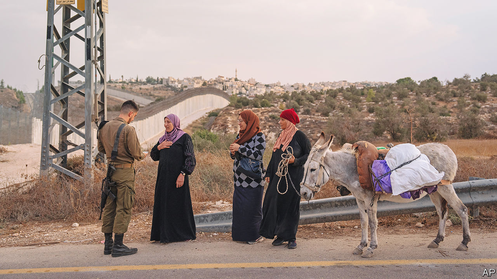

###### When the shooting stops

# Israel’s four unpalatable options for Gaza’s long-term future 

##### The path to Israel’s preferred outcome is littered with obstacles 

 

> Oct 19th 2023 

THE PUBLIC statements Joe Biden made during his lightning visit to Israel on October 18th did not suggest many misgivings about Israel’s impending invasion of the Gaza Strip. In private, however, the American president’s advisers hoped to press Israel’s leaders on an urgent question: what should happen after the war?

Israeli officials say they are focused on toppling Hamas from power, in retribution for the massacre it committed in southern Israel on October 7th. “Gaza will no longer be a threat for Israel,” says Eli Cohen, the foreign minister. “We will not agree that Hamas will have any power in Gaza.” Even after the risks of fighting in such a densely populated place were illustrated by a deadly blast on October 17th at Gaza’s Ahli Arab hospital, which Israel blamed on an errant Palestinian rocket, Israel’s stated war aims have not changed.

Four-way stop

But Israel’s post-war plans remain uncertain. It has four main options, all bad ones. First is a prolonged occupation of Gaza, like the one it undertook from 1967 to 2005. Israeli troops would have to secure the enclave and, in the absence of a Palestinian government, might have to oversee basic services as well.

This might please a segment of Israel’s religious right, which still fumes about the withdrawal in 2005 of all Israeli soldiers and settlers from Gaza as the abandonment of a sliver of the biblical homeland of the Jews. But no one else wants to see Gaza reoccupied, given the heavy financial burden and the likelihood of endless bad press and a steady trickle of casualties. Mr Biden warned on October 15th that a lasting occupation would be a “big mistake”. Most Israeli strategists agree.

The second option is to wage a war that decapitates Hamas and then leave the territory. This is arguably the worst way forward. Some of Hamas’s leaders and supporters would probably emerge to reconstitute the group. Even if they did not, some other undesirable force would take its place. The Middle East has a history of radical groups taking advantage of ungoverned spaces.

The best outcome, from Israel’s perspective, would be the return of the Palestinian Authority (PA), which governs parts of the West Bank in co-ordination with Israel. But that path is littered with obstacles. The first is that Mahmoud Abbas, the Palestinian president, is loth to do it. “I don’t think anybody can be that stupid and think he can go back to Gaza on the back of an Israeli tank,” says Ghassan al-Khatib, a former Palestinian minister.

Even if Mr Abbas were able to take power that way, he may not want to. Yasser Arafat, the previous president of the PA and longtime figurehead for Palestinian nationalism, had a fondness for Gaza; he lived there for a time after being allowed to return to Palestine in 1994. People close to Mr Abbas say that he, in contrast, views Gaza as a hostile place.

 


Gaza would almost certainly be hostile to Palestinian police sent to secure it. The PA employs around 60,000 people in its security services, which have authority in roughly a third of the West Bank (see map). It cannot control even that limited area: parts of Jenin and Nablus, cities in the northern West Bank, are so restive that the PA’s forces dare not patrol them lest they be attacked. Morale is low. If Palestinian police returned to Gaza, they would be a target for the remnants of Hamas, Islamic Jihad and other militants. Hamas and the PA fought a bloody civil war in Gaza after Hamas won parliamentary elections in 2006. Hamas eventually prevailed and ejected the PA from the strip in 2007.

Nor is security the only question. After Hamas came to power, Mr Abbas told bureaucrats in Gaza to stop working. Hamas hired tens of thousands of supporters to fill the civil service instead, while the PA continued to pay its workers to sit at home. Keeping that bureaucracy would mean working with around 40,000 people hired for their ideological loyalty to Hamas; dismissing it would repeat the mistake of America’s “de-Baathification” programme in Iraq, which threw legions of angry, unemployed men on the streets.

A fourth option would be to cobble together some sort of alternate administration, composed of local notables working closely with Israel and Egypt. Israel relied on that sort of arrangement until the 1990s, before the PA began to take over civil functions in the occupied territories.

There has been talk of trying to enlist Muhammad Dahlan, a former PA security chief who grew up in Gaza, to take the reins after Hamas. But Mr Dahlan has spent the past decade in Abu Dhabi, the capital of the United Arab Emirates (UAE). He has fallen out with the PA; in 2016 a Palestinian court convicted him of corruption. There is also bad blood between him and families in Gaza: he led the fighting against Hamas in 2007. “I think that’s an illusion,” says Michael Milstein, a reserve colonel in the Israeli army and an analyst at the Moshe Dayan Centre, a think-tank in Tel Aviv. “I’m not even sure he’d want to come back. He’d be worried people would want him dead.”

The case of Mr Dahlan points to a larger problem. The Palestinians have been divided for almost two decades. The split is largely their fault: though Hamas and PA leaders meet every couple of years to pay lip service to reconciliation, neither party wants to compromise. But the schism has also been exacerbated by the divide-and-rule policy of Binyamin Netanyahu, the Israeli prime minister, who thought it a useful tool to stymie the Palestinian dream of an independent state. “Netanyahu had a flawed strategy of keeping Hamas alive and kicking,” says Ehud Barak, a former Israeli prime minister.

Both Hamas and the PA rule their statelets as one-party authoritarian regimes. In 2021 Nizar Banat, a critic of Mr Abbas, was beaten to death by Palestinian police at his home in Hebron. Those who oppose Hamas in Gaza risk torture and execution. Most Palestinians choose to keep silent, shunning politics and focusing on their day-to-day struggles.

The most recent poll from the Palestinian Centre for Policy and Survey Research (PCPSR) found that 65% of Gazans would vote for Ismail Haniyeh, the leader of Hamas, in a head-to-head presidential race against Mr Abbas (who would lose the West Bank as well). Hamas would win 44% of the vote in Gaza in a parliamentary ballot, whereas Fatah, Mr Abbas’s faction, would take just 28%.

Between a rock and a crock

At first glance this would suggest enduring support for Hamas. But such polls offer only a binary choice between militants and incompetents. Fully 80% of Palestinians want Mr Abbas to resign. Hours after the hospital explosion there were protests in cities across the West Bank, where demonstrators chanted: “The people demand the downfall of the president.” He is 87 and has no clear successor. None of his would-be replacements inspires much enthusiasm.

In a hypothetical race between Mr Haniyeh and Muhammad Shtayyeh, the PA’s colourless prime minister, the former would win by a 45-point margin in Gaza and 21 points in the West Bank. Again, this is less a testament to Mr Haniyeh’s popularity than to Mr Shtayyeh’s lack of it: a poll in 2019, after his first 100 days in office, found that 53% of Palestinians did not even know he was the prime minister.

Open-ended questions yield more telling results. When the PCPSR asked Palestinians to name their preferred successor to Mr Abbas, a plurality said they did not know. The second most popular answer, in both the West Bank and Gaza, was Marwan Barghouti, a member of Fatah serving multiple life sentences in an Israeli prison for orchestrating terrorist attacks in which Israeli civilians were killed. Several of the other top choices, such as Mr Dahlan and Khaled Meshal, a former Hamas leader, do not even live in the Palestinian territories.

Exiles, prisoners—or no one: Palestinian political life is moribund. Palestinians blame this sorry situation on Israel, arguing that the lack of meaningful peace talks has deprived the PA of its . “I think Mr Abbas will be the last Palestinian president,” says Mr Khatib. “The whole idea of the Palestinian Authority is that it’s a transition towards a Palestinian state. If there’s no political horizon, then the whole PA becomes irrelevant.”

Israelis contend that the PA has undermined itself through rampant graft. Billions of dollars in foreign aid have been siphoned off over the past three decades to buy plush villas in Jordan and to pad bank accounts in Europe. Asked to name the main problems in Palestinian society, more people cite their own government’s corruption (25%) than Israel’s continued occupation (19%).

There is blame enough to share. The result, though, is that Fatah is probably irredeemable in the eyes of most Palestinians, a liberation movement turned ossified and decadent. In recent years even some Israelis had begun to wonder if Hamas could become an interlocutor, following the same path Fatah did decades earlier, from violent militants to pliable bureaucrats.

Not only had Hamas appeared focused on trying to improve Gaza’s economy, some of its leaders also seemed amenable to a two-state solution. That would have been a remarkable shift for a group whose charter used to call for Israel’s destruction. Last year Bassem Naim, a member of the group’s political leadership in Gaza, told your correspondent that it was willing to accept “a state on 1967 borders”. Ghazi Hamad, another political official, said much the same a year earlier.

Such thoughts now seem naive. Mr Milstein was one of the few prominent Israelis who warned, well before the massacre, that Hamas’s apparent pragmatism was just a ruse. His view, vindicated by awful events, is now a near-universal one in Israel. Even if Hamas were willing to take part in peace talks, an angry, grieving Israeli public would not be a willing partner: the vast majority of Israelis want to obliterate Hamas, not reward it.

Two other questions will shape Gaza’s future. One is what role Arab states will play. In private conversations over the past week, several Arab officials floated the idea of a foreign peacekeeping force for the enclave—but most quickly added that their country was not eager to participate.

Egypt is not popular in Gaza, both because it has joined Israel in blockading the territory and because of its prior history as Gaza’s ruler from 1948 to 1967. The UAE would be hesitant to play a big role. “We don’t act solo,” says an Emirati diplomat. The same is probably true of Saudi Arabia.

Israel would probably veto any role for Qatar, one of the countries with the most influence in Gaza. For years the emirate has helped stabilise Gaza’s economy with Israel’s blessing, distributing up to $30m a month in welfare payments, salaries for civil servants and free fuel. But its support for Hamas—some of the group’s leaders live there—will now make it suspect. “The whole strategy of Israel during the last decade was to trust Qatar,” says Mr Milstein. “One of the lessons we should learn from this war is that we should not give Qatar any more involvement.”

Although Arab states do not want to secure Gaza, they may be willing to help rebuild it. After the last big war, in 2014, donors pledged $3.5bn for  (though by the end of 2016 they had disbursed just 51% of that). The bill will be even bigger this time.

The other question is what happens to the PA. Half of Palestinians tell pollsters it should be dissolved. Doing so would deprive many of them of an income (the PA is the largest employer in the West Bank) and probably lead to more violence. But it would also raise the costs of Israel’s occupation and, perhaps, force Palestine’s long-term future back onto Israel’s political agenda after two decades in which it was rarely discussed. “It’s the only card he has left,” says a former confidant of Mr Abbas.

There is no lasting solution for Gaza alone. Despite the long schism, Palestinians there still see themselves as part of a larger polity. Anyway, the strip is too small and bereft of natural resources to thrive by itself. Its economy depends on Israel’s: everything from strawberry farms to furniture factories relies on exports to its wealthier neighbour. Whoever takes control, Gaza will be neither stable nor prosperous as an isolated statelet.

The only way to bring enduring quiet to Gaza is through a broader settlement of the Israeli-Palestinian conflict. If the prospect of a negotiated solution evaporates completely, warns Mr Khatib, “with it, moderate leadership will vanish.” Israel can decapitate Hamas. But it is far less clear that anything better will take its place. ■

