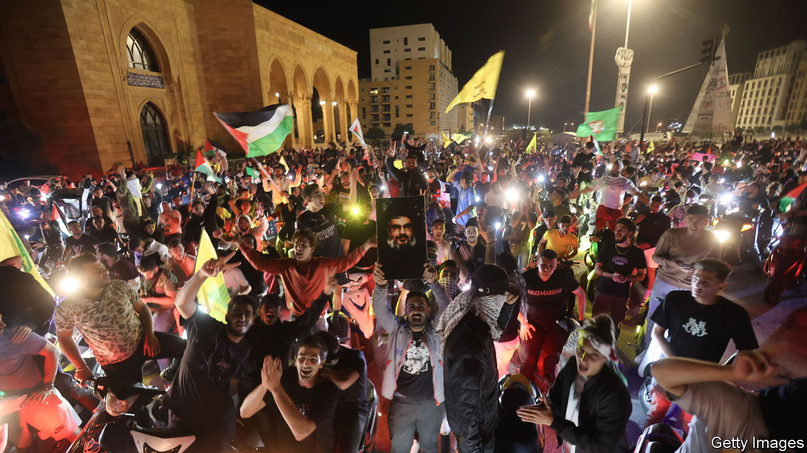

###### Maelstrom in the Middle East

# The Arab world thinks differently about this war 

##### But Israel’s evidence about a hospital strike still carries little weight 

 

> Oct 18th 2023 

THE SCENES looped on news channels all night: ambulances, bodies, an explosion lighting the night sky. Hamas blamed Israel for the blast at Gaza’s al-Ahli hospital on October 17th. The Gaza health ministry said hundreds of people were killed. Israel later denied that it was carrying out air strikes in the area; the explosion, it said, was caused by a misfired rocket launched by Islamic Jihad, another militant group in . By the time Israel issued its denial, though, details had ceased to matter. The catastrophe had sparked protests in the West Bank and Jordan, and as far away as Tunisia. That was the maelstrom into which Joe Biden flew when he arrived in Israel on October 18th for a quick visit.

It is hard to generalise about “the Arab world”, a collection of 450m people spread across thousands of kilometres and nearly two dozen countries. But it is safe to say that most Arabs still sympathise with the Palestinian cause. Their dispossession remains a totemic political issue across the Middle East, able to mobilise popular anger and protest like little else.

The war between Israel and , now in its 12th day, has been no different. Covered around the clock on television, discussed endlessly on social media, it has sparked an outpouring of support for Palestinians. Still, compared with past conflicts, like the 50-day war in Gaza in 2014, a few things look different.

One is geopolitics. Since 2020 four Arab states—Bahrain, Morocco, Sudan and the United Arab Emirates (UAE)—have established relations with Israel, which previously had ties with just two (Egypt and Jordan). Saudi Arabia has been in talks to do the same. That has changed the way some Arab media outlets cover the conflict.

Al Jazeera, the Qatari broadcaster, has given ample time to Hamas, which is supported by Qatar. Meanwhile, channels run by Saudi Arabia and the UAE have tried to walk a tightrope. Though they cover scenes of devastation in Gaza, they do not book Hamas officials for interviews (Arabic-speaking Israeli Jews are frequent guests, though). There have been heated debates in newsrooms over language: where once they might have used the phrase  (“occupation army”), for example, today they just refer to it as the Israeli army.

A second difference is fear of a broader conflict. The 2014 war was limited to the holy land. It may not stay there this time—and that has complicated the discussion, at least in those countries close to Israel. Take Egypt. America and several Arab countries are urging it to open Rafah, the sole border crossing with Gaza not controlled by Israel, to allow civilians to escape the fighting.

But a broad swath of Egyptian society is adamant that their country should resist such pressure. “Why did you impose this war on me?” asked Ibrahim Eissa, a pro-government talk-show host, in a message directed at Hamas. “You want me to risk 100m Egyptians for your sake?” Other pundits have made similar remarks. One could dismiss them as mere mouthpieces for the regime—but their words have been widely echoed by the public.

The discourse is similar in Lebanon, which is four years into one of the worst economic crises in modern history. Many Lebanese are worried that Hizbullah, the powerful Shia militia and political party, will open a second front against Israel, thus dragging their country into another ruinous war like the one in 2006. “Don’t enter us into this hell,” wrote Dima Sadek, a well-known journalist who is both deeply supportive of the Palestinians and deeply critical of Hizbullah.

That points to a third shift: the region is more polarised today. Many Syrians, in particular, are appalled by the scenes in Gaza, where Israel’s siege warfare reminds them of the tactics deployed by Bashar al-Assad. But they are simultaneously loth to cheer for Hamas, a group backed by Iran, which did so much to destroy their country. And they fume at commentators across the Arab world who abhor Israeli atrocities but cheered Mr Assad’s. In Lebanon, too, some people are focused on the wider politics: whatever their views of Israel, they hope Iran (and thus Hizbullah) will emerge weakened.

In off-the-record conversations over the past 12 days, some Arab officials have spoken about Hamas and Gaza in the sort of language one would expect to hear from right-wing Israelis. They harbour no sympathy for an Islamist group backed by Iran. But they dare not repeat such remarks in public.

The disconnect between palace and public helps explain why Antony Blinken, the secretary of state, received a frosty reception on his recent round of shuttle diplomacy. First it was Muhammad bin Salman, the Saudi crown prince, who kept Mr Blinken and his entourage waiting hours for a planned Saturday-night meeting (the prince did not receive them until the next morning).

It is not unusual for Prince Muhammad, a night owl with an erratic schedule, to leave guests to cool their heels. That he did it to such a high-profile visitor, though, was seen as a pointed message. Then, after landing in Cairo, Mr Blinken was subjected to an unusual public lecture by Abdel-Fattah al-Sisi, the Egyptian president, who lamented the plight of the Palestinians. 

Mr Biden will not even receive that chilly welcome. He had been scheduled to fly to Jordan after Israel, where he was to meet King Abdullah; Mahmoud Abbas, the Palestinian president; and Mr Sisi. But Mr Abbas backed out shortly after the hospital blast, and then Jordan announced that the whole summit was off. Whatever Mr Biden had hoped to say to Arab leaders, they are in no mood to hear it.

Yet behind the public posturing lies deep unease. Since October 7th many analysts have drawn parallels with the Yom Kippur war, the last time Israel experienced such a calamitous intelligence failure. But there is also a profound contrast with that moment.

In 1973 Arab states were able to launch a war that seemed, to Israel, an existential threat. Historians have argued ever since about whether that was true. But it felt that way at the time—enough so that Moshe Dayan, the defence minister, is said to have mooted the use of nuclear weapons. Half a century later, Israel was dragged to war by a militant group, and the region now faces the prospect of a broader conflict waged by other non-state actors supported by non-Arab Iran.

As for Arab states, they are nervous onlookers. Najib Mikati, the Lebanese prime minister, was blunt about the possibility of war in Lebanon: “These decisions are not in my hands,” he told al-Jadeed, a local television network. The leaders of Egypt and Jordan fear fallout from the war will destabilise their own brittle regimes. Gulf states are nervous about antagonising Iran, lest its proxies lash out at Riyadh or Abu Dhabi. This is not an existential moment for Israel—but some Arab rulers fear it might be for them. ■

