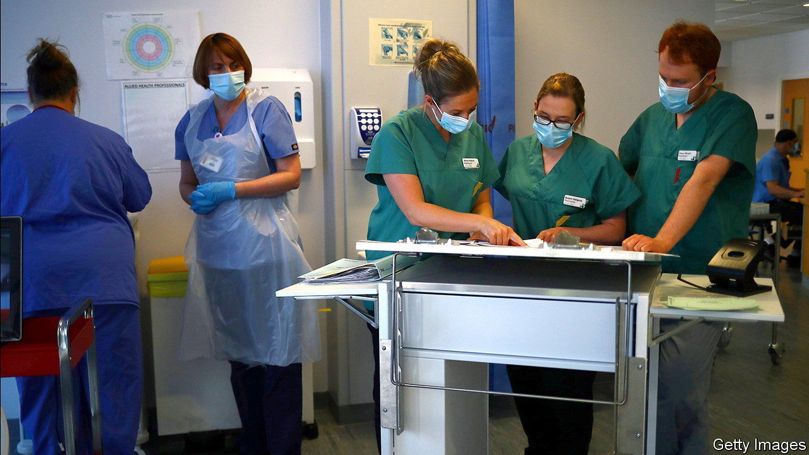

###### Joining up the bots

# Britain’s NHS is trying once again to collate patients’ data 

##### The project is imperfect and controversial, but the technology is needed 

 

> Oct 18th 2023 

BEING IN HOSPITAL is rarely fun. But some things in the  (NHS) contrive to add to patients’ pains. When IT systems cannot talk to each other, the sick must drive themselves dizzy repeating their medical histories in every new interaction. Without good systems to manage data, operating rooms often lie empty despite endless demand. Such snafus are not only maddening, but harmful. Each delay to treatment compounds backlogs exacerbated by strikes and the covid-19 pandemic, pushing the NHS waiting list in England to a record 7.75m cases.

Such inefficiencies are not inevitable. Many can be reduced by stitching together disparate datasets across the NHS, as an upcoming project, the Federated Data Platform, or FDP, should do. Its boring name belies big ambitions. In pilots using similar software doctors have diagnosed cancer patients quicker when their scans, prescriptions and appointments are collated in one place. When one hospital trust combined data to monitor barriers to discharges, the number of long stays fell by over a third. Opportunities go far beyond helping doctors see more patients. Artificial intelligence trained on large datasets spots patterns human eyes never could.

The covid-19 response proved the benefits of joining up data. With the help of Palantir Technologies, an American firm, real-time insights gleaned from combined datasets enabled officials to dispatch ventilators and personal protective equipment to where they were most needed, and to design vaccination campaigns targeting the most vulnerable. Because software engineers were linking data rather than building a central repository, data stores could be built and refined more quickly. This marked a departure from previous clunky, costly, failed NHS data projects. 

The FDP was intended to be the latest iteration of covid-era ingenuity. Instead it appears to be running on the same old scripts. Poor communication meant that until recently some NHS trusts’ own data chiefs were unsure of what the FDP was meant to do. As pressures have mounted on front-line services, “digital transformation” has again been deprioritised. Hospitals still spend £234m ($285m) a year on storing paper records, according to the Times Health Commission. 

The procurement process has also raised the antennae of privacy activists. They would always have twitched at the front-runner for the £480m contract: Palantir, which has combined data for the CIA. (Comments by the firm’s co-founder, Peter Thiel, likening Britons’ affection for the NHS to Stockholm syndrome, only add to activists’ misgivings.) To the suspicious, the fact that the firm initially handled the NHS’s covid analytics for a mere £1 has the feel of a stitch-up. Since data will be used for direct patient care in the FDP, people cannot opt out of sharing it. Though it will be anonymised, this risks eroding trust in what the NHS does with data. 

No surprise then that the winner of the contract, due to be revealed in September, is yet to be announced. But even if the fdp does goes ahead, after myriad delays, some wonder if it will ultimately prove obsolete. The contract lasts seven years, which risks locking the NHS into the software. The FDP is likely to be outpaced by projects that share data beyond the NHS, and can adapt more nimbly to innovation.

That doesn’t mean it shouldn’t go ahead. Trusts will still be free to pursue their own plans. But for the NHS’s laggards the project should be the start, not the end, of joining up data. In these difficult times, the NHS needs all the help it can get.■


