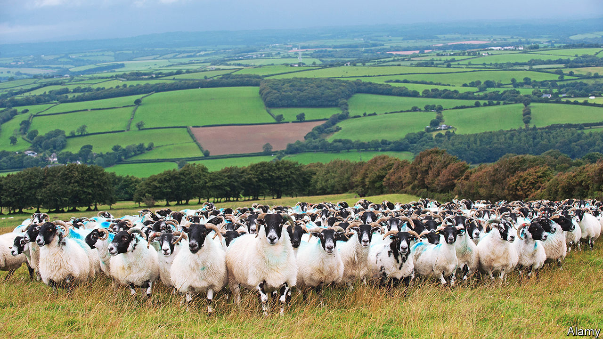

###### Park life

# Britain’s national parks are not protecting nature 

##### Why is Dartmoor in such a bad way? 

 

> Oct 16th 2023 

Until 2019 Derek Gow farmed 121 hectares of Dartmoor, in Devon, with 1,500 breeding sheep and 120 cows. But he abandoned traditional agriculture after the last of the curlews, a type of bird, vanished. “In the end, you just begin to realise that everything you’re doing is wrong,” says the farmer-turned-conservationist. He has since “rewilded”, emptying his fields and restocking them with much smaller numbers of cattle, pigs, water buffalo and wild horses—as well as reintroducing species ranging from Eurasian beavers to wildcats. 

Dartmoor is one of 15 national parks in Britain. To the untrained eye it looks like one of the country’s finest wild spaces: 954 square kilometres of rugged, sweeping moorland punctuated by tors. A third of it is protected as either a site of special scientific interest (SSSI), meaning it is of special biological or geological interest, or a special area of conservation (SAC), meaning its biodiversity is of international importance by European Union standards. 

But much of Dartmoor is in a bad way. Breeding populations of golden plover, red grouse and ring ouzels—magnificent “mountain blackbirds” that migrate from north-west Africa and seek out the most remote areas of upland Britain—are on the brink of extinction or gone. Some 91% of its SSSIs are in an “unfavourable condition”. Only 6.6% of its SAC, which covers around a quarter of the park, is in a “favourable” condition. The problem is not unique to Dartmoor: nearly 75% of SSSIs in English national parks are in an “unfavourable condition”, compared with 61% of SSSIs across England as a whole. 

The culprit, in Dartmoor at least, is easy to identify. Over 90% of the park is farmed. In the late 19th century hardy sheep from Scotland were introduced that could be grazed year round, as opposed to only in the summer. The number of sheep in the park rose from 44,000 in 1952 to some 145,000 in the early 2000s. The landscape was nibbled into submission. Agri-environmental subsidies were agreed on between Natural England, the government’s environment watchdog, and local farmers in 2012 and 2013. They were designed to restore peat bogs and heather moorland through specified stocking rates and grazing calendars. But some agreements were inadequate; others were ignored. 

The fact that some farmers were able to disregard the agreements points to three fundamental flaws with the stewardship of the national parks. The first concerns Natural England’s mandate. National parks have a statutory purpose to “conserve and enhance natural beauty, wildlife and cultural heritage”. But as the government’s own independent report stated in 2019, “conserve and enhance” does not “reflect the reality that much of our biodiversity is badly damaged; simply sustaining what we have is not nearly good enough.”

A proposed amendment to the Levelling Up and Regeneration Bill, which would have given national parks a beefed-up statutory purpose, was withdrawn in July after the government argued that national parks were sufficiently protected. The government’s Environmental Improvement Plan sets out an aim of restoring 75% of SSSIs to favourable condition by 2042, but it is not legally binding.

The second flaw is that budget cuts have hampered Natural England’s monitoring capacity. It has an average of just one staff member to assess the condition of every 73 protected sites, according to calculations by the , an environmental magazine. Almost two-thirds of the area covered by SSSIs in England hasn’t been assessed in the past ten years, according to research by Wild Justice, a campaign group. Funding for national parks has fallen by 40% in inflation-adjusted terms over the past decade, although in March the government promised an extra £4.4m ($5.3m)—around 10% of the overall annual budget—across ten parks, including Dartmoor. If Natural England had properly monitored Dartmoor’s protected areas over the past decade, the moor might not be in such a state. 

The third flaw is that farmers on the moor, and elsewhere, do not have sufficient incentives to overhaul their practices. The government is phasing in new farming subsidies that focus on environmental “public goods”, but they have not come in as quickly as EU subsidies have been withdrawn. Phil Stocker, chairman of the National Sheep Association, argues that moorlands have been particularly neglected by the proposed schemes. Most of the payment rates are based on income forgone; in upland and moorland areas—such as Dartmoor, where incomes are lower because of challenging conditions such as poor soil and heavy rain—the payments are lower. Some farmers were told they had to reapply to schemes in September, sowing confusion. 

Matters are now coming to a head. This summer Natural England told some sheep farmers on Dartmoor that they would have to reduce grazing levels in order to continue receiving subsidies, sparking a backlash from the National Farmers Union. The government has announced an independent review into Natural England’s management of protected sites on Dartmoor. Campaigners are hopeful that it will boost Natural England’s powers. In contrast, some farmers want to see the body’s remit and leadership overhauled. Mr Gow has other, higher goals: “What I want to do is give the earth the chance to heal itself and for other life to form in the land I own, so there can be voles living out in the fields…there can be skylarks singing.” ■


