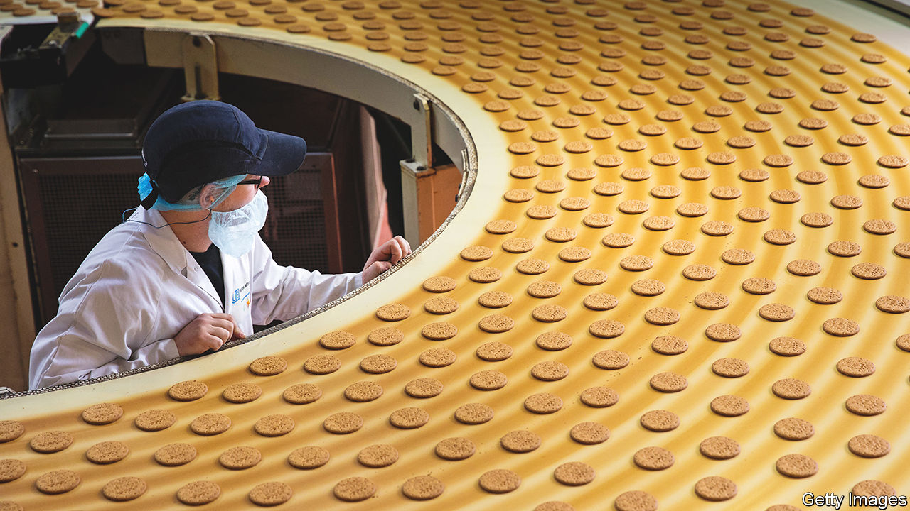
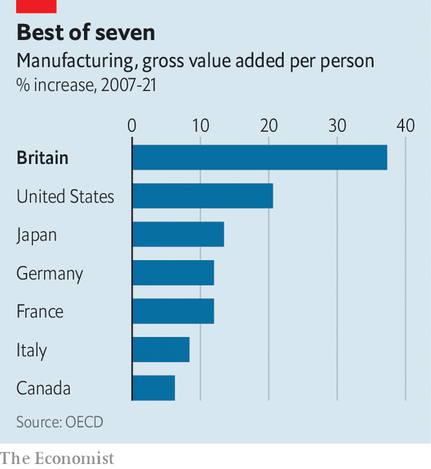

###### Food for thought

# Despite Brexit and the government, British manufacturing is doing well 

##### But food and drug firms have fared better than carmakers 

 

> Oct 19th 2023 

IN A RECENT survey of the British public, respondents were asked where they believed the country ranked in the global manufacturing league table. The median answer, 43rd, was a little wide of the mark. The latest comparable data, for 2021, make Britain the world’s eighth-biggest manufacturer, up one place from 2020 and (better still) overtaking France. 

You might have supposed the past decade to have been hard for British factories. The Brexit referendum in 2016 begat four years of uncertainty, followed by a trade deal that introduced friction to a formerly near-frictionless border. The covid-19 pandemic ruptured global supply chains. Then a spike in energy prices pushed up costs in what remains an energy-hungry sector.

 


Yet British manufacturing has been remarkably successful. According to the OECD, a club mostly of rich economies, its productivity growth comfortably outstripped that of any other G7 country in the 14 years after the onset of the financial crisis in 2007 (see chart). Gross value added (a measure of output) per manufacturing employee rose by 37.3% between 2007 and 2021, against an average of 12.1% among Britain’s peers.

This wasn’t done just by shedding employees. After a long decline in the 1980s, 1990s and 2000s manufacturing employment has been stable since 2008, at around 2.6m. “We stopped deindustrialising as a country 15 years ago,” says one boss. “Just no one seemed to notice.” Though net job losses have stopped, manufacturing’s share of all jobs has shrunk from 8.9% in 2008 to 7.1%, a far cry from its peak of almost one in three in the 1960s. For those who do remain, higher productivity has translated into higher pay. It averages £36,488 ($44,500) a year, 9.2% higher than the whole-economy average.

Yet averages obscure as much as they reveal. Just as the service sector encompasses everything from management consulting to cleaning offices, British manufacturing ranges from the making of ultra-high-tech cutting-edge scientific instruments to the production of pre-packaged sandwiches. And that partially explains why warnings that Brexit would sound the death knell for the country’s manufacturers turned out to be inaccurate.

For some industries with complex cross-European supply chains, such as carmaking, Britain’s decision to leave both the European Union’s single market and its customs union have presented serious difficulties. The government has deemed it necessary to open its chequebook for a generous programme of subsidies to support future production. However, for many other parts of the sector the effects of Brexit have been contained.

The food industry is the single largest component of British manufacturing, accounting for almost one-quarter of total output, even if politicians and television reporters generally prefer hard hats to hairnets when going on a factory visit. Much of it has always relied on domestic labour, suppliers and sales, so that although Brexit made both recruitment and exports of fresh produce trickier, it has not derailed the majority of firms. Some have even managed to increase their domestic market share at the expense of EU imports. Meanwhile at the top of the value chain, in areas such as aerospace and pharmaceuticals, companies have tended to have the pricing power to overcome the added burdens of new trade frictions.

Even if the fallout did prove manageable for most of the sector, bosses still grumble about the uncertainty that followed the vote in 2016. The head of one mid-sized firm argues that the real risk was never that most manufacturers would simply shut up shop but that future investment would go elsewhere. “It’s still too early to say if that will happen,” he warns.

Many manufacturers believe that the successes of recent years have come about despite rather than because of government policy. There is more to that grumble than Brexit. For firms with long investment cycles, policy stability is essential, yet the government has pursued six different industrial strategies in the past decade, making even medium-term planning arduous. Industrialists met the axing in 2021 of the Industrial Strategy Council, which brought together policymakers and bosses, with disbelief. They regard the recent watering-down of the government’s net-zero targets for 2050 and the scrapping of a high-speed railway from Birmingham to Manchester as emblematic. 

The long decline of British manufacturing was accompanied by much gnashing of teeth. Its quiet success, by contrast, has been little noticed. And manufacturers, not ministers, can claim the credit. ■


