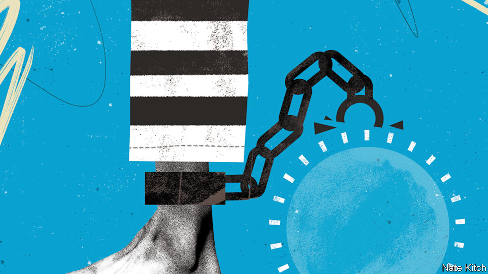

###### Bagehot

# How rationing became the fashion under the Tories 

##### When queues, cajoling and ministerial diktat trump need 

 

> Oct 19th 2023 

When Wandsworth Prison opened in south-west London in 1851, its Victorian architects thought it was fit for 1,000 inmates. Today it hosts 1,600. The conditions are worse than Dickensian: cells designed for one in the 19th century now house two, or more. Vermin are rife. A recent report labelled the prison “overcrowded” and “squalid”. 

Wandsworth is the norm rather than the exception. A prison estate with a capacity of 88,782—even allowing for Wandsworth-style overcrowding—holds 88,225. Judges, realising they had nowhere to send rogues, delayed sentencing. On October 16th the Conservative government reversed-engineered a solution: letting criminals out early and sending fewer of them to jail. 

For a party elected to hang ’em and flog ’em, or at least lock ’em up, this is a remarkable shift. Prisons are overcrowded in part because Conservative politicians have demanded longer sentences. At the same time, the government refused to build enough new prisons. The 20,000 extra places promised by the mid-2020s will not arrive until 2030 at the earliest. And so the government finds itself rationing prison places instead. 

Such rationing is in vogue. Prisons are simply the most absurd example of a tactic increasingly deployed by the government. From health care to welfare via heat-pump subsidies and planning, erratic rationing has become the norm. Politicians are not willing to increase taxes enough to cover the real costs of the services voters demand. Nor are voters willing to pay them. And neither side is willing to forgo the dream of comprehensive services on the cheap. The results are shortages, which can be managed only by queues, unpredictable rationing and ministerial diktat. 

It is a familiar problem. Janos Kornai, a Hungarian economist, examined how Soviet economies failed to supply enough of the things people wanted. When things running out was the “normal state for the system, not an unusual event” it was a “shortage economy”. In Britain, mercifully, capitalism thrives in the private sector. Supermarket shelves are full and a brand new bmw is yours, if you can afford it. When it comes to government services it is another story. Shortages reign. Where the Russians built a shortage economy, the Tories have created a shortage state. 

When Rishi Sunak cancelled the Manchester leg of hs2, a £100bn ($120bn) high-speed railway, the prime minister painted it as redistribution. In fact it was rationing. Money saved could be spent on other schemes, he argued. Given Britain’s record in building infrastructure, it is fair to assume few will materialise. The result will be that trains remain congested and further pressure is heaped on roads. Since politicians fear pricing roads properly to manage demand, expect more traffic jams. Ultimately, government policy is for people to travel less. 

Sometimes rationing makes for subtle savings. Cutting benefits for, say, children with special needs would be cruel and unpopular. Making them hard to get attracts less attention. Professional email-slingers may not be daunted by a 39-page application to unlock four figures’ worth of benefits; others may struggle without help. Often, what looks like government generosity is in fact more rationing. Amid a glut of green measures, Mr Sunak increased the subsidy for installing a heat pump to £7,500 from £5,000. At the same time, the government did not increase funding for the programme. Fewer people will benefit. 

The effects of rationing are most pernicious in housing. A discretionary planning system, with building approved or denied by planners and politicians, inevitably leads to shortages of homes in the manner Kornai would recognise, argues Anthony Breach of Centre for Cities, a think-tank. In 2020, the Conservatives promised to loosen the system. Backbench MPs scuppered it; the minister responsible was ejected. Strict rationing remains even where the government has tried to remove it. 

Where some rationing is supposed to happen, such as in health care, shortages have reached new highs. In the National Health Service in England, waiting lists stand at nearly 8m cases, in a country of 56m people. Those in the queue are the lucky ones. Each morning across Britain, patients are forced to call a gp at 8am on the dot if they want an appointment. In 2005, Sir Tony Blair was berated on the BBC’s “Question Time” by angry guests annoyed because gps only offered appointments inconveniently soon. Now, only inconsistent rationing—and grumpy receptionists—keep acute care from being overwhelmed.

Completely irrational

When Kornai explained his theory to an audience of Maoists in Kolkata in 1975, they reacted with horror. Better to suffer shortage than iniquity, ran their logic. Voters in Kenilworth have similar instincts. Allowing the market to police access to services makes Britons feel icky. Charging to see a gp is politically forbidden: eight in ten voters oppose the idea. Whenever road-pricing is mentioned, critics are quick to label it a “poll tax on wheels”. The Tories are allergic to the high taxes required for a European-sized state but no longer have the  to support market-based solutions. Rationing is the miserable compromise. 

Forcing Britons to queue, cajole receptionists or go without the services they are owed is no way to run a country. The fix for Britain is the same as it was for the eastern bloc. “The lasting solution to misery lies in reforming production, not distribution,” wrote Kornai. “Rationing systems that spread misery equally may assuage feelings of injustice for a while, but they will not solve anything.” Britain’s public services must become more efficient. Making them so will not be cheap, but it beats the alternatives. Britons must either pay more for those services, expect less or face up to a future of erratic provision, in which stamina, persistence and luck trump need—and people who would otherwise be in hmp Wandsworth are wandering in the streets. ■


