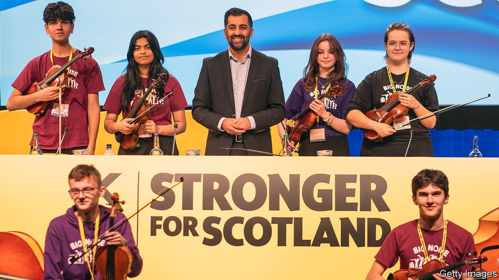
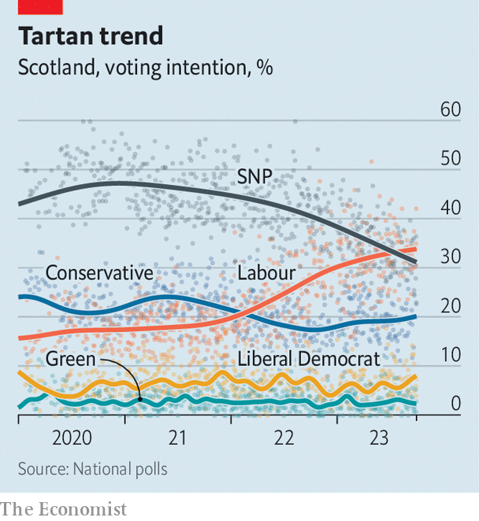

###### Nevereverendum

# Scottish independence has become a long game 

##### Where does that leave the SNP? 

 

> Oct 17th 2023 

IN JUNE 2022 Nicola Sturgeon, then first minister of Scotland and leader of the Scottish National Party (SNP), proposed that the country would hold a second independence referendum on October 19th 2023. (Scots voted against secession in 2014.) Since then much has gone wrong for Ms Sturgeon, the SNP and the dream of independence that is the party’s raison d’être. At its annual conference in Aberdeen this week, far from looking to the sunlit uplands of secession, members seemed to be gathered under lowering clouds. 

The SNP’s run of disasters began last November, when Britain’s Supreme Court ruled that Scotland could not hold another referendum without Westminster’s say-so. In February Ms Sturgeon, a charismatic champion of independence, resigned. Four months later she was briefly arrested in a police inquiry into the SNP’s finances. That contributed to electoral catastrophe on October 5th, when the party lost a by-election in Rutherglen and Hamilton West, near Glasgow, to Labour. Days later an SNP MP defected to the Conservatives. 

 


The daunting task of claiming convincingly that the party was getting on top of all this fell to Humza Yousaf, who succeeded Ms Sturgeon in March. In his first conference speech as leader Mr Yousaf said that rather than “feeling sorry for ourselves” the SNP would “roll up our sleeves and work harder than ever before for the people of Scotland”. The most powerful passage alluded to a dreadful personal crisis: several members of his wife’s family are trapped in Gaza, which is  by Israel. Some delegates said his statesmanlike conduct in recent days had won him new respect from them.

Yet the conference chiefly underlined Mr Yousaf’s myriad difficulties. The biggest concerns independence. In November, after the Supreme Court scotched Ms Sturgeon’s latest referendum plan, she said the general election due by January 2025 would be a “de facto referendum” (it can be no such thing). On October 15th the SNP agreed instead that if the party won a majority of Scotland’s 57 Westminster seats it would have a mandate to begin negotiations on another referendum. 

This new strategy is meant to be a show of strength: the SNP has long told nationalists that its electoral success will force a referendum. In fact it is an admission of weakness. Polls suggest the party is heading for heavy losses. It has 43 seats at Westminster, out of Scotland’s current 59, but after Labour’s big win in Rutherglen, it is expected to lose between 20 and 40. 

Its ploy would not work anyway. Sir Keir Starmer, Labour’s leader and Britain’s probable next prime minister, has said he won’t back another referendum. Although support for independence among Scottish voters remains steady, at a bit below 50%, it has never enjoyed the clear majority that might persuade Westminster to give Scotland another shot at sovereignty. 

Mr Yousaf said this week he hoped that dealing with the “process” side of independence would allow him to convince more Scots of its benefits. He is linking the issue to the cost-of-living crisis (which some consider Labour to have campaigned on more effectively in Rutherglen) by railing against the “Westminster cost-of-living crisis”. But arguments about governance are weakened by the SNP’s own record. Its school performance lags behind England’s; its health service has long waiting lists too. Voters give low ratings for both.

The conference, meanwhile, offered a reminder of divisions in the party that surfaced during the leadership election and appear to have worsened since. Several prominent nationalists skipped the gathering altogether, including Kate Forbes, Mr Yousaf’s main rival in that contest, and Fergus Ewing, a long-serving MSP who was briefly suspended in September after various rebellions. 

Some say Mr Yousaf, having inherited a party in all sorts of muddles, needs time to prove himself. He was not helped by Ms Sturgeon’s appearance at the conference on October 16th. She was quickly surrounded by adoring fans. It was a rare moment of drama in an otherwise leaden show. ■


