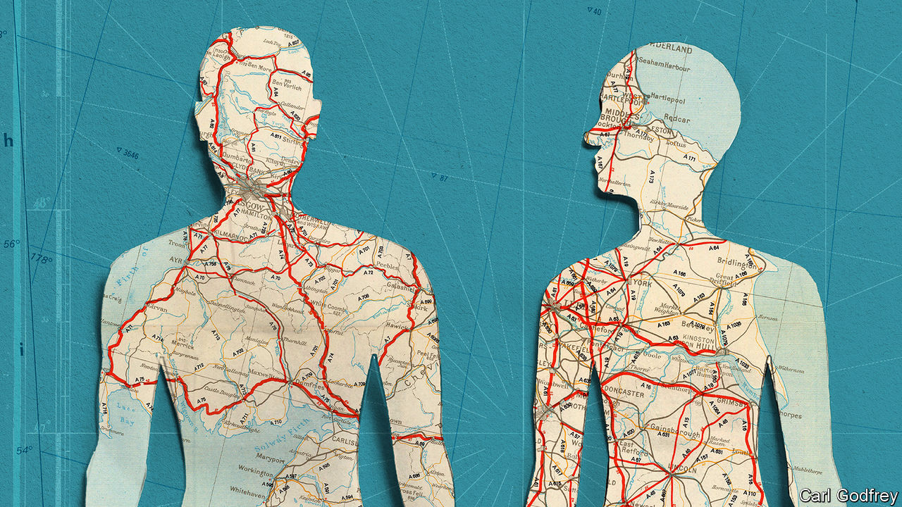
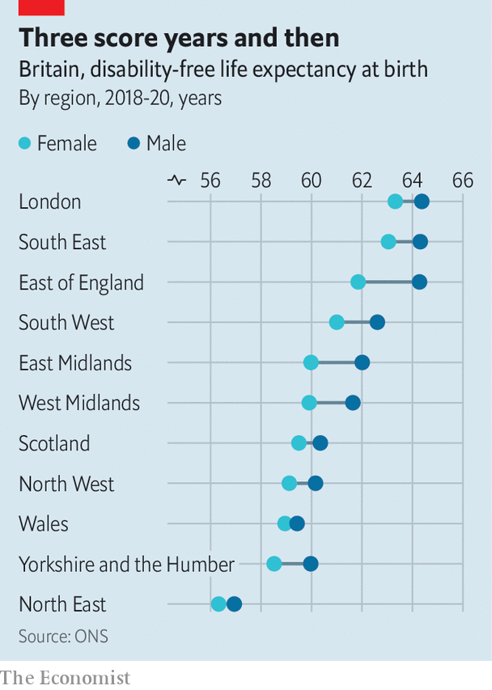

###### Sickness service to health service

# The world’s largest health-research study is under way in Britain 

##### It is aimed at saving Britons—and the NHS 

 

> Oct 18th 2023 

Volunteer number one rolled up his sleeve on July 12th last year. Volunteer two put out an arm to give blood the same day. Volunteer 100 stepped onto the scales on August 3rd. A tape measure was slipped around the waist of volunteer 1,000 on September 30th. Then things sped up: volunteer 100,000 gave blood this March. The roll is now growing so fast—by thousands every day—that putting a precise number in print is pointless: by the time you read this it will be out of date. By the end of this year this research study—called Our Future Health—will be Britain’s largest of its kind. By the end of next year, the world’s. 

Across Britain, the study is unfurling. In Liverpool and in London, in Manchester and Grimsby and Oxford, in dreary supermarket car parks, mobile vans are drawing up, cubicle curtains being drawn back and queues forming. The plan is to recruit 5m people—almost as many as there are in Norway—and get them weighed, measured, quizzed, genotyped, phenotyped. Then to put the data to work to see who gets sick, with what, and when, and why—and if intervening early can help. The aim is simple. To save them—and the NHS. Because as Sir John Bell, regius professor of medicine at Oxford University and the study’s chair, says, the NHS is “not sustainable in its current form”.

 


The has two main problems. The first is that it works badly. The second is that it works well. Its failings—waiting lists, , costs invariably labelled “spiralling”—are well known. Its successes are harder to see—but are there in those same lists, queues and costs. For all exist, in part, because the NHS is keeping many alive who would, without it, be dead. But not being dead is not the same as being healthily alive: an average Briton may reach only 60 or so in good fettle (see chart. As Raghib Ali, the chief medical officer of Our Future Health (and its volunteer number one), says: “What we have…is not really a National Health Service but a national sickness service.”

It was never meant to be like this. When in 1943 Winston Churchill promised Britain a health service “from the cradle to the grave” no one dreamt that Britons would spend so long with one foot in that grave, or cost so much as they stood there. On the contrary: it was thought that the NHS would get cheaper over time as Britons—laid in their cradles by NHS midwives, fortified by NHS vaccinations—would gaze through their newly issued NHS spectacles to a bright, healthy future. The NHS’s very existence, wrote William Beveridge, its architect, would lead to “a reduction in the number of cases requiring it”. It was, one politician later said, “a miscalculation of sublime dimensions”. 

In its first year the NHS promptly ran twice over budget, not helped by those NHS specs, of which twice as many pairs (8m) were handed out as had been expected. Aneurin Bevan, the father of the NHS, grumbled that “cascades of medicine [are] pouring down British throats—and they’re not even bringing the bottles back.” It has not got cheaper: the budget for NHS England is £169bn ($205bn) this year. Its prognosis is “hopeless, actually”, says Sir John. People tend to use the verb “collapse” to describe the end of the NHS. It will not. It will do something worse: it will ebb. Those who can afford to leave, will. Those who can’t will stay and queue and suffer. “Our NHS” will, almost imperceptibly, become “Their NHS”. And Bevan’s dream will be lost.

To save it Britain must do no less than “pivot the way we deliver health care”, says Sir John. The NHS must stop mainly treating people who are manifestly very sick and get them when they still, ostensibly, seem well. Which is why, on a rainy Friday afternoon, Dr Ali, slight, clever, softly spoken, is standing in an unprepossessing Tesco car park in Watford outside a yellow van. On it is the Our Future Health logo—and the NHS one. (The study is a public-private partnership: one-third of its £239m budget is funded by government, two-thirds by life-sciences companies.) Inside, people wait as a fine drizzle falls.

The unprepossessing air of this study—all those car parks—is not accidental. The life-expectancy gap between Britain’s richest and poorest local authorities is ten years. Yet the gap in expectancy of life without ill health is 20. And those at the bottom of such ranges tend not to volunteer for medical studies. Dr Ali is obsessed by ensuring that they do. Which is why those yellow vans are drawing up in the car parks of Tesco, Asda, Lidl and Morrisons. “Not Waitrose.” Medical trials don’t need more Waitrose shoppers. 

As the rain falls, Dr Ali welcomes volunteers in. The NHS’s size is its great weakness—it is unwieldy and all but impossible to reform—but also its strength. The RECOVERY trial, which found that a cheap steroid cut covid deaths by a third, yielded a result within 100 days. Sir Martin Landray, a professor of epidemiology at Oxford who ran RECOVERY and now runs Protas, a not-for-profit founded to improve clinical trials tackling common conditions, says that in its breadth (almost 70m people) and length of coverage (from cradle to grave) the NHS is “almost unique…The opportunities are really enormous.”

Our Future Health is trying to make the most of them. Each volunteer will generate hundreds of data points for researchers immediately; billions when their genomes are sequenced. That data will be married to their NHS data; AI will be used to crunch the lot. Then the work will begin: volunteers will (if they wish) be told what conditions they are at risk of and, for certain conditions (some cancers, diabetes, heart disease) be put on NHS pathways, for more tests and, if necessary, treatment.

It will not be perfect: inevitably there will be false positives and consequent anxiety. It remains to be seen whether the NHS—a cantankerous, intransigent 75-year-old patient—will accept its medicine. Dr Ali is optimistic: “It’s quite hard to see how the study could fail.” And in Watford and in Grimsby and in Manchester, volunteers queue, and roll up their sleeves. Some to help the NHS. Some to help themselves. Some to help both. Because we are all in this together. For now. ■


